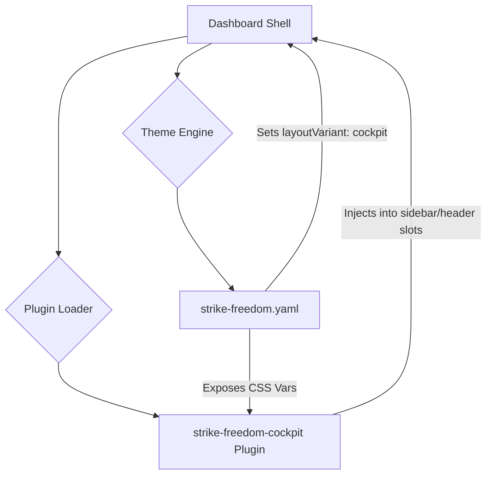

# plugins — strike-freedom-cockpit

# Strike Freedom Cockpit

The `strike-freedom-cockpit` module is a reference implementation of the Hermes dashboard skinning and plugin system. It demonstrates how to create a deep visual overhaul (a "cockpit" HUD) using a combination of a theme configuration file and a functional plugin without modifying the core dashboard source code.

## Architecture Overview

The module is split into two distinct parts that work in tandem:

1.  **Theme Configuration (`theme/strike-freedom.yaml`)**: Defines the static visual properties, including the color palette, typography, layout variant, and component-level CSS overrides.
2.  **Dashboard Plugin (`dashboard/`)**: A functional extension that injects dynamic content into specific UI slots reserved by the theme's layout.



## Theme Configuration

The `strike-freedom.yaml` file utilizes the Hermes theme schema to redefine the UI's look and feel.

### Layout & Chrome
- **`layoutVariant: cockpit`**: This is a critical setting that instructs the dashboard shell to render a 260px left rail (sidebar) and specific header/footer areas.
- **`componentStyles`**: Maps directly to CSS variables used by core components. For example, `card.clipPath` generates `--component-card-clip-path`, allowing for the "notched" mecha-style corners.
- **`customCSS`**: Injects a raw CSS block for effects that cannot be achieved through variable overrides alone, such as the scanline overlay and pseudo-element corner pips.

### Asset Exposure
The theme defines an `assets` block:
```yaml
assets:
  hero: "/path/to/image.png"
  crest: "/path/to/crest.svg"
```
These are exposed to the browser as CSS variables (`--theme-asset-hero`, `--theme-asset-crest`). This allows the paired plugin to render theme-specific artwork without hardcoding URLs in the JavaScript source.

## Dashboard Plugin

The plugin component handles the dynamic elements of the cockpit HUD.

### Manifest (`manifest.json`)
The plugin is configured as a "hidden" plugin. It does not appear in the main navigation but instead targets specific layout slots:
- **`tab.hidden: true`**: Prevents the plugin from creating a dedicated navigation entry.
- **`slots`**: Declares intent to render into `sidebar`, `header-left`, and `footer-right`.

### Slot Implementations
- **`sidebar`**: Renders the `MS-STATUS` panel. It consumes real-time agent telemetry and displays it using segmented progress bars. It also reads the `--theme-asset-hero` variable to display the character/mecha portrait.
- **`header-left`**: Injects the `COMPASS` crest or organizational logo, reading from `--theme-asset-crest`.
- **`footer-right`**: Overrides the default system tagline with theme-appropriate text.

## Integration Points

### CSS Variable Mapping
The dashboard shell maps theme properties to CSS variables following these patterns:
- **Palette**: `--color-<key>` (e.g., `--color-warm-glow`)
- **Component Styles**: `--component-<bucket>-<property>` (e.g., `--component-card-box-shadow`)
- **Assets**: `--theme-asset-<key>` (e.g., `--theme-asset-bg`)

### Layout Variants
When `layoutVariant` is set to `cockpit`, the shell activates specific `data-layout-variant="cockpit"` attributes on the root element. The `customCSS` in this module uses these attributes as selectors to ensure styles only apply when the Strike Freedom theme is active:
```css
[data-layout-variant="cockpit"] .border-border::before { ... }
```

## Installation & Development

### File Placement
To activate the module, files must be placed in the Hermes home directory (typically `~/.hermes/`):

1.  **Theme**: `~/.hermes/dashboard-themes/strike-freedom.yaml`
2.  **Plugin**: `~/.hermes/plugins/strike-freedom-cockpit/`

### Discovery
The system discovers the module via two mechanisms:
- **Startup**: Automatic scan of the `plugins/` and `dashboard-themes/` directories.
- **Runtime**: Triggering the `GET /api/dashboard/plugins/rescan` endpoint forces the shell to reload available themes and plugin manifests.

### Development Workflow
When modifying the plugin, the `entry` point defined in `manifest.json` (usually `dist/index.js`) must be rebuilt. The theme YAML can be edited live; however, a rescan or page refresh is required for the shell to pick up changes to the `layoutVariant` or `slots` definitions.