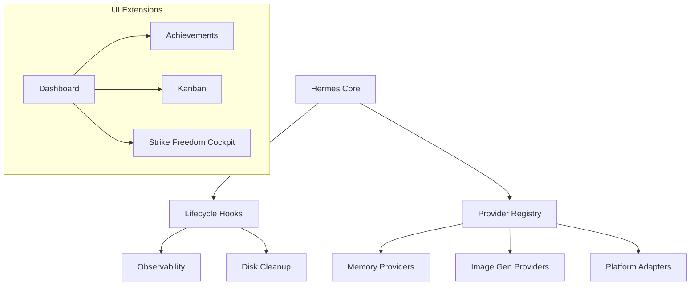

# plugins

# Plugins Module

The `plugins` module is the central extensibility layer for the Hermes ecosystem. It provides a standardized namespace for discovering, loading, and orchestrating external features, ranging from low-level memory management to high-level UI dashboards.

## Architecture Overview

The module operates on a "pluggable backend" philosophy where core Hermes logic remains agnostic of specific implementations. Integration typically follows one of three patterns:

1.  **Provider Interfaces**: Modules like [Memory](memory.md) and [Image Generation](image_gen.md) define abstract interfaces (`MemoryProvider`, `ImageGenProvider`), allowing the system to swap backends (e.g., OpenAI vs. xAI) via `config.yaml`.
2.  **Lifecycle Hooks**: Modules like [Disk Cleanup](disk-cleanup.md) and [Observability](observability.md) subscribe to internal agent events (e.g., `post_tool_call`) to perform background tasks like file management or Langfuse tracing.
3.  **Dashboard Manifests**: UI-centric plugins like [Hermes Achievements](hermes-achievements.md) and [Kanban](kanban.md) use a `manifest.json` to register new tabs and slots within the web dashboard.

## Sub-Module Categories

### Core Infrastructure
*   **[Context Engine](context_engine.md)**: Manages and compresses conversation history before LLM submission.
*   **[Memory](memory.md)**: Orchestrates long-term storage backends for agent persistence.
*   **[Observability](observability.md)**: Integrates with Langfuse for deep tracing of generations and tool calls.
*   **[Platforms](platforms.md)**: Adapters that bridge Hermes to external networks like IRC and MS Teams.

### Agent Capabilities & Tools
*   **[Google Meet](google_meet.md)**: Enables the agent to join calls, scrape captions, and speak via duplex audio.
*   **[Image Generation](image_gen.md)**: Provides a unified API for DALL-E and other image synthesis models.
*   **[Spotify](spotify.md)**: Grants the agent control over playback, searching, and library management.

### Dashboard & User Experience
*   **[Hermes Achievements](hermes-achievements.md)**: A gamified system that analyzes `SessionDB` history to unlock badges.
*   **[Kanban](kanban.md)**: A multi-agent task board for real-time collaboration.
*   **[Strike Freedom Cockpit](strike-freedom-cockpit.md)**: A reference implementation for deep visual skinning and HUD overlays.
*   **[Example Dashboard](example-dashboard.md)**: A boilerplate for developers to build new UI extensions.

### System Maintenance
*   **[Disk Cleanup](disk-cleanup.md)**: Automatically manages the lifecycle of ephemeral files generated by tools like `write_file` or `terminal`.

## Plugin Discovery
Most sub-modules support dynamic discovery. The system typically scans two locations:
1.  **Bundled**: Internal plugins located within the `plugins/` directory.
2.  **User**: External plugins located in `$HERMES_HOME/plugins/`.

In cases of conflict, bundled plugins generally take precedence unless specified otherwise in the global configuration.