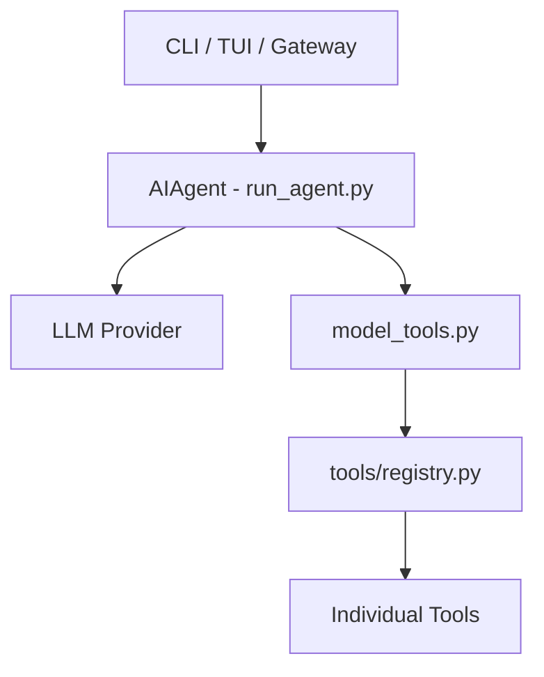

# Root — AGENTS.md

# Hermes Agent - Development Guide

This module serves as the primary technical reference for developers and AI assistants working on the `hermes-agent` codebase. It outlines the project architecture, core execution loops, and extensibility patterns.

## Core Architecture Overview

Hermes is structured as a multi-interface agentic system where the core logic (`AIAgent`) is decoupled from the presentation layers (CLI, TUI, Gateway).



### Key Entry Points
- **`run_agent.py`**: Contains the `AIAgent` class, the central orchestration point for conversations and tool-calling loops.
- **`cli.py`**: The interactive terminal interface using `Rich` and `prompt_toolkit`.
- **`model_tools.py`**: The bridge between the LLM's function-calling intent and actual Python execution.
- **`gateway/run.py`**: The messaging adapter for external platforms (Telegram, Slack, etc.).

---

## The AIAgent Execution Loop

The `AIAgent` class manages the conversation state and the iterative tool-calling process. The primary entry point for logic is `run_conversation()`.

### Conversation Flow
1. **Initialization**: `AIAgent` is instantiated with credentials, model routing, and `enabled_toolsets`.
2. **The Loop**: A synchronous `while` loop continues until the model provides a final text response or the `max_iterations` / `iteration_budget` is exhausted.
3. **Tool Execution**: When the LLM returns `tool_calls`, `handle_function_call()` dispatches the request to the registered tool handler.
4. **State Management**: Messages are stored in OpenAI-compatible format. Reasoning content is captured in the `reasoning` field of assistant messages.

```python
# Simplified execution pattern in run_agent.py
while self.should_continue(api_call_count):
    response = client.chat.completions.create(model=model, messages=messages, tools=tool_schemas)
    if response.tool_calls:
        for tool_call in response.tool_calls:
            result = handle_function_call(tool_call.name, tool_call.args, task_id)
            messages.append(tool_result_message(result))
        api_call_count += 1
    else:
        return response.content
```

---

## Tool & Skill System

Hermes uses a decentralized tool discovery system. Tools are registered at import time and orchestrated via `model_tools.py`.

### Adding a New Tool
To add a tool, create a file in `tools/` and use the `registry.register()` method.
- **Schema**: Must follow JSON Schema for LLM compatibility.
- **Handler**: Must return a JSON-formatted string.
- **Environment**: Use `requires_env` to gate tools based on available API keys.

### Skills
- **Built-in (`skills/`)**: Core capabilities shipped with the agent.
- **Optional (`optional-skills/`)**: Niche or heavy-dependency skills installed via `hermes skills install`.
- **Slash Commands**: Skills can inject logic as user messages via `agent/skill_commands.py` to preserve prompt caching.

---

## User Interfaces

### Interactive CLI (`cli.py`)
The CLI uses a **Skin Engine** (`hermes_cli/skin_engine.py`) for visual customization. It supports slash commands defined in a central `COMMAND_REGISTRY` in `hermes_cli/commands.py`. Adding a command here automatically updates help text, autocomplete, and gateway menus.

### TUI Architecture (`ui-tui`)
The TUI is a React-based (Ink) terminal interface that communicates with a Python backend (`tui_gateway`) via JSON-RPC over stdio.
- **Process Model**: Node.js owns the rendering; Python owns the Agent and Tools.
- **Dashboard**: The `hermes dashboard` embeds the TUI via a PTY bridge, ensuring UI consistency across terminal and web.

---

## Configuration & Profiles

Hermes supports isolated instances via **Profiles**. Each profile has its own `HERMES_HOME`.

### Profile Safety Rules
1. **Paths**: Always use `get_hermes_home()` from `hermes_constants.py`. Never hardcode `~/.hermes`.
2. **Display**: Use `display_hermes_home()` for user-facing logs to show the correct profile path.
3. **Config**: Settings go in `config.yaml` (via `DEFAULT_CONFIG` in `hermes_cli/config.py`). Secrets (API keys) go in `.env`.

---

## Plugin System

Plugins live in `plugins/` and allow extending the agent without modifying core files.
- **Lifecycle Hooks**: Plugins can hook into `pre_tool_call`, `post_llm_call`, etc.
- **Memory Providers**: Specialized plugins in `plugins/memory/` (e.g., `mem0`, `honcho`) implement the `MemoryProvider` ABC to handle long-term state.

---

## Development Policies

### Prompt Caching
Maintain the integrity of the system prompt. Do not change toolsets or context mid-conversation, as this invalidates LLM provider caches and increases costs.

### Testing Standards
**Always use `scripts/run_tests.sh`**. This script ensures:
- Timezone is set to `UTC`.
- API keys are unset (hermetic testing).
- `xdist` is limited to 4 workers to match CI environments.

**Avoid Change-Detector Tests**: Do not write tests that assert specific counts of models or hardcoded version numbers. Instead, test invariants (e.g., "all models in the catalog must have a defined context length").

### Background Processes
When tools run in the background, the Gateway uses a watcher to notify the user upon completion. This behavior is controlled by `display.background_process_notifications` in the configuration.