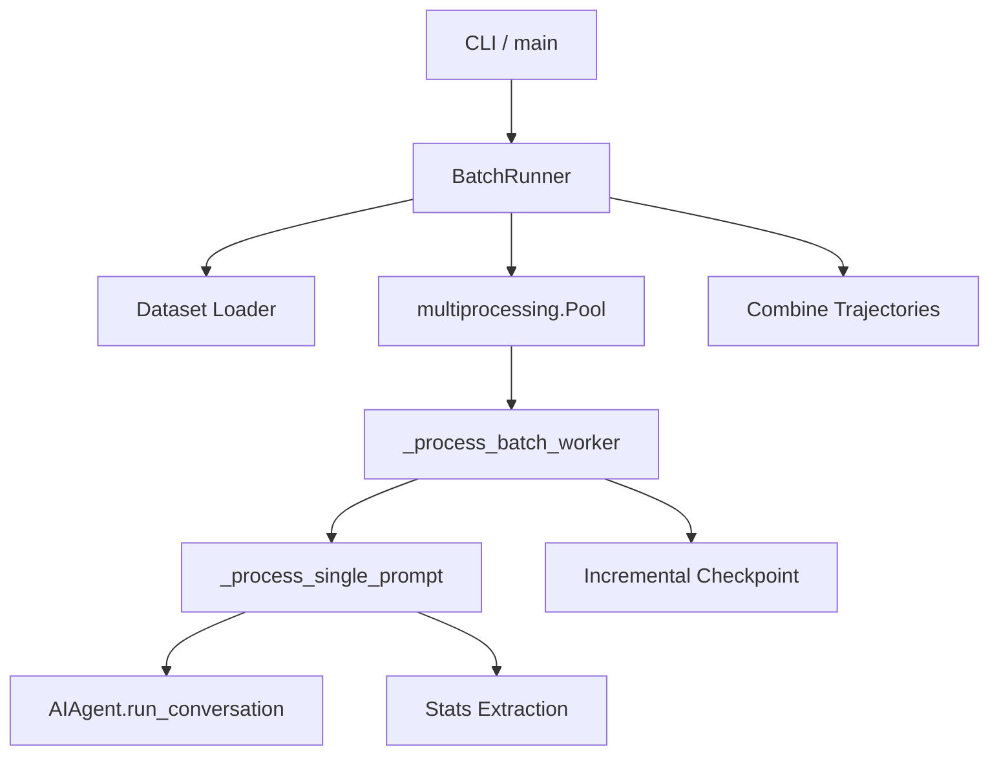

# Root — batch_runner.py

# Batch Agent Runner

The `batch_runner.py` module provides a high-performance, parallelized framework for executing the `AIAgent` across large datasets. It manages the lifecycle of batch jobs, including dataset partitioning, worker process orchestration, fault-tolerant checkpointing, and comprehensive statistics aggregation.

## Core Architecture

The module utilizes a producer-consumer pattern via Python's `multiprocessing.Pool`. The `BatchRunner` class orchestrates the overall run, while `_process_batch_worker` functions as the entry point for individual worker processes.



## Key Components

### BatchRunner Class
The central orchestrator. It handles:
- **Dataset Loading**: Reads JSONL files and partitions them into chunks based on `batch_size`.
- **Worker Management**: Spawns a process pool to execute batches concurrently.
- **State Persistence**: Manages the `checkpoint.json` and `statistics.json` files.
- **Result Merging**: Combines individual batch files into a final `trajectories.jsonl` while filtering corrupted entries.

### _process_single_prompt
This function encapsulates the execution of a single task. It performs several critical steps:
1. **Environment Setup**: If the dataset entry contains an `image` or `docker_image` field, it calls `register_task_env_overrides` from `tools.terminal_tool` to ensure the agent's sandbox uses the correct container.
2. **Tool Distribution**: Samples a set of tools for the prompt using `sample_toolsets_from_distribution`.
3. **Agent Execution**: Instantiates `AIAgent` and runs the conversation loop.
4. **Data Extraction**: Processes the resulting message history to extract tool usage and reasoning statistics.

### Statistics & Normalization
To ensure compatibility with downstream consumers (like HuggingFace Datasets or Apache Arrow), the module enforces a strict schema:
- **`_normalize_tool_stats`**: Ensures every entry in the output contains the same set of tool keys (derived from `TOOL_TO_TOOLSET_MAP`), even if those tools weren't used in a specific run.
- **`_extract_reasoning_stats`**: Monitors for the presence of `<REASONING_SCRATCHPAD>` or native thinking tokens. Samples that contain zero reasoning turns are discarded to maintain dataset quality.

## Fault Tolerance and Resumption

The module implements a "Smart Resume" mechanism that goes beyond simple index tracking:

1. **Content-Based Matching**: `_scan_completed_prompts_by_content` reads existing `batch_*.jsonl` files to identify prompts that have already succeeded by their text content. This prevents duplicate processing if the input dataset order changes.
2. **Incremental Checkpointing**: The `checkpoint.json` is updated atomically after every batch completion using `utils.atomic_json_write`.
3. **Error Recovery**: Failed prompts are logged but not marked as completed in the checkpoint, allowing them to be retried automatically when the script is re-run with the `--resume` flag.

## Data Output Format

The runner produces a `trajectories.jsonl` file where each line is a JSON object containing:
- `conversations`: The full trajectory in `from`/`value` format.
- `tool_stats`: Normalized dictionary of tool call counts, successes, and failures.
- `tool_error_counts`: A simplified mapping of tool names to failure counts.
- `metadata`: Information about the model, batch number, and timestamp.

## Usage and Configuration

The module is invoked via the command line using `fire`.

### Basic Execution
```bash
python batch_runner.py \
    --dataset_file=tasks.jsonl \
    --batch_size=20 \
    --run_name=experiment_v1 \
    --num_workers=8
```

### Advanced Configuration
- **Tool Distributions**: Use `--distribution` to select specific tool subsets (e.g., `image_gen`, `coding`).
- **OpenRouter Integration**: Configure provider logic via `--providers_allowed`, `--providers_order`, and `--provider_sort`.
- **Reasoning Control**: Use `--reasoning_effort` (none, low, medium, high) to control model thinking depth, or `--reasoning_disabled` to strip thinking tokens entirely.
- **Prefilling**: Use `--prefill_messages_file` to provide few-shot context or system-level priming to every prompt in the batch.

### Resuming a Run
```bash
python batch_runner.py --run_name=experiment_v1 --resume --dataset_file=tasks.jsonl --batch_size=20
```
The runner will detect the existing directory in `data/experiment_v1`, scan existing batch files, and only process the remaining prompts.