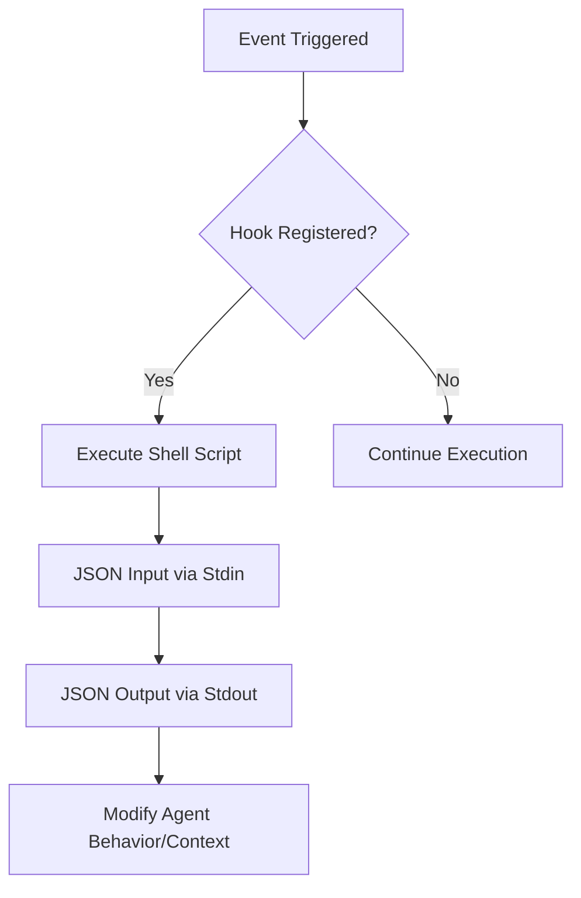

# Root — cli-config.yaml.example

# CLI Configuration (cli-config.yaml)

The `cli-config.yaml.example` file serves as the primary template for configuring the Hermes Agent's behavior, execution environment, and model parameters. To activate these settings, copy this file to `~/.hermes/cli-config.yaml` (or the project root) and modify as needed.

## Configuration Hierarchy

Hermes resolves configuration using the following priority (highest to lowest):
1.  **Command Line Flags** (e.g., `--model`, `--provider`, `--worktree`)
2.  **Environment Variables** (defined in `.env` or the shell)
3.  **`cli-config.yaml`**
4.  **Internal Defaults**

## Core Configuration Modules

### 1. Model & Inference
This section defines which LLM "brain" the agent uses and how it communicates with providers.

*   **`model.default`**: The primary model identifier (e.g., `anthropic/claude-3-5-sonnet`).
*   **`model.provider`**: Supports `auto` detection or explicit providers like `openrouter`, `anthropic`, `openai-codex`, `ollama`, and `lmstudio`.
*   **`context_length`**: While usually auto-detected, this can be manually set for local servers (vLLM/Ollama) to control when history compression triggers.
*   **`auxiliary`**: Configures lightweight models (like Gemini Flash) for side-tasks such as vision analysis, web summarization, and session search to save costs on the primary model.

### 2. Terminal & Execution Backends
Hermes can execute commands in various environments. The `terminal` block defines the "hands" of the agent.

| Backend | Description | Key Requirements |
| :--- | :--- | :--- |
| `local` | Runs directly on the host machine. | Default behavior. |
| `ssh` | Executes on a remote server via SSH. | `ssh_host`, `ssh_user`, `ssh_key`. |
| `docker` | Runs inside an isolated container. | `docker_image`, Docker daemon. |
| `modal` | Serverless cloud execution. | `modal_image`. |
| `daytona` | Cloud development sandboxes. | `DAYTONA_API_KEY`. |

**Resource Limits:** For containerized backends, you can specify `container_cpu`, `container_memory`, and `container_persistent` to ensure the environment survives between agent turns.

### 3. Context Management & Compression
To prevent "context window" overflow and manage costs, Hermes implements an automated compression strategy.

*   **`compression.threshold`**: Triggers summarization when the prompt reaches a percentage of the total context (default `0.50`).
*   **`compression.protect_last_n`**: Ensures the most recent `N` messages are never summarized, preserving immediate conversation flow.
*   **`prompt_caching`**: Configures TTL for Anthropic's prompt caching (e.g., `5m` or `1h`).

### 4. Persistent Memory
Hermes maintains two long-term storage files to provide continuity across sessions:
*   **`MEMORY.md`**: Facts about the environment, project conventions, and learned technical details.
*   **`USER.md`**: User preferences and communication style.
*   **`nudge_interval`**: How often the agent is reminded to update these files.

### 5. Toolsets & Guardrails
Tools are grouped into "toolsets" (e.g., `web`, `terminal`, `file`).
*   **`platform_toolsets`**: Maps specific toolsets to platforms (CLI vs. Telegram vs. Slack). This allows restricting dangerous tools (like `terminal`) on public messaging platforms while keeping them enabled for the CLI.
*   **`tool_loop_guardrails`**: Circuit breakers that stop the agent if it enters an infinite loop of failing tools or makes no progress.

### 6. Model Context Protocol (MCP)
The `mcp_servers` block allows extending Hermes with external tool servers.
```yaml
mcp_servers:
  filesystem:
    command: npx
    args: ["-y", "@modelcontextprotocol/server-filesystem", "/home/user"]
  github:
    command: npx
    args: ["-y", "@modelcontextprotocol/server-github"]
    env:
      GITHUB_PERSONAL_ACCESS_TOKEN: "ghp_..."
```

## UI and Display Customization

The `display` section controls the CLI's visual output:
*   **`skin`**: Choose from built-in themes like `ares`, `slate`, or `monochrome`.
*   **`tool_progress`**: Set to `all`, `new`, or `off` to control how much detail is shown during tool execution.
*   **`streaming`**: Enables/disables real-time token streaming in the terminal.
*   **`show_reasoning`**: Displays the model's internal "thinking" process in a dedicated UI box.

## Advanced Integration: Shell Hooks
The `hooks` section allows developers to run arbitrary shell scripts at specific lifecycle events.



**Supported Events:**
*   `pre_tool_call` / `post_tool_call`: Useful for security audits or auto-formatting code.
*   `pre_llm_call`: Inject custom context into the prompt.
*   `on_session_start` / `on_session_end`: Setup or teardown logic.