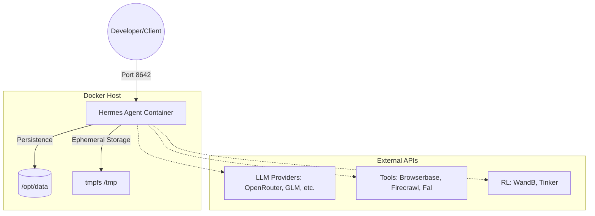

# Root — coolify-docker-compose.yaml

# Hermes Agent Deployment Configuration (`coolify-docker-compose.yaml`)

The `coolify-docker-compose.yaml` file defines the production-grade container orchestration for the **Hermes Agent**. This configuration is specifically hardened for secure deployment, likely within a [Coolify](https://coolify.io/) environment or similar self-hosted Docker infrastructure.

## Service Architecture

The configuration defines a single service, `hermes`, which encapsulates the agent's logic, LLM integrations, and tool execution environments.

## Security Hardening

A primary feature of this configuration is its "Secure-by-Default" posture. The container is heavily restricted to prevent privilege escalation and limit the blast radius of potential exploits:

| Directive | Purpose |
| :--- | :--- |
| `read_only: true` | Prevents modifications to the container's root filesystem. |
| `security_opt: [no-new-privileges:true]` | Prevents processes from gaining new privileges via `setuid` or `setgid` binaries. |
| `cap_drop: [ALL]` | Drops all Linux capabilities; the container runs with the bare minimum permissions. |
| `pids_limit: 256` | Prevents fork-bomb attacks by limiting the number of concurrent processes. |
| `tmpfs: [/tmp]` | Provides a small (128MB), non-executable memory-backed storage for temporary files. |

## Environment Configuration

The module relies heavily on environment variables to configure the agent's intelligence and toolset. These are categorized as follows:

### 1. LLM Providers
The agent supports multiple backends. While `OPENROUTER_API_KEY` and `LLM_MODEL` are the primary defaults, placeholders exist for:
*   **Regional/Specific Providers:** GLM (Zhipu AI), Kimi (Moonshot), MiniMax.
*   **Specialized Providers:** OpenCode Zen, OpenCode Go.
*   **Open Source:** Hugging Face Inference Providers (`HF_TOKEN`).

### 2. Tooling & Integration
*   **Search & Crawling:** `EXA_API_KEY`, `FIRECRAWL_API_KEY`.
*   **Execution Environments:** 
    *   **Terminal:** Configures a `mini-swe-agent` backend using the `nikolaik/python-nodejs` image with specific timeouts (`TERMINAL_TIMEOUT`, `TERMINAL_LIFETIME_SECONDS`).
    *   **Browser:** Integrates with **Browserbase** for headless navigation, including stealth and proxy settings.
*   **Media & Voice:** `FAL_KEY` for image generation and `VOICE_TOOLS_OPENAI_KEY` for TTS/transcription.

### 3. Observability & Training
*   **Debug Flags:** Individual toggles for `WEB_TOOLS`, `VISION_TOOLS`, `MOA_TOOLS`, and `IMAGE_TOOLS`.
*   **Reinforcement Learning:** Integration with `WANDB_API_KEY` (Weights & Biases) and `TINKER_API_KEY` for agent training and tracking.

## Infrastructure Requirements

### Networking
The service exposes port `8642` bound to `127.0.0.1`. This ensures the agent is only accessible locally or via a reverse proxy (like Nginx or Traefik) managed by Coolify, preventing direct exposure to the public internet.

### Persistence
The configuration maps a host directory to the internal data store:
*   **Host Path:** `/home/limcheekin/docker/volumes/hermes-agent`
*   **Container Path:** `/opt/data`

### Health Monitoring
The container includes a health check that polls the internal API:
*   **Endpoint:** `http://localhost:8642/health`
*   **Interval:** 30 seconds.
*   **Start Period:** 20 seconds (allows the agent and LLM connections to initialize before failing health checks).

## Deployment Notes

To deploy this module:
1. Ensure the host volume path exists or update it to your environment's standard.
2. Populate the `.env` file with the required API keys (specifically `OPENROUTER_API_KEY`).
3. The build context is set to `.`, requiring the `Dockerfile` to be present in the same directory as this compose file.