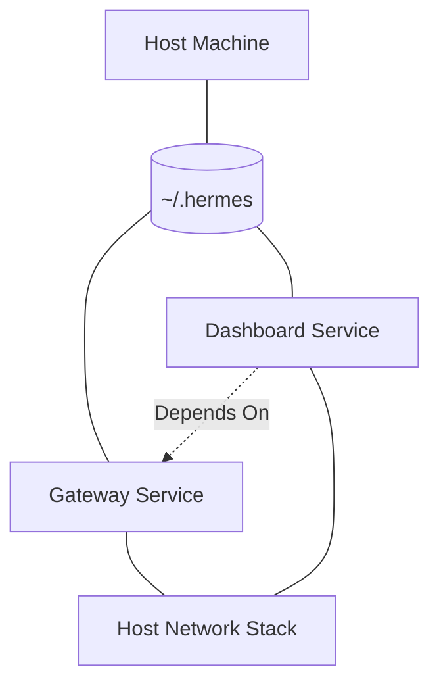

# Root — docker-compose.yml

# Hermes Agent Orchestration (docker-compose.yml)

The `docker-compose.yml` file defines the multi-container architecture for the Hermes Agent. It orchestrates two primary services—the **Gateway** and the **Dashboard**—ensuring they share the same persistent data volume and networking stack.

## Service Architecture

The deployment consists of two services built from the same `hermes-agent` image but executing different entrypoint commands.



### 1. Gateway Service (`gateway`)
The Gateway is the core engine of the Hermes Agent.
- **Command**: `gateway run`
- **Role**: Handles LLM interactions, tool execution, and external integrations (like Microsoft Teams).
- **Networking**: Uses `network_mode: host` to allow direct communication with local services and simplify port management for integrations.

### 2. Dashboard Service (`dashboard`)
The Dashboard provides a web-based UI for managing the agent, configuring API keys, and monitoring activity.
- **Command**: `dashboard --host 127.0.0.1 --no-open`
- **Role**: Management interface.
- **Security**: By default, it binds to `127.0.0.1`. This prevents the dashboard (which handles sensitive API keys) from being exposed to the local network or the internet without an explicit proxy or SSH tunnel.

## User and Permission Management

To prevent file permission conflicts between the container and the host, the module utilizes environment variables to synchronize the internal `hermes` user with the host user.

| Variable | Default | Description |
| :--- | :--- | :--- |
| `HERMES_UID` | `10000` | The UID of the host user owning `~/.hermes`. |
| `HERMES_GID` | `10000` | The GID of the host user owning `~/.hermes`. |

**Usage Pattern:**
```bash
HERMES_UID=$(id -u) HERMES_GID=$(id -g) docker compose up -d
```
The container entrypoint uses these values via `usermod`/`groupmod` and `gosu` to ensure that files created in `/opt/data` (mapped to `~/.hermes`) remain owned by the host user.

## Configuration and Integrations

The services are configured primarily through environment variables passed into the `gateway` service.

### OpenAI-Compatible API Server
The Gateway can act as an API server. This is disabled by default for security. To enable it, both variables must be set:
- `API_SERVER_HOST`: Set to `0.0.0.0` to expose the API.
- `API_SERVER_KEY`: A mandatory authentication key.

### Microsoft Teams Gateway
To enable the Teams integration, the following variables must be uncommented and populated:
- `TEAMS_CLIENT_ID`
- `TEAMS_CLIENT_SECRET`
- `TEAMS_TENANT_ID`
- `TEAMS_ALLOWED_USERS`: A comma-separated list of authorized users.
- `TEAMS_PORT`: Defaults to `3978`.

## Persistence

Both services mount the host directory `~/.hermes` to `/opt/data` inside the container. This directory stores:
- SQLite databases for state and history.
- Encrypted API keys and configuration.
- Logs and temporary session data.

## Security Best Practices

1.  **Network Isolation**: The Dashboard is restricted to `localhost`. For remote access, use an SSH tunnel:
    `ssh -L 9119:localhost:9119 user@remote-host`
2.  **API Exposure**: Do not set `API_SERVER_HOST=0.0.0.0` without a strong `API_SERVER_KEY`.
3.  **Root Access**: The services run as a non-root `hermes` user inside the container, mapped to your host user via the `HERMES_UID/GID` logic.