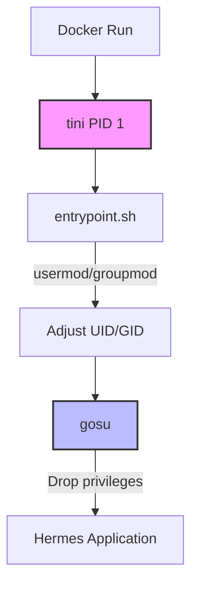

# Root — Dockerfile

# Root — Dockerfile

The root `Dockerfile` defines the production container image for the Hermes application. It is responsible for packaging a complex environment that includes a Python backend, a Node.js-based web dashboard, a Terminal UI (TUI), and system-level dependencies like Playwright browsers. 

The build process is heavily optimized for Docker layer caching and is designed to handle dynamic runtime user permissions safely.

## Architecture & Execution Flow

The container uses a multi-stage build to pull pre-compiled binaries (`uv` and `gosu`) before assembling the final Debian-based image. At runtime, the container starts as `root` to allow permission adjustments, then drops privileges before executing the main application.



## Key Components

### 1. Binary Sourcing (Multi-stage)
Instead of installing package managers and utilities via `apt` or `curl` scripts in the main image, the Dockerfile uses the `AS <name>` pattern to pull specific versions of binaries from external images:
*   **`uv_source`**: Pulls the Astral `uv` binary (v0.11.6) for fast Python dependency resolution and virtual environment management.
*   **`gosu_source`**: Pulls `gosu` (v1.19) to handle safe privilege dropping at runtime without the unpredictable signal-handling behavior of `su` or `sudo`.

### 2. Process Management (`tini`)
The container installs and uses `tini` as its `ENTRYPOINT`. Because Hermes spawns numerous subprocesses (e.g., MCP stdio subprocesses, `git`, `bun`), running Hermes directly as PID 1 would result in orphaned zombie processes accumulating over time. `tini` acts as a lightweight init system that properly reaps these zombies.

### 3. Node.js & UI Build Caching
The Dockerfile employs a specific layer-caching strategy for Node.js dependencies to speed up rebuilds:
*   **Manifest Copying**: `package.json` and `package-lock.json` files for the root, `web/`, and `ui-tui/` directories are copied first.
*   **The `hermes-ink` Workspace**: The `ui-tui/packages/hermes-ink/` directory is copied *in full* during the manifest stage. This is required because `ui-tui/package.json` references it as a `file:` workspace dependency. If only the manifest were copied, `npm` would fail to resolve the workspace content.
*   **Symlink Enforcement**: The environment variable `npm_config_install_links=false` is explicitly set. Debian 13 ships with npm 9.x (which copies `file:` dependencies by default), while the host uses npm 10+ (which symlinks them). Forcing symlinks prevents a lockfile mismatch that would otherwise trigger the TUI launcher (`_tui_need_npm_install()`) to attempt a runtime `npm install`, which would fail due to read-only permissions.

### 4. Playwright Browser Storage
Playwright browsers are installed during the build phase. To ensure these browsers are not overwritten or hidden when the user mounts a volume to `/opt/data` at runtime, the installation path is explicitly moved via:
```dockerfile
ENV PLAYWRIGHT_BROWSERS_PATH=/opt/hermes/.playwright
```

### 5. Python Environment
Python dependencies are managed using `uv`. The Dockerfile creates a virtual environment (`uv venv`) and installs the local package with all optional dependencies (`uv pip install --no-cache-dir -e ".[all]"`).

### 6. Runtime Permissions & User Management
The container is designed to run securely while interacting with host-mounted files:
*   A default non-root user `hermes` (UID 10000) is created with `/opt/data` as its home directory.
*   The entire `/opt/hermes` installation directory is made world-readable and traversable (`chmod -R a+rX /opt/hermes`).
*   **Dynamic UID Mapping**: The container intentionally starts as `root`. This allows `/opt/hermes/docker/entrypoint.sh` to read the `HERMES_UID` environment variable, modify the `hermes` user's UID/GID to match the host user, and then use `gosu` to step down from `root` to the newly mapped user before launching the application.

## Environment Variables

| Variable | Purpose |
| :--- | :--- |
| `PYTHONUNBUFFERED=1` | Disables Python stdout buffering so logs stream immediately to the container output. |
| `PLAYWRIGHT_BROWSERS_PATH` | Relocates Playwright binaries to `/opt/hermes/.playwright` to survive volume overlays. |
| `npm_config_install_links` | Set to `false` to force symlinking of local workspace packages, preventing runtime lockfile conflicts. |
| `HERMES_WEB_DIST` | Points the backend to the built static assets for the web dashboard (`/opt/hermes/hermes_cli/web_dist`). |
| `HERMES_HOME` | Sets the application home directory to the mountable volume (`/opt/data`). |
| `PATH` | Prepends `/opt/data/.local/bin` to ensure user-installed runtime binaries take precedence. |

## Volumes
*   **`/opt/data`**: The primary volume mount point. This is used for persistent storage of user data, configuration, and runtime artifacts. It also serves as the home directory for the `hermes` user.