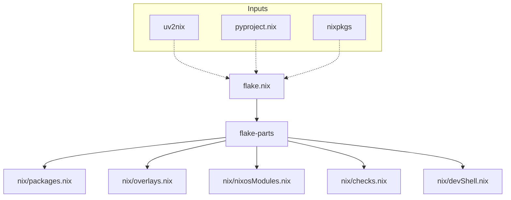

# Root — flake.nix

# Hermes Agent: Root Flake Configuration

The `flake.nix` file serves as the entry point for the Hermes Agent development environment, build system, and deployment configurations. It leverages the **Nix** ecosystem to provide reproducible builds, cross-platform development shells, and dependency management for both Python and Node.js components.

## Architecture Overview

The project utilizes `flake-parts` to maintain a modular structure. Instead of a monolithic `flake.nix`, the logic is distributed across specialized modules located in the `./nix` directory.



## Key Inputs

The flake defines several critical dependencies to handle the polyglot nature of the Hermes Agent:

*   **nixpkgs (nixos-unstable)**: The primary package repository.
*   **flake-parts**: Simplifies the multi-system flake structure by providing a module system for `outputs`.
*   **uv2nix & pyproject-nix**: These inputs are used to translate `pyproject.toml` and `uv.lock` files into Nix derivations. This allows the project to use the `uv` package manager's speed while maintaining Nix's reproducibility.
*   **npm-lockfile-fix**: A utility to ensure Node.js lockfiles are compatible with Nix's sandboxed environment.

## Supported Systems

The configuration explicitly supports the following architectures:
*   `x86_64-linux`
*   `aarch64-linux`
*   `aarch64-darwin` (Apple Silicon)

## Module Structure

The `outputs` are generated by importing specific logic from the `./nix` directory. Developers looking to modify the build or environment should look into these files:

| Module | Responsibility |
| :--- | :--- |
| `nix/packages.nix` | Defines the primary build outputs for the Hermes Agent. |
| `nix/overlays.nix` | Contains modifications to standard `nixpkgs` or custom package overrides. |
| `nix/nixosModules.nix` | Provides NixOS service definitions for deploying the agent as a system service. |
| `nix/checks.nix` | Defines CI tests, linting, and formatting checks. |
| `nix/devShell.nix` | Configures the `nix develop` environment, including Python interpreters and CLI tools. |

## Usage for Developers

### Entering the Development Environment
To load the development environment (including all Python dependencies and system libraries):
```bash
nix develop
```

### Building the Project
To build the default package defined in `nix/packages.nix`:
```bash
nix build
```

### Running Checks
To execute the test suite and linters defined in `nix/checks.nix`:
```bash
nix flake check
```