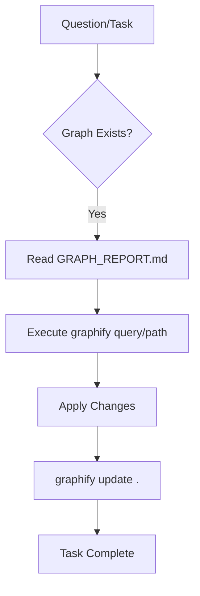

# Root — GEMINI.md

# Root — GEMINI.md (AI Context & Graphify Integration)

The `GEMINI.md` file serves as a protocol definition for AI agents (specifically LLMs like Gemini) and developers interacting with the project's knowledge graph. It establishes a standardized workflow for codebase exploration, architectural analysis, and graph maintenance using the `graphify` toolset.

## Purpose

The primary goal of this module is to shift codebase navigation from manual file scanning (grep/find) to semantic and structural graph traversal. By leveraging a pre-computed knowledge graph located in `graphify-out/`, the AI can understand high-level community structures, "god nodes" (highly coupled components), and inferred relationships that are not immediately obvious through static analysis alone.

## Knowledge Graph Structure

The project's metadata is stored in the `graphify-out/` directory. The documentation defines a hierarchy for information retrieval:

1.  **Architectural Overview**: `graphify-out/GRAPH_REPORT.md` contains the macro-view of the system, identifying central hubs and module clusters.
2.  **Navigational Index**: If available, `graphify-out/wiki/index.md` acts as the entry point for human-readable documentation generated from the graph.
3.  **Raw Data**: The underlying graph edges (both extracted via AST and inferred via logic) are queried via the CLI.

## Graphify Workflow

The module dictates a specific sequence for interacting with the codebase:



### 1. Discovery and Analysis
Instead of traditional text searches, the documentation mandates the use of the `graphify` CLI for cross-module relationship analysis. This is particularly useful for "How does X relate to Y" questions where the connection might be several hops away in the call graph.

| Command | Usage | Purpose |
|:---|:---|:---|
| `graphify query "<question>"` | Semantic Search | Finds nodes and edges relevant to a natural language query. |
| `graphify path "<a>" "<b>"` | Traceability | Identifies the specific chain of dependencies or calls between two modules. |
| `graphify explain "<concept>"`| Contextualization | Provides a high-level summary of a specific architectural concept based on graph density. |

### 2. Maintenance Lifecycle
To prevent "knowledge drift," the graph must be synchronized with the source code. The documentation specifies that after any file modification, the following command must be executed:

```bash
graphify update .
```

This performs an **AST-only update**, meaning it re-parses the local file structure to refresh edges and nodes without incurring external API costs.

## Operational Rules for AI Agents

*   **Prefer Graph over Grep**: Do not use `grep` for architectural questions. Use `graphify path` to find hidden dependencies.
*   **Wiki First**: Always check `graphify-out/wiki/index.md` before reading raw source files to understand the intended design patterns.
*   **Mandatory Updates**: Every coding session that results in a disk write must conclude with a graph update to ensure subsequent queries are accurate.