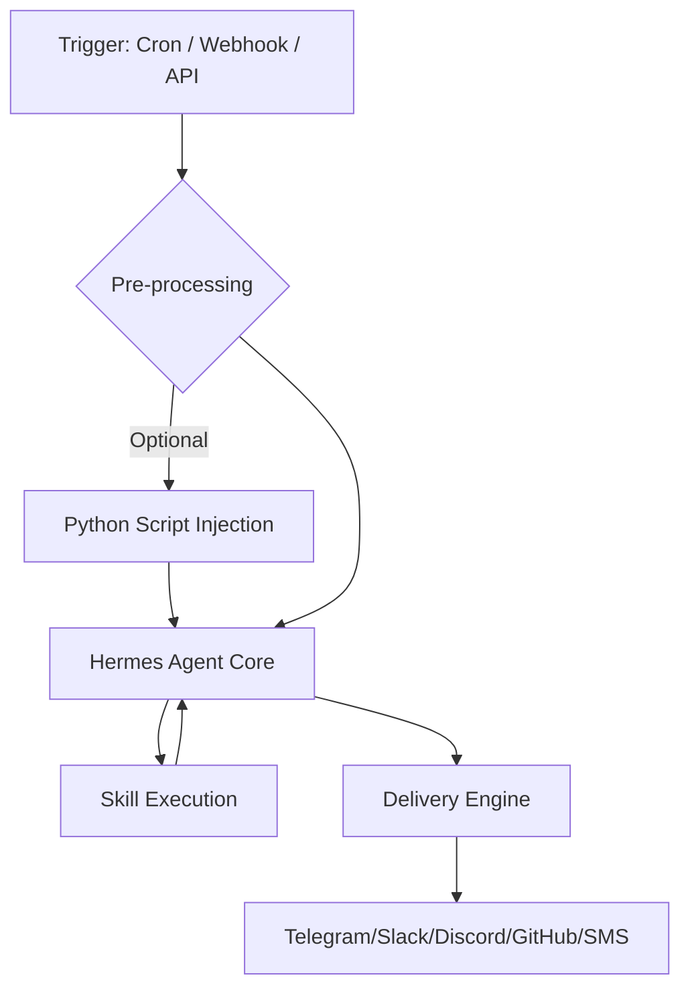

# Root — hermes-already-has-routines.md

# Hermes Agent Automation & Routines

The Hermes Agent provides a robust automation framework that allows developers to schedule tasks, respond to external events via webhooks, and chain complex workflows. This system predates similar industry offerings and is designed to be model-agnostic, self-hosted, and extensible via Python scripts and specialized skills.

## Core Automation Architecture

Hermes automations operate on a "Trigger-Process-Deliver" pipeline. Unlike standard agentic loops, these routines are designed for headless execution on your own infrastructure.



## Trigger Mechanisms

Hermes supports three primary methods for initiating an automated routine.

### 1. Scheduled Tasks (Cron)
The `hermes cron` command allows for time-based execution using standard cron syntax or human-readable intervals.

*   **Command:** `hermes cron create`
*   **Key Arguments:**
    *   `schedule`: A cron expression (e.g., `"0 2 * * *"`) or interval (e.g., `"every 1h"`).
    *   `prompt`: The instruction for the agent to execute.
    *   `--deliver`: The output destination.

**Example:**
```bash
hermes cron create "0 2 * * *" \
  "Pull the top bug from the issue tracker, attempt a fix, and open a draft PR." \
  --name "Nightly bug fix" \
  --deliver telegram
```

### 2. GitHub Event Triggers
Hermes can subscribe to specific GitHub repository events. This requires the `hermes gateway` to be active to receive incoming webhooks.

*   **Command:** `hermes webhook subscribe`
*   **Key Arguments:**
    *   `--events`: Comma-separated list of GitHub events (e.g., `pull_request`, `push`, `issues`).
    *   `--prompt`: Supports template variables injected from the GitHub payload (e.g., `{pull_request.number}`).

**Example:**
```bash
hermes webhook subscribe auth-watch \
  --events "pull_request" \
  --prompt "Review PR #{pull_request.number}: {pull_request.title}. Check for auth-provider changes." \
  --deliver slack
```

### 3. Generic API Triggers
Any external service can trigger a Hermes routine by POSTing to a webhook route. Hermes supports HMAC authentication for secure API triggers.

**Example:**
```bash
hermes webhook subscribe alert-triage \
  --prompt "Alert: {alert.name}. Find the owning service and post a triage summary." \
  --deliver slack
```

## Advanced Execution Features

### Script Injection (`--script`)
Before the LLM processes the prompt, Hermes can execute a local Python script. The `stdout` of this script is injected into the agent's context. This is used for:
*   Fetching dynamic data not available via MCP.
*   Performing heavy computation or data filtering.
*   Implementing "Silent" logic (e.g., if the script outputs `[SILENT]`, the agent suppresses delivery).

```bash
hermes cron create "every 1h" \
  "Summarize changes if detected." \
  --script ~/.hermes/scripts/watch-site.py \
  --deliver telegram
```

### Multi-Skill Chaining (`--skills`)
Automations can be granted specific capabilities by loading one or more skills. Skills are modular tools that the agent can invoke to interact with external environments (e.g., ArXiv, Obsidian, GitHub).

```bash
hermes cron create "0 8 * * *" \
  "Search arXiv for papers on LLMs. Save to Obsidian." \
  --skills "arxiv,obsidian" \
  --deliver local
```

## Delivery Engine

The `--deliver` flag determines where the final output of the routine is sent. Hermes supports a wide array of delivery targets:

| Target | Format | Description |
| :--- | :--- | :--- |
| `telegram` | `--deliver telegram` | Sends to the default configured Telegram channel. |
| `slack` | `--deliver slack` | Sends to the configured Slack workspace/channel. |
| `discord` | `--deliver discord` | Sends to a Discord webhook or bot channel. |
| `sms` | `--deliver sms:+1555...` | Sends a text message via configured SMS gateway. |
| `github_comment`| `--deliver github_comment` | Posts the output as a comment on the triggering PR/Issue. |
| `local` | `--deliver local` | Saves the output to a local log file; no external notification. |

## Configuration and Setup

To enable the automation infrastructure, the gateway must be initialized to handle incoming webhooks and the scheduler must be active.

1.  **Initialize:** `hermes setup`
2.  **Enable Webhooks:** `hermes gateway setup`
3.  **Verify Routines:** Use `hermes cron list` or `hermes webhook list` to inspect active automations.

## Comparison with Cloud-Locked Alternatives

| Feature | Hermes Agent | Cloud-Locked Routines |
| :--- | :--- | :--- |
| **Model Choice** | Any (Claude, GPT, Local, etc.) | Provider-specific |
| **Limits** | Unlimited (User-controlled) | Capped (e.g., 5-25/day) |
| **Data Residency** | Local/Private Infrastructure | Provider Cloud |
| **Pre-processing** | Python Script Injection | None |
| **Extensibility** | Open Source (MIT) | Proprietary |