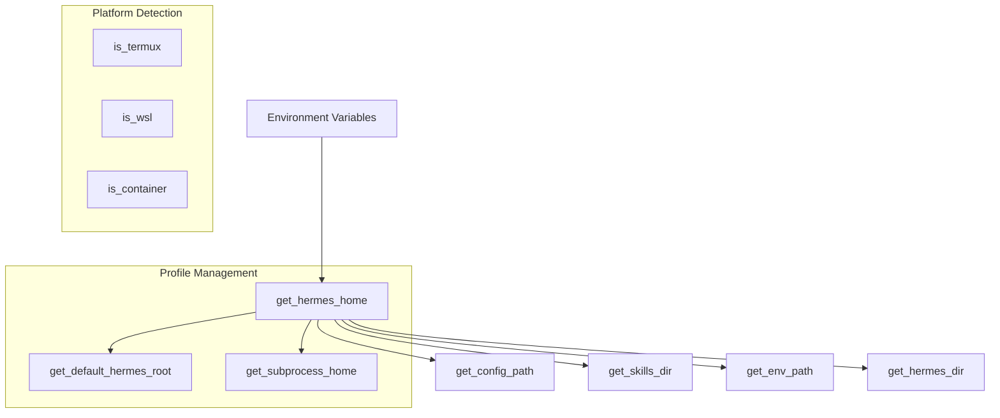

# Root — hermes_constants.py

# Root — hermes_constants.py

The `hermes_constants.py` module serves as the single source of truth for path resolution, environment detection, and global configuration constants within the Hermes Agent. 

It is designed to be **import-safe**, meaning it has zero internal dependencies within the Hermes codebase. This allows it to be imported by any module—including low-level utilities and high-level CLI commands—without the risk of circular dependencies.

## Path Resolution Strategy

The module manages a hierarchical path resolution system that supports standard installations, Docker containers, and multi-profile environments.

### Core Path Functions

*   **`get_hermes_home()`**: Returns the active Hermes data directory. It checks the `HERMES_HOME` environment variable, falling back to `~/.hermes`. 
    *   *Safety Mechanism:* If `HERMES_HOME` is unset but a non-default profile is marked as active in `~/.hermes/active_profile`, the function emits a one-shot warning to `stderr`. This prevents silent data corruption where a process might accidentally write to the default profile instead of the intended active one.
*   **`get_default_hermes_root()`**: Used for profile-level operations (e.g., listing all available profiles). It identifies the "parent" directory containing the `profiles/` subdirectory, regardless of whether the agent is running in a standard or custom Docker layout.
*   **`get_hermes_dir(new_subpath, old_name)`**: A migration-friendly helper. It checks if `old_name` exists (e.g., `image_cache`); if so, it returns that path. Otherwise, it returns the `new_subpath` (e.g., `cache/images`). This allows the codebase to evolve its directory structure without breaking existing installations.

### Well-Known Paths
The module provides standardized accessors for frequently used files to prevent hardcoding strings across the repository:
*   `get_config_path()`: Resolves to `config.yaml`.
*   `get_env_path()`: Resolves to `.env`.
*   `get_skills_dir()`: Resolves to the `skills/` directory.
*   `get_optional_skills_dir()`: Resolves to `optional-skills/`, honoring the `HERMES_OPTIONAL_SKILLS` override used by package managers.

## Environment Detection

Hermes adjusts its behavior based on the host environment. These functions are cached after the first call to minimize filesystem I/O.

| Function | Detection Logic | Use Case |
| :--- | :--- | :--- |
| `is_termux()` | Checks `TERMUX_VERSION` or `PREFIX`. | Adjusting audio/microphone commands for Android. |
| `is_wsl()` | Checks `/proc/version` for "microsoft". | Handling Windows-specific pathing or interop. |
| `is_container()` | Checks `/.dockerenv`, `/run/.containerenv`, or cgroups. | Determining persistence requirements and audio drivers. |

## Subprocess Isolation

**`get_subprocess_home()`** implements a critical isolation feature. If a directory named `home/` exists within the current `HERMES_HOME`, this function returns its path. 

Subprocess spawners (like the Kanban dispatcher or Systemd templates) use this value to set the `HOME` environment variable for child processes. This ensures that tools like `git`, `ssh`, and `npm` write their configurations and caches inside the Hermes profile rather than the system user's home directory, facilitating:
1.  **Docker Persistence:** Configs stay within the mounted volume.
2.  **Profile Isolation:** Different profiles can maintain distinct SSH keys or Git identities.

## Network and API Constants

### IPv4 Preference
**`apply_ipv4_preference(force=False)`** addresses issues where broken IPv6 stacks cause long timeouts in libraries like `httpx` or the OpenAI SDK. When enabled via `network.force_ipv4` in `config.yaml`, it monkey-patches `socket.getaddrinfo` to prioritize `AF_INET` (IPv4) resolutions while falling back to IPv6 only if no A record is found.

### External Endpoints
The module defines standard base URLs for external services:
*   `OPENROUTER_BASE_URL`: `https://openrouter.ai/api/v1`
*   `AI_GATEWAY_BASE_URL`: `https://ai-gateway.vercel.sh/v1`

## Reasoning Effort Configuration

**`parse_reasoning_effort(effort)`** standardizes the "reasoning effort" parameter used by modern LLMs (e.g., O1/O3 models). It maps string inputs (`minimal`, `low`, `medium`, `high`, `xhigh`) into a configuration dictionary:
*   Input `"none"` returns `{"enabled": False}`.
*   Valid levels return `{"enabled": True, "effort": <level>}`.
*   Invalid or empty inputs return `None`, signaling the caller to use defaults.

## Architecture Overview

