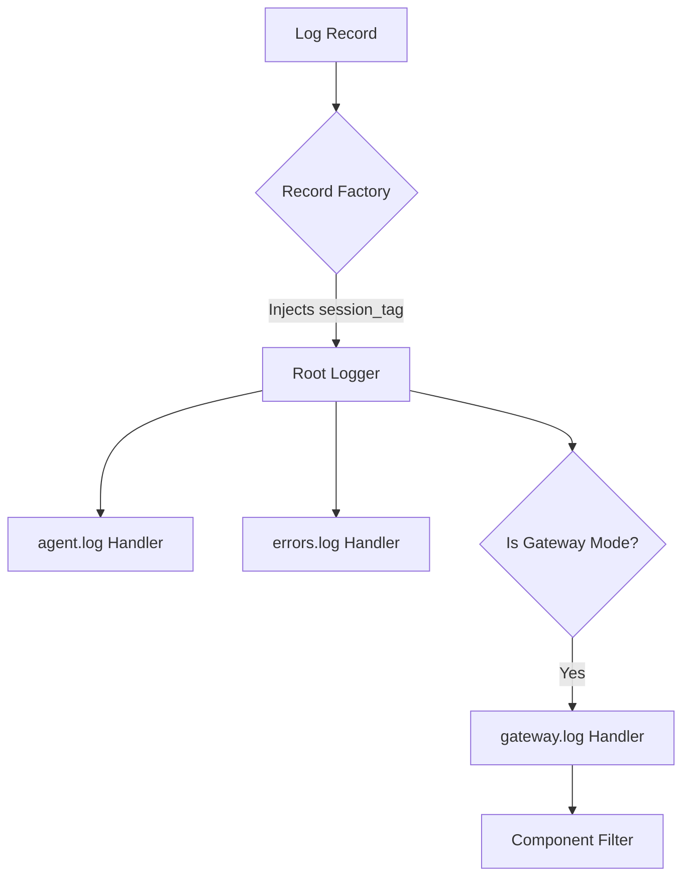

# Root — hermes_logging.py

# Root — hermes_logging.py

The `hermes_logging.py` module provides a centralized logging infrastructure for the Hermes Agent. It handles multi-file logging, secret redaction, thread-local session context injection, and environment-specific file permissions.

## Core Architecture

Hermes uses a multi-handler approach where log records are routed to different files based on their severity and component origin. All logs are stored in `~/.hermes/logs/` (or the path defined by `get_hermes_home()`).

### Log Files
| File | Level | Description |
| :--- | :--- | :--- |
| `agent.log` | `INFO`+ | The primary log file. Captures all activity across the agent, tools, and sessions. |
| `errors.log` | `WARNING`+ | A high-priority log for triage, containing only warnings and errors. |
| `gateway.log` | `INFO`+ | Created only when `mode="gateway"`. Contains records from the `gateway.*` namespace. |

### Log Flow Diagram



## Initialization

### `setup_logging()`
This is the primary entry point, typically called early in the CLI or Gateway startup sequence. It is idempotent; subsequent calls return the log directory path without reconfiguring handlers unless `force=True` is passed.

**Key Behaviors:**
- **Configuration Discovery:** Attempts to read `level`, `max_size_mb`, and `backup_count` from `config.yaml` via `_read_logging_config()`.
- **Redaction:** Uses `RedactingFormatter` (from `agent.redact`) to ensure sensitive data (keys, tokens) is stripped before writing to disk.
- **Noise Reduction:** Automatically sets noisy third-party loggers (e.g., `openai`, `httpx`, `urllib3`) to `WARNING` level to keep logs actionable.

### `setup_verbose_logging()`
Enables `DEBUG` level logging to the console (`stderr`). This is triggered by the `--verbose` or `-v` flags in the CLI. It uses a more detailed format string (`_LOG_FORMAT_VERBOSE`) including high-resolution timestamps.

## Session Context Tracking

To correlate logs across complex asynchronous operations, the module uses thread-local storage to track session IDs.

### Usage
```python
from hermes_logging import set_session_context, clear_session_context

def run_conversation(session_id):
    set_session_context(session_id)
    try:
        # All logs emitted here include [session_id]
        logger.info("Processing request") 
    finally:
        clear_session_context()
```

### Implementation Details
The module installs a global `LogRecord` factory via `_install_session_record_factory()`. Unlike a standard filter, this factory runs for every record created in the process. It injects a `session_tag` attribute into every record:
- If a session ID is set in the current thread: ` [session_id]`
- If no session ID is set: An empty string `""`

This prevents `KeyError` exceptions in format strings that expect `%(session_tag)s`.

## Component Filtering

The `_ComponentFilter` class routes logs to specific files based on logger name prefixes. This is primarily used to isolate gateway events (platform adapters, slash commands, delivery) into `gateway.log` while allowing `agent.log` to remain a catch-all for the entire system.

The `COMPONENT_PREFIXES` mapping defines these boundaries:
- **gateway**: `gateway`
- **agent**: `agent`, `run_agent`, `model_tools`, `batch_runner`
- **tools**: `tools`
- **cli**: `hermes_cli`, `cli`

## Managed Environment Support

### `_ManagedRotatingFileHandler`
In managed environments (like NixOS), Hermes may run in a context where multiple users or services need access to the same log files. 

This subclass of `RotatingFileHandler` ensures that:
1. New log files are created with `0660` permissions (read/write for owner and group).
2. Rotated files (e.g., `agent.log.1`) maintain these permissions.

It checks `hermes_cli.config.is_managed()` to determine if these permission overrides should be applied.

## Internal Helpers

- **`_add_rotating_handler`**: An idempotent helper that attaches a `RotatingFileHandler` to a logger only if a handler for that specific file path does not already exist.
- **`_read_logging_config`**: Performs a best-effort read of the `logging` block in `config.yaml`. It is designed to fail silently if the config file is missing or malformed, falling back to hardcoded defaults.