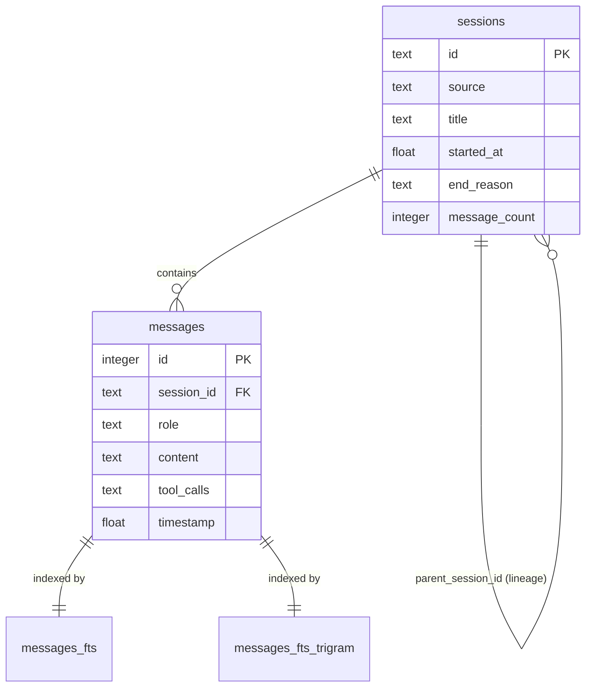

# Root — hermes_state.py

# Root — hermes_state.py

The `hermes_state.py` module provides a persistent SQLite-backed state store for the Hermes Agent. It replaces legacy JSONL-based storage with a centralized database capable of handling concurrent access, full-text search (FTS5), and complex session lineages.

## Core Architecture

The module is centered around the `SessionDB` class, which manages a SQLite database (defaulting to `~/.hermes/state.db`). 

### Concurrency and Write-Contention
To support multi-platform gateway usage (e.g., Telegram, Discord, and CLI simultaneously), the database operates in **WAL (Write-Ahead Logging) mode**. 

A key design decision is the implementation of a custom application-level retry mechanism for writes. Instead of relying on SQLite's deterministic busy handler, which can cause "convoy effects" (multiple processes waking up and colliding simultaneously), `SessionDB` uses:
- **`BEGIN IMMEDIATE`**: Acquires the write lock at the start of the transaction.
- **Jittered Retries**: If the database is locked, the process sleeps for a random interval (20ms–150ms) before retrying.
- **Passive Checkpoints**: Every 50 writes, the module attempts a `wal_checkpoint(PASSIVE)` to keep the WAL file size under control without blocking readers.

### Declarative Schema Management
The module uses a declarative reconciliation pattern for schema updates. `SCHEMA_SQL` serves as the single source of truth. On startup, `_reconcile_columns` compares the live database schema against the SQL definition and automatically executes `ALTER TABLE ... ADD COLUMN` for any missing fields. This eliminates the need for manual migration scripts for simple column additions.

## Data Model

### Session Lineage and Compression
Hermes supports long-running conversations through "compression." When a session context becomes too large, it is ended with `end_reason = 'compression'` and a new child session is created.
- **`get_compression_tip(session_id)`**: Walks the chain of compressed sessions to find the current "live" session ID.
- **`list_sessions_rich`**: By default, projects compression roots forward. This means a user sees one logical conversation in their history, even if it consists of multiple underlying database sessions.

### Message Storage
Messages are stored with support for multimodal content. Since SQLite cannot natively store Python lists or dicts, `SessionDB` uses a serialization trick:
- **Encoding**: Structured content (like image parts) is JSON-serialized and prefixed with a NUL-byte sentinel (`\x00json:`).
- **Decoding**: The `_decode_content` method detects this prefix and restores the original Python structure.

## Search Engine

The module implements two distinct FTS5 virtual tables to handle global message search:

1.  **`messages_fts`**: Uses the standard `unicode61` tokenizer. It is optimized for Western languages and handles prefix matching (e.g., `deploy*`).
2.  **`messages_fts_trigram`**: Uses a trigram tokenizer. This is specifically included to support **CJK (Chinese, Japanese, Korean)** characters and substring searches that the standard tokenizer fails to index correctly.

The `search_messages` function automatically routes queries:
- Queries with $\ge 3$ CJK characters use the trigram index.
- Short CJK queries (1-2 characters) fall back to a standard `LIKE` search.
- Standard text queries use the primary FTS5 index.

## Session Title Management

Titles are managed with strict sanitization and lineage logic:
- **`sanitize_title`**: Strips ASCII/Unicode control characters, collapses whitespace, and enforces a 100-character limit.
- **Lineage Numbering**: If a user tries to reuse a title or branches a session, `get_next_title_in_lineage` generates a numbered suffix (e.g., "Project Alpha #2").
- **Resolution**: `resolve_session_by_title` allows looking up sessions by their human-readable name, preferring the latest continuation in a numbered chain.

## Maintenance and Cleanup

The module includes self-healing and maintenance utilities:
- **`prune_empty_ghost_sessions`**: Removes TUI sessions that were started but never received messages and are older than 24 hours.
- **`maybe_auto_prune_and_vacuum`**: An idempotent maintenance task that deletes sessions older than a retention period (default 90 days) and runs `VACUUM` to reclaim disk space. It uses the `state_meta` table to ensure this only runs once every 24 hours.
- **`_remove_session_files`**: When a session is deleted from the DB, this helper also cleans up associated `.json` or `.jsonl` transcript files and gateway request dumps from the filesystem.

## Integration Patterns

- **CLI/TUI**: Uses `list_sessions_rich` to populate history views and `resolve_session_id` to allow users to resume sessions using short ID prefixes.
- **Gateway**: Relies on `get_messages_as_conversation` to reconstruct the full OpenAI-compatible message history, including replaying reasoning tokens and tool calls for model context.
- **Token Tracking**: `update_token_counts` is called after every LLM interaction to accumulate costs and usage metrics at the session level.