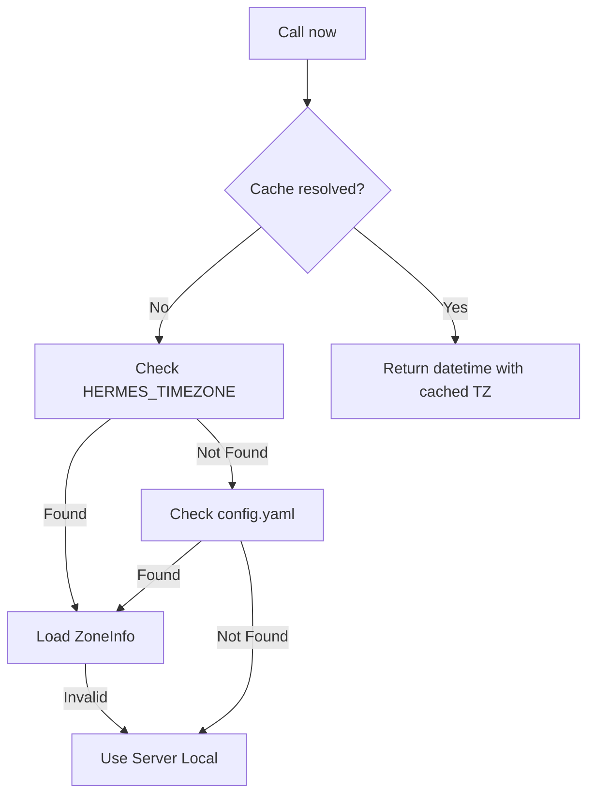

# Root — hermes_time.py

# hermes_time.py

The `hermes_time.py` module provides a centralized, timezone-aware clock for the Hermes system. It ensures that all time-based operations—such as job scheduling, execution logging, and timestamping—remain consistent regardless of the server's hardware clock settings.

## Core Functionality

The primary interface for this module is the `now()` function. Unlike the standard library's `datetime.now()`, which returns a naive object by default, `hermes_time.now()` always returns a **timezone-aware** datetime object.

### Timezone Resolution Hierarchy

The module resolves the active timezone once and caches the result. It searches for a configuration in the following order:

1.  **Environment Variable**: Checks `HERMES_TIMEZONE` (e.g., `America/New_York`).
2.  **Configuration File**: Reads the `timezone` key from `~/.hermes/config.yaml`.
3.  **System Default**: Falls back to the server's local timezone using `astimezone()`.

## API Reference

### `now() -> datetime`
The standard method for getting the current time. 
- If a valid IANA timezone is configured, it returns the wall-clock time for that zone.
- If no configuration exists or the configuration is invalid, it returns the system's local time with UTC offset information included.

### `get_timezone() -> Optional[ZoneInfo]`
Returns the currently active `zoneinfo.ZoneInfo` object. This is used internally by `now()` but can be accessed by other modules that need to perform manual conversions or comparisons. Returns `None` if the system is falling back to local time.

### `_resolve_timezone_name() -> str`
Internal helper that performs the I/O required to find the timezone string. It uses `get_config_path()` from `hermes_constants` to locate the YAML configuration.

## Caching and State

To avoid repeated file I/O and environment lookups, the module state is stored in three global variables:
- `_cached_tz`: The actual `ZoneInfo` object.
- `_cached_tz_name`: The string name of the timezone.
- `_cache_resolved`: A boolean flag indicating if resolution has occurred.

> **Note:** If the configuration file is modified while the process is running, the cache must be cleared to reflect changes. While the module defines the logic for caching, external callers should be aware that the first call to `now()` or `get_timezone()` locks in the setting.

## Error Handling and Resilience

A core design principle of `hermes_time.py` is that **time resolution must never crash the application.**

- **Invalid Timezones**: If a user provides a nonsense string (e.g., `timezone: "Mars/Base_Alpha"`), the `_get_zoneinfo` function catches the `KeyError`, logs a warning, and allows the system to fall back to the server's local time.
- **Missing Dependencies**: The module includes a fallback for `zoneinfo` (introduced in Python 3.9) via `backports.zoneinfo` to support older environments if necessary.
- **YAML Failures**: If `config.yaml` is malformed or inaccessible, the module silently ignores the error and proceeds to the next resolution step.

## Integration Points

This module is a critical dependency for the cron and job management systems:
- **`cron/scheduler.py`**: Uses `now()` in the `tick()` loop to determine if a job is due.
- **`cron/jobs.py`**: Uses `now()` to calculate `next_run` times, mark job completion, and compute "grace periods" for missed executions.
- **`tests/test_timezone.py`**: Extensively validates the resolution logic and ensures that the cache behaves correctly under different environment configurations.