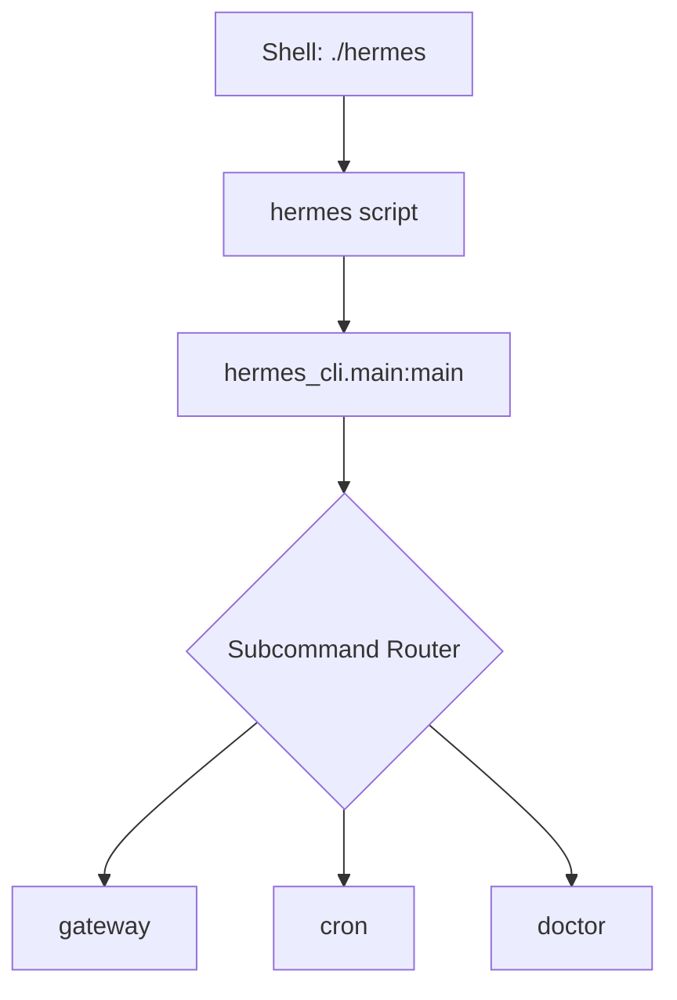

# Root — hermes

# Hermes CLI Entry Point (`hermes`)

The `hermes` module is the primary command-line interface (CLI) launcher for the Hermes Agent. It serves as a thin wrapper and entry point, delegating all execution logic to the `hermes_cli` package. This script is designed to provide a consistent interface for developers and operators, mimicking the behavior of the `hermes` command installed via `pip` or `setuptools`.

## Overview

The script acts as a bootstrap mechanism. When executed, it imports the core CLI logic and invokes the main execution loop. This structure keeps the root directory clean while ensuring the agent's functionality is accessible without needing to manually invoke the `hermes_cli` package via `python -m`.

### Key Responsibilities
- **Environment Initialization**: Provides the `__main__` entry point for the Python interpreter.
- **Command Delegation**: Routes all arguments to `hermes_cli.main.main()`.
- **Unified Interface**: Supports all agent subcommands, including `gateway`, `cron`, and `doctor`.

## Execution Flow

The execution flow is straightforward, moving from the shell environment into the structured CLI package.



## Usage

### Development
During development, you can run the agent directly from the repository root:

```bash
./hermes [subcommand] [options]
```

### Subcommands
The launcher supports the following primary subcommands defined in the `hermes_cli` package:

| Subcommand | Description |
| :--- | :--- |
| `gateway` | Starts the Hermes Agent gateway service. |
| `cron` | Executes scheduled tasks and maintenance routines. |
| `doctor` | Performs system health checks and diagnostic reporting. |

## Implementation Details

The module contains no business logic. It relies entirely on the `hermes_cli` package:

```python
if __name__ == "__main__":
    from hermes_cli.main import main
    main()
```

By importing `main` inside the `if __name__ == "__main__":` block, the script avoids unnecessary imports if the module is referenced elsewhere, though its primary purpose is strictly as an executable script.

## Integration with `hermes_cli`

The `hermes` script is the external-facing boundary. To modify CLI behavior, add new flags, or implement new subcommands, developers should look into the `hermes_cli/` directory rather than modifying this wrapper. This script assumes that the `hermes_cli` package is available in the `PYTHONPATH`.