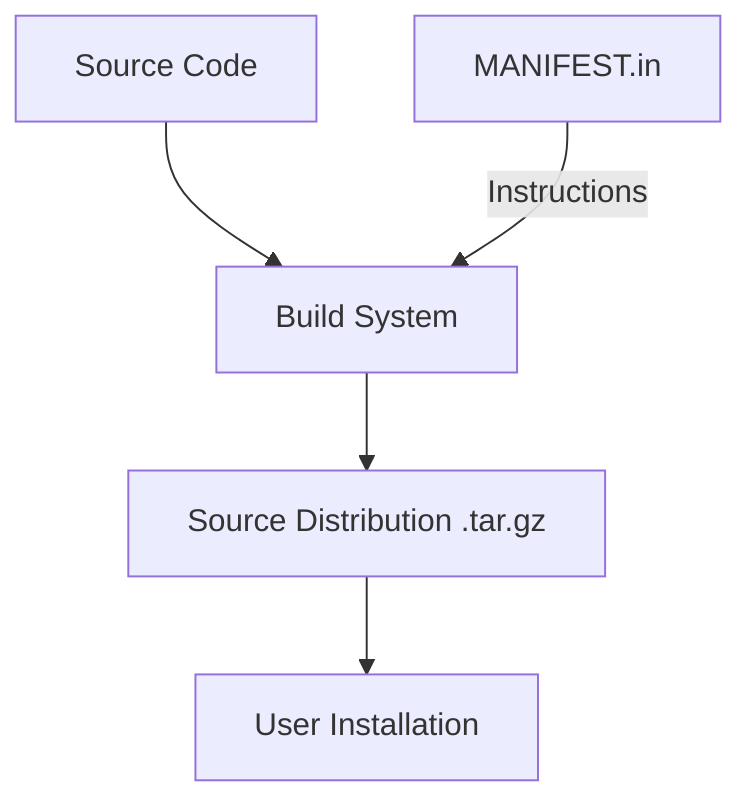

# Root — MANIFEST.in

# Root — MANIFEST.in

The `MANIFEST.in` file is a configuration file used by Python packaging tools (such as `setuptools`) to define which files and directories should be included in the Source Distribution (`sdist`). While `setuptools` automatically includes all Python modules tracked by the build system, `MANIFEST.in` is required to explicitly bundle non-code assets, data files, and specific directory structures.

## Packaging Directives

The file uses the following commands to manage the package contents:

### Directory Inclusion (`graft`)
The `graft` command recursively includes the entire contents of the specified directories, regardless of file extension.

*   **`graft skills`**: Includes all files within the core `skills` directory. This ensures that skill-specific metadata, JSON configurations, READMEs, or other non-Python assets are available when the package is installed.
*   **`graft optional-skills`**: Includes the entire `optional-skills` directory. This is critical for modular architectures where certain features are distributed alongside the core package but may not be imported by default.

### Global Exclusions (`global-exclude`)
To ensure the distribution remains clean and platform-independent, specific patterns are excluded globally, even if they reside within "grafted" directories.

*   **`global-exclude __pycache__`**: Prevents the inclusion of Python's automated bytecode cache directories.
*   **`global-exclude *.py[cod]`**: Prevents the inclusion of compiled Python files (`.pyc`, `.pyo`, or `.pyd`), ensuring that users compile the source for their specific environment upon installation.

## Integration in the Build Pipeline

The `MANIFEST.in` file is processed during the execution of build commands like `python -m build` or `python setup.py sdist`.

## Developer Impact

When contributing to this repository, developers should be aware of how `MANIFEST.in` affects their changes:

1.  **Adding New Skills**: If you create a new directory under `skills/` or `optional-skills/`, the `graft` commands will automatically pick up any new files (e.g., `.json`, `.yaml`, `.md`).
2.  **Adding New Root Directories**: If you add a new top-level directory containing non-Python assets (e.g., a `templates/` or `data/` folder), you **must** add a corresponding `graft <directory_name>` line to this file, or the files will be missing from the published package.
3.  **Testing Distributions**: To verify that the manifest is working correctly, run `python -m build --sdist` and inspect the resulting `.tar.gz` file in the `dist/` directory to ensure all expected assets are present.