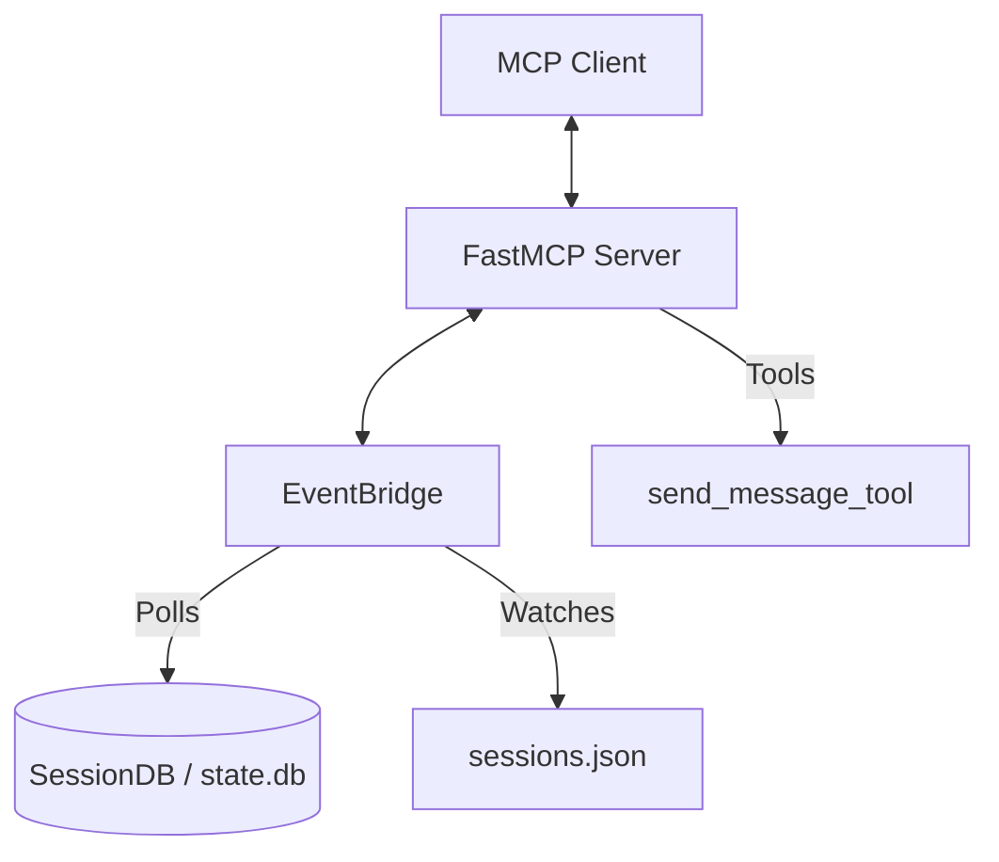

# Root — mcp_serve.py

# mcp_serve.py

The `mcp_serve.py` module implements the **Hermes MCP Server**, a bridge that exposes messaging conversations from various platforms (Telegram, Discord, Slack, etc.) as Model Context Protocol (MCP) tools. This allows MCP-compliant clients—such as Claude Desktop, Cursor, or Codex—to read message history, send messages, and manage approvals through a standardized interface.

## Architecture Overview

The server operates as a stdio-based MCP server using the `FastMCP` SDK. Because Hermes stores conversation state in a local SQLite database rather than providing a live WebSocket stream, this module implements an **EventBridge** to simulate real-time event delivery.



## The EventBridge

The `EventBridge` class is a background poller that monitors the Hermes state and maintains an in-memory queue of events. It is essential for supporting the `events_poll` and `events_wait` tools.

### Polling Logic
To minimize CPU usage, `_poll_once` performs high-frequency checks (every 200ms) using file system metadata:
1. It checks the `mtime` (modification time) of `sessions.json` and `state.db`.
2. If neither file has changed, the poll exits immediately.
3. If changes are detected, it queries the `SessionDB` for messages newer than the last seen timestamp for each active session.

### Event Queue
Events are stored in a fixed-size queue (`QUEUE_LIMIT = 1000`). Each event is assigned a monotonically increasing `cursor`.
- **Message Events**: Triggered when new "user" or "assistant" messages appear in the DB.
- **Approval Events**: Tracks `approval_requested` and `approval_resolved` states for plugin or execution permissions.

## Tool Reference

The module registers 10 tools that match the OpenClaw messaging bridge surface, plus Hermes-specific extensions.

### Discovery Tools
- **`conversations_list`**: Returns active sessions, filtered by platform or search terms. It reads from the `sessions.json` index.
- **`conversation_get`**: Provides detailed metadata for a specific `session_key`, including token usage and platform-specific IDs.
- **`channels_list`**: Lists available targets for new messages. It attempts to load from `channel_directory.json` or falls back to the session index.

### Reading Tools
- **`messages_read`**: Fetches the chronological history of a conversation from `SessionDB`. It automatically filters for "user" and "assistant" roles and extracts text content.
- **`attachments_fetch`**: Extracts non-text media (images, file references, or `MEDIA:` tags) from a specific message ID.

### Writing Tools
- **`messages_send`**: Routes outgoing messages. It imports and invokes `tools.send_message_tool.send_message_tool` to handle the actual delivery to the target platform.

### Event Tools
- **`events_poll`**: A non-blocking tool to retrieve events occurring after a specific `after_cursor`.
- **`events_wait`**: A long-polling tool that blocks until a new event arrives or a timeout (default 30s) is reached.

### Permission Tools
- **`permissions_list_open`**: Lists pending approval requests (e.g., tool execution requests) observed during the current server session.
- **`permissions_respond`**: Submits a decision (`allow-once`, `allow-always`, `deny`) for a pending request.

## Data Extraction Helpers

The module includes robust logic for normalizing message content across different platform formats:

- **`_extract_message_content`**: Handles both raw strings and multi-part content lists, concatenating text blocks into a single string.
- **`_extract_attachments`**: Parses message structures for `image_url` blocks, `image` source objects, and regex-based `MEDIA:` tags within text bodies.

## Usage and Configuration

The server is typically invoked via the Hermes CLI:

```bash
hermes mcp serve
```

### Client Configuration (claude_desktop_config.json)
To connect a client to Hermes, add the following to the MCP configuration:

```json
{
  "mcpServers": {
    "hermes": {
      "command": "hermes",
      "args": ["mcp", "serve"]
    }
  }
}
```

## Implementation Details

- **Lazy Imports**: The `mcp` SDK is imported lazily to allow the rest of the Hermes CLI to function even if the MCP dependencies are not installed.
- **Thread Safety**: The `EventBridge` uses a `threading.Lock` to manage concurrent access to the event queue and a `threading.Event` to wake up long-polling `events_wait` calls.
- **Environment**: Uses `HERMES_HOME` (defaulting to `~/.hermes`) to locate the `sessions/` directory and `state.db`.