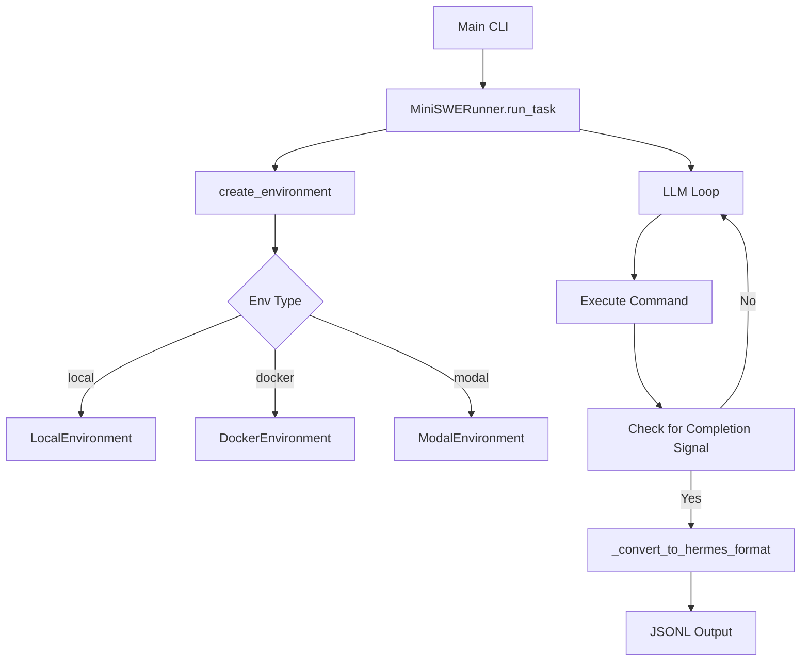

# Root — mini_swe_runner.py

# Root — mini_swe_runner.py

The `mini_swe_runner.py` module is a specialized execution engine designed to run software engineering tasks using the Hermes-Agent trajectory format. It provides a bridge between LLM reasoning and sandboxed code execution, producing structured logs compatible with the project's trajectory compression and batch processing pipelines.

## Core Functionality

The runner orchestrates a loop where an LLM is prompted to solve a task by executing bash commands. It abstracts the execution layer, allowing the same agent logic to run locally, inside Docker containers, or on Modal cloud infrastructure.

### Key Features
- **Environment Abstraction**: Uses a factory pattern to instantiate `LocalEnvironment`, `DockerEnvironment`, or `ModalEnvironment`.
- **Hermes Trajectory Format**: Converts standard OpenAI-style message histories into a specific XML-tagged format (`<tool_call>`, `<tool_response>`) used by downstream analysis tools.
- **Strict Sampling Control**: Integrates with `agent.auxiliary_client` to handle model-specific temperature requirements (e.g., omitting temperature for Kimi models).
- **Completion Signaling**: Uses a specific sentinel string `MINI_SWE_AGENT_FINAL_OUTPUT` to detect when an agent has finished its task via the terminal.

## Architecture and Execution Flow

The `MiniSWERunner` class manages the lifecycle of a task, from environment setup to final trajectory serialization.



## Component Reference

### Environment Factory: `create_environment`
This function acts as a provider router for execution backends. It imports the necessary environment classes from `tools.environments` dynamically to minimize dependency overhead.

- **Local**: Runs commands directly on the host system.
- **Docker**: Spawns a container from a specified `image`.
- **Modal**: Provisions a remote container in the Modal cloud.

### The `terminal` Tool
The runner provides a single tool definition, `TERMINAL_TOOL_DEFINITION`, which allows the agent to execute bash commands. The system prompt instructs the agent to use this tool for all actions and to signal completion by echoing a specific string.

### Trajectory Formatting: `_convert_to_hermes_format`
This is a critical method for data compatibility. It transforms the internal `messages` list into a "Hermes Trajectory," which includes:
1.  **System Message**: Injected with XML-wrapped tool definitions (`<tools>`).
2.  **GPT Messages**: Reasoning and tool calls wrapped in `<tool_call>` tags.
3.  **Tool Messages**: Execution results wrapped in `<tool_response>` tags.

## Usage Patterns

### Programmatic Execution
```python
from mini_swe_runner import MiniSWERunner

runner = MiniSWERunner(
    model="anthropic/claude-sonnet-4.6",
    env_type="docker",
    image="python:3.11-slim"
)

result = runner.run_task("Fix the bug in the local script.py")
print(f"Task completed: {result['completed']}")
```

### Batch Processing
The `run_batch` method allows processing multiple prompts from a JSONL file. It writes results incrementally to the output file, ensuring data is preserved even if the batch is interrupted.

### Command Line Interface
The module uses `python-fire` to expose its functionality.

```bash
# Run a single task locally
python mini_swe_runner.py --task "Create a hello world script" --env local

# Run a batch of tasks in Docker
python mini_swe_runner.py --prompts_file tasks.jsonl --output_file results.jsonl --env docker
```

## Integration Details

- **LLM Client**: Initialized via `resolve_provider_client` from `agent.auxiliary_client`. It defaults to OpenRouter but supports direct OpenAI/Anthropic configurations if API keys are provided.
- **Temperature Management**: Uses `_effective_temperature_for_model` to determine if a `temperature` parameter should be sent to the API, ensuring compatibility with models that enforce strict sampling contracts.
- **Cleanup**: The `_cleanup_env` method ensures that Docker containers or Modal instances are terminated immediately after task completion or failure.