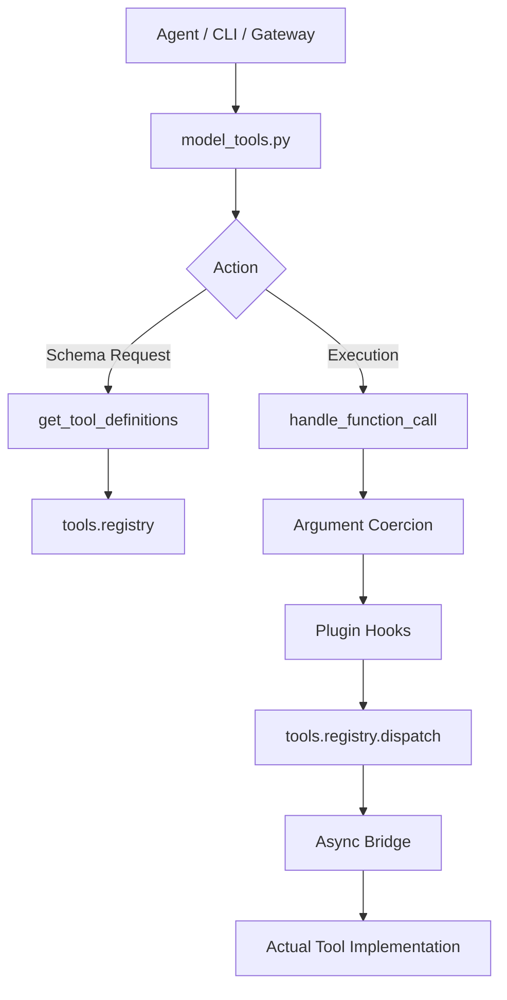

# Root — model_tools.py

# Root — model_tools.py

The `model_tools.py` module serves as the primary orchestration layer for the system's tool ecosystem. It acts as a bridge between the high-level agents (e.g., `run_agent.py`, RL environments) and the low-level `tools.registry`. 

Its primary responsibilities include tool discovery, schema generation with dynamic filtering, argument type coercion, and managing the sync-to-async execution bridge.

## Core Architecture

The module functions as a stateless dispatcher that relies on the `tools.registry` for storage and `toolsets.py` for grouping logic.

## Tool Discovery

Discovery is triggered upon module import. The module executes `discover_builtin_tools()` and attempts to load external plugins via `hermes_cli.plugins.discover_plugins()`. 

**Note on MCP Tools:** Unlike built-in tools, MCP (Model Context Protocol) discovery is no longer a module-level side effect to prevent blocking the event loop during gateway initialization. Entry points (like `gateway/run.py`) are responsible for triggering MCP discovery explicitly.

## Sync-to-Async Bridging

One of the most critical components of this module is `_run_async`. Because many tool handlers are `async` but the calling agents or CLI paths are often synchronous, this module manages persistent event loops to avoid the "Event loop is closed" errors common with `asyncio.run()`.

- **Main Thread:** Uses a long-lived `_tool_loop`.
- **Worker Threads:** Uses `_worker_thread_local` to maintain per-thread loops for parallel execution (e.g., `delegate_task`).
- **Async Contexts:** If called from within an existing running loop (like the Discord gateway), it spawns a fresh thread with a managed loop and a 300-second timeout to prevent hanging the main process.

## Tool Definitions and Filtering

The `get_tool_definitions` function is the source of truth for the model's available tools.

### Memoization
To optimize performance for hot callers (like the Gateway), results are cached in `_tool_defs_cache`. The cache key includes:
- Enabled/Disabled toolset sets.
- The registry's `_generation` counter (invalidated on tool registration).
- A fingerprint of the configuration file (mtime/size) to catch dynamic changes in tool settings.

### Dynamic Schema Modification
The module performs "just-in-time" schema adjustments before returning them to the model:
- **`execute_code`**: Rebuilds the schema to only list sandbox tools that are currently available and enabled.
- **`discord` / `discord_admin`**: Filters available actions based on the bot's privileged intents and the user's allowlist.
- **`browser_navigate`**: Strips references to `web_search` if those tools are disabled, preventing model hallucinations.
- **Sanitization**: Passes all schemas through `tools.schema_sanitizer` to ensure compatibility with strict parsers like `llama.cpp`.

## Function Call Handling

The `handle_function_call` function manages the lifecycle of a tool execution.

### 1. Argument Coercion
LLMs frequently output numbers or booleans as strings (e.g., `"true"` or `"42"`). `coerce_tool_args` uses the tool's JSON Schema to safely cast these values back to their expected types before dispatching.

### 2. Interception and Hooks
The dispatcher integrates with the plugin system:
- **Pre-call Hooks**: `get_pre_tool_call_block_message` allows plugins to intercept and block calls.
- **Agent-Loop Tools**: Tools like `todo`, `memory`, and `delegate_task` are intercepted and returned as stub errors if they reach this dispatcher, as they must be handled by the higher-level agent loop.
- **Post-call Hooks**: `post_tool_call` is fired after execution, providing the result and `duration_ms`.
- **Transformation Hooks**: `transform_tool_result` allows plugins to modify the tool's output before it is returned to the model.

### 3. Execution Tracking
For file-related tools, the dispatcher calls `notify_other_tool_call` in `tools.file_tools`. This resets consecutive read counters, helping the system detect and break infinite "read-file" loops.

## Public API Reference

| Function | Description |
| :--- | :--- |
| `get_tool_definitions(...)` | Returns OpenAI-format tool schemas filtered by toolsets. |
| `handle_function_call(...)` | Coerces arguments, runs hooks, and dispatches execution. |
| `get_all_tool_names()` | Returns a flat list of all registered tool names. |
| `get_toolset_for_tool(name)` | Identifies which toolset a specific tool belongs to. |
| `check_tool_availability(quiet)` | Returns status of toolsets and any missing requirements. |
| `_run_async(coro)` | The internal utility for running coroutines from sync code. |

## Legacy Support
The module maintains `_LEGACY_TOOLSET_MAP` to map old toolset names (e.g., `web_tools`, `vision_tools`) to their modern tool equivalents, ensuring backward compatibility with older configuration files and agent implementations.