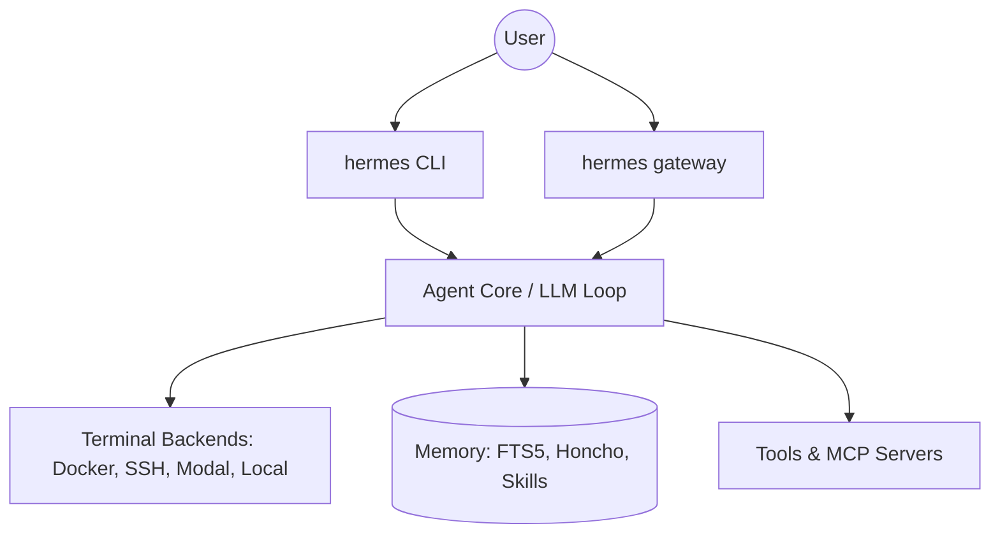

# Root — README.md

# Hermes Agent: Project Overview

Hermes Agent is a self-improving AI agent framework designed for persistence, cross-platform availability, and autonomous skill acquisition. Unlike stateless chat interfaces, Hermes maintains a continuous learning loop, building a procedural memory of "skills" and a declarative memory of user preferences and session history.

## System Architecture

Hermes is structured to decouple the user interface (CLI or Messaging Gateway) from the execution environment (Terminal Backends). This allows the agent to run on serverless infrastructure or remote VMs while being controlled from lightweight clients like Telegram or a local terminal.



## Core Components

### 1. Entry Points
The system provides two primary interaction methods:
*   **Interactive CLI (`hermes`)**: A rich Terminal User Interface (TUI) featuring multiline editing, slash-command autocomplete, and streaming tool outputs.
*   **Messaging Gateway (`hermes gateway`)**: A multi-protocol bridge that connects the agent to Telegram, Discord, Slack, WhatsApp, Signal, and Email. It supports voice memo transcription and cross-platform session continuity.

### 2. The Learning Loop
Hermes implements a "closed learning loop" that distinguishes it from standard ReAct agents:
*   **Autonomous Skill Creation**: After completing complex tasks, the agent can curate its own logic into reusable "skills" (compatible with the [agentskills.io](https://agentskills.io) standard).
*   **Dialectic User Modeling**: Utilizes [Honcho](https://github.com/plastic-labs/honcho) to build a deepening model of the user across sessions.
*   **Cross-Session Recall**: Uses SQLite FTS5 for full-text search across session histories, combined with LLM-driven summarization for context retrieval.

### 3. Execution Backends
The agent does not execute code directly in its host process. Instead, it utilizes one of six terminal backends:
*   **Local**: Direct execution on the host machine.
*   **Docker/Singularity**: Containerized isolation.
*   **SSH**: Execution on a remote server.
*   **Daytona/Modal**: Serverless execution environments that hibernate when idle and wake on demand, providing persistent state without constant compute costs.

### 4. Tooling & Extensibility
*   **Built-in Tools**: Over 40 native tools for file manipulation, web searching, and system administration.
*   **MCP Integration**: Support for the Model Context Protocol (MCP), allowing the agent to connect to any external MCP server.
*   **Subagents**: The ability to spawn isolated subagents for parallel workstreams or specialized tasks.

## Developer Commands

The `hermes` binary serves as the primary management utility for the environment:

| Command | Description |
|:---|:---|
| `hermes setup` | Interactive wizard to configure providers, keys, and backends. |
| `hermes model` | Switches the active LLM provider (OpenRouter, OpenAI, NVIDIA NIM, etc.). |
| `hermes tools` | Enables or disables specific toolsets. |
| `hermes doctor` | Runs diagnostic checks on the environment and dependencies. |
| `hermes claw migrate` | Utility to import state (SOUL.md, memories, skills) from OpenClaw. |

## Development Environment

The project uses `uv` for fast, reproducible dependency management.

### Setup for Contributors
To set up a local development environment with all extras (including RL environments and dev tools):

```bash
git clone https://github.com/NousResearch/hermes-agent.git
cd hermes-agent
./setup-hermes.sh
```

The `setup-hermes.sh` script automates:
1.  Installation of the `uv` package manager.
2.  Creation of a Python 3.11 virtual environment.
3.  Editable installation of the package with `[all,dev]` extras.
4.  Symlinking the `hermes` executable to `~/.local/bin/`.

### Testing
Run the test suite using the provided helper script:
```bash
scripts/run_tests.sh
```

### RL & Research
For research-focused workflows, the module includes integrations for:
*   **Atropos RL**: Located in `environments/`, used for trajectory generation and reinforcement learning.
*   **Trajectory Compression**: Tools for processing agent logs into training data for tool-calling models.