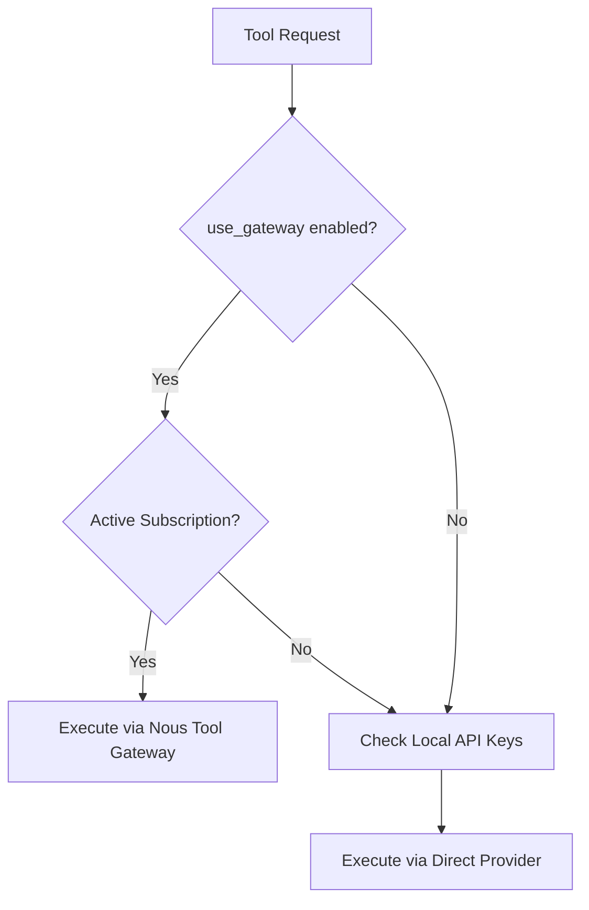

# Root — RELEASE_v0.10.0.md

# Hermes Agent v0.10.0 Release Documentation

The v0.10.0 release (v2026.4.16) introduces the **Nous Tool Gateway**, a centralized infrastructure for managing and accessing external tools without requiring individual third-party API keys. This release shifts the agent's tool execution logic to prioritize subscription-based access via the Nous Portal.

## Nous Tool Gateway

The Tool Gateway acts as a unified provider for high-latency or complex external services. It allows paid Nous Portal subscribers to utilize a suite of tools through their existing authentication context.

### Supported Tools
The gateway currently provides managed access to:
*   **Web Search:** Powered by Firecrawl.
*   **Image Generation:** Powered by FAL / FLUX 2 Pro.
*   **Text-to-Speech (TTS):** Powered by OpenAI TTS.
*   **Browser Automation:** Powered by Browser Use.

### Tool Selection Logic
The runtime implements a priority-based selection mechanism. When a tool is requested, the agent evaluates the configuration in the following order:
1.  **Gateway Preference:** If `use_gateway` is enabled in the configuration and a valid Nous Portal subscription is detected, the agent routes the request through the Gateway.
2.  **Direct API Keys:** If the gateway is disabled or the user is not a subscriber, the agent falls back to local environment variables/API keys (e.g., `FIRECRAWL_API_KEY`).

## CLI Integration

The Tool Gateway is integrated into the standard Hermes CLI workflow:

*   **`hermes model`**: During model selection, users can choose the Nous Portal provider. This triggers the prompt to enable specific gateway-managed tools.
*   **`hermes tools`**: Lists available tools and indicates whether they are being served via the Gateway or a direct provider.
*   **`hermes status`**: Displays the current subscription status and gateway connectivity.

## Configuration and Environment Changes

### `use_gateway` Config
A new configuration flag, `use_gateway`, has been introduced. This is a per-tool opt-in setting that determines if the agent should attempt to route requests through the Nous infrastructure.

### Deprecations
*   **`HERMES_ENABLE_NOUS_MANAGED_TOOLS`**: This environment variable is now deprecated and replaced by the subscription-based detection logic. The agent now automatically detects eligibility based on the authenticated Nous Portal session.

## Implementation Details

The implementation (originally tracked in PR [#11206](https://github.com/NousResearch/hermes-agent/pull/11206)) ensures that the gateway is treated as a primary provider. This reduces the configuration overhead for developers and end-users, as the agent handles the underlying authentication and request formatting for the proxied services.

When a tool is invoked, the agent's tool executor checks the `use_gateway` boolean. If true, it wraps the tool call in a gateway-specific request header containing the user's portal credentials, routing it to the Nous Research managed endpoints rather than the tool provider's direct API.