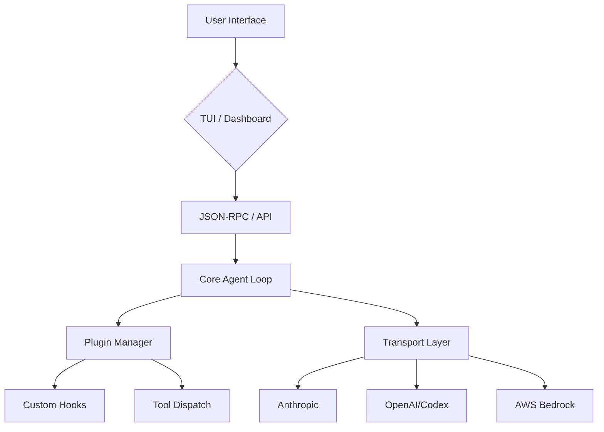

# Root — RELEASE_v0.11.0.md

# Hermes Agent v0.11.0 (v2026.4.23) — Technical Overview

The v0.11.0 release, internally dubbed "The Interface Release," represents a significant architectural shift in how Hermes Agent handles model communication, user interaction, and plugin extensibility. The primary technical achievements include the abstraction of the transport layer, a complete rewrite of the CLI using a React-based TUI, and a major expansion of the plugin surface.

## 🏗️ Architectural Shift: The Transport Layer

Prior to v0.11.0, format conversion and HTTP logic were tightly coupled within `run_agent.py`. This release introduces a pluggable transport architecture located in `agent/transports/`, centered around a `Transport` Abstract Base Class (ABC).

### Transport Implementations
The transport layer now owns the responsibility of converting internal agent states into provider-specific API shapes:

*   **`AnthropicTransport`**: Handles the Anthropic Messages API format.
*   **`ChatCompletionsTransport`**: The standard path for OpenAI-compatible providers.
*   **`ResponsesApiTransport`**: Supports the newer OpenAI Responses API and Codex-specific `build_kwargs`.
*   **`BedrockTransport`**: Implements the AWS Bedrock Converse API, providing native support for AWS-hosted models.

This decoupling allows developers to add new inference paths by implementing a single transport class rather than modifying the core agent loop.

## 🖥️ New Ink-based TUI Architecture

The interactive CLI has been rewritten from the ground up using **React** and **Ink**. This architecture separates the UI rendering from the agent logic via a JSON-RPC bridge.

### Components
*   **`ui-tui/`**: A TypeScript/React project using Ink to render terminal components.
*   **`tui_gateway/`**: A Python-based JSON-RPC backend that manages the agent session.
*   **`_SlashWorker`**: A persistent subprocess dedicated to dispatching slash commands without blocking the main UI thread.

### Key TUI Features for Developers
*   **State Management**: Uses a state machine in `src/app.tsx` to handle transitions between idle, thinking, and tool-execution states.
*   **RPC Hooks**: Custom hooks like `useCompletion` and `useInputHistory` manage communication with the Python backend.
*   **Observability**: Includes a subagent spawn overlay to visualize the hierarchy of delegated tasks in real-time.

## 🧩 Expanded Plugin Surface

The plugin system has been significantly hardened and expanded, allowing third-party code to intercept and modify almost every stage of the agent's execution cycle.

### New Hook Points
Developers can now utilize the following hooks in their plugins:
*   **`register_command()`**: Dynamically adds new slash commands to the agent.
*   **`dispatch_tool()`**: Allows a plugin to programmatically trigger a tool execution.
*   **`pre_tool_call`**: A veto-capable hook that can block tool execution based on custom logic.
*   **`transform_tool_result`**: Intercepts and rewrites the output of any tool before the LLM sees it.
*   **`transform_terminal_output`**: Specifically targets the output of terminal/shell tools for sanitization or formatting.

### Shell Hooks
A new bridge allows non-Python scripts to act as lifecycle hooks. By configuring shell scripts for events like `on_session_start` or `post_tool_call`, developers can extend Hermes using any language.

## 🤖 Agent Orchestration & Delegation

The delegation logic has been upgraded to support complex, multi-layered agent hierarchies.

### Subagent Coordination
*   **Orchestrator Role**: Subagents are now aware of their role and can spawn their own workers.
*   **`max_spawn_depth`**: A configurable parameter (defaulting to flat) that prevents infinite delegation loops.
*   **File Coordination Layer**: Concurrent sibling subagents now utilize a coordination layer to prevent race conditions when editing the same files on the filesystem.

### Mid-run Steering
The `/steer <prompt>` command allows users to inject "nudges" into the agent's context. Technically, this injects a system-level note that is processed immediately after the next tool call, allowing for course correction without interrupting the current generation or breaking the prompt cache.

## 📱 Messaging Gateway Updates

The messaging layer (Gateway) now supports 17 platforms with the addition of **QQBot** (via QQ Official API v2).

### Platform-Specific Enhancements
*   **Telegram**: Added `TELEGRAM_PROXY` support and `ignored_threads` configuration.
*   **Discord**: Support for Forum channels and role-based access control via `DISCORD_ALLOWED_ROLES`.
*   **Webhook Direct-Delivery**: A "zero-LLM" mode where incoming webhooks are forwarded directly to a chat platform, bypassing the agent loop for simple alerting and notifications.

## 📊 Web Dashboard Extensibility

The web dashboard now mirrors the agent's plugin philosophy. It features a **Live-switching theme system** and a **Dashboard plugin system**, allowing developers to add custom tabs, widgets, and views to the web UI without forking the core repository.

## 🔧 Tooling & Infrastructure
*   **Inference Paths**: Added native support for NVIDIA NIM, Arcee AI, and Google Gemini (via AI Studio and CLI OAuth).
*   **Session Management**: Automatic `VACUUM` of `state.db` and session pruning at startup to maintain performance.
*   **Security**: Introduced a global toggle to restrict the agent's ability to resolve private/internal URLs.