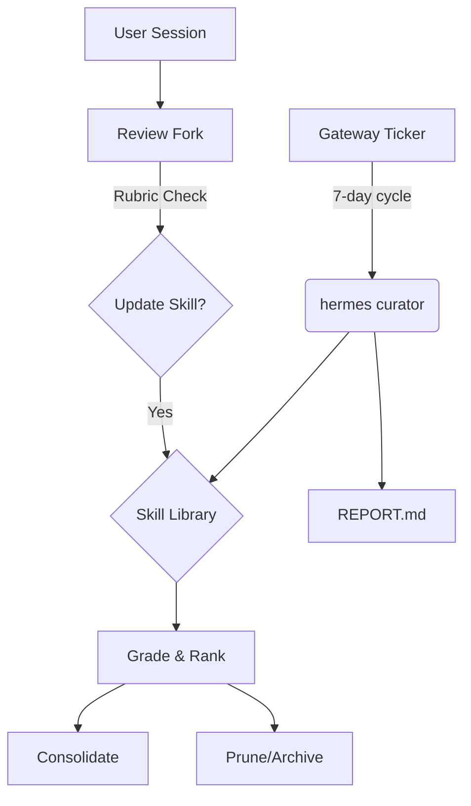

# Root — RELEASE_v0.12.0.md

# Release v0.12.0: The Curator Release

Release v0.12.0 (v2026.4.30) introduces a shift toward autonomous maintenance and self-optimization. The core theme of this release is the **Curator**, a background agent responsible for the lifecycle management of the agent's skill library.

## 🤖 Autonomous Curator (`hermes curator`)

The Curator is an autonomous background agent designed to maintain the health of the skill library. It operates on a 7-day cron cycle (configurable via the gateway's ticker) and performs grading, pruning, and consolidation of skills.

### Key Components
- **Execution Engine**: Runs via `hermes curator`. It inherits the parent configuration but operates with unbounded iterations to complete its maintenance tasks.
- **Classification Logic**: Uses a combination of model-based reasoning and heuristics to decide if a skill should be **consolidated** (merged with related skills) or **pruned** (archived due to lack of use or redundancy).
- **Reporting**: Generates per-run artifacts in `logs/curator/run.json` and a human-readable `REPORT.md`.
- **Skill Protection**: Implements defense-in-depth gates. Skills marked as "pinned" or those residing in protected "bundled/hub" directories are immune to mutation or pruning by the Curator.

### Commands
- `hermes curator status`: Ranks skills by usage metrics (most-used vs. least-used) based on `bump_use()` telemetry.
- `hermes model`: Used to select the specific model assigned to `auxiliary.curator`.

---

## 🔄 Self-Improvement Loop (Background Review Fork)

The self-improvement mechanism, which reviews sessions to save memories or update skills, has been refactored into a class-first, rubric-based system.

### Technical Improvements
- **Rubric-Based Grading**: Replaces free-form evaluation with a structured rubric to determine if a skill update is necessary.
- **Runtime Propagation**: The review fork now correctly inherits the parent's live runtime, including specific providers, models, and credentials.
- **Context Sanitization**: Prior-turn tool messages are excluded from the summary provided to the fork, ensuring the model sees a clean context for decision-making.
- **Tool Scoping**: To prevent "agent sprawl," the review fork is strictly restricted to the `memory` and `skills` toolsets. It cannot access the shell or web search.

---

## 🔌 Pluggable Gateway & Messaging

The Gateway has been refactored into a **Plugin Host**, allowing messaging platforms to exist as drop-in adapters outside the core codebase.

### New Platforms & Integrations
- **Microsoft Teams**: The first platform delivered entirely as a plugin.
- **Tencent 元宝 (Yuanbao)**: Added as the 18th native messaging platform.
- **Spotify**: Native integration featuring 7 tools (play, search, queue, etc.) using PKCE OAuth.
- **Google Meet**: A realtime plugin utilizing OpenAI transport and a Node-based bot server for transcription and follow-ups.

### Gateway Hooks
Developers can now intercept the message lifecycle using:
- `pre_gateway_dispatch`: Intercept messages before they reach the platform adapter.
- `pre_approval_request` / `post_approval_response`: Hooks for custom logic around tool execution approvals.

---

## ⚡ Performance & Cold Start Optimization

Visible TUI cold start times have been reduced by approximately **57%** through aggressive lazy loading and caching strategies.

| Optimization | Implementation Detail |
| :--- | :--- |
| **Lazy Agent Init** | Defers full agent instantiation until the first user interaction. |
| **Lazy Imports** | Heavy libraries (OpenAI, Anthropic, Firecrawl) are only imported when the specific provider is invoked. |
| **Config Caching** | `load_config()` and `read_raw_config()` now utilize mtime-based caching. |
| **Tool Memoization** | `get_tool_definitions()` is memoized, and `check_fn` results are stored in a TTL cache. |
| **Pattern Precompilation** | Security patterns (`DANGEROUS_PATTERNS`) are precompiled at startup. |

---

## 🛠️ Developer & CLI Enhancements

### One-Shot Mode
The new `hermes -z <prompt>` flag allows for non-interactive execution. It supports model/provider overrides via `--model`, `--provider`, or the `HERMES_INFERENCE_MODEL` environment variable.

### Skill Management
- **Direct URL Install**: `hermes skills install <url>` allows installing skills directly from HTTP(S) sources.
- **Hot Reloading**: The `/reload-skills` slash command and `.env` hot-reloading via `/reload` reduce the need for restarts during development.
- **External Directory Editing**: `skill_manage` now supports in-place edits for skills located in `external_dirs`.

### TUI Updates
- **LaTeX Support**: Native rendering of mathematical expressions.
- **Session Management**: The `/resume` picker now supports deleting sessions with the `d` key.
- **Mouse Handling**: Added a `/mouse` toggle to resolve ConPTY "phantom mouse" issues, particularly in WSL2 environments.

---

## 🔒 Security & Reliability

- **Secret Redaction**: Now **disabled by default**. This prevents "fake secret" substrings from corrupting tool outputs or patches. It can be re-enabled via `redaction.enabled: true`.
- **Atomic Writes**: File operations now preserve symlinks during atomic writes to prevent configuration loss.
- **Content Filter Dodging**: User-injected `[SYSTEM:` markers are automatically renamed to `[IMPORTANT:` to prevent triggering aggressive Azure AI content filters.
- **FTS5 Indexing**: The search engine now indexes `tool_name` and `tool_calls` in the SQLite FTS5 index, improving the retrievability of past tool usage.

