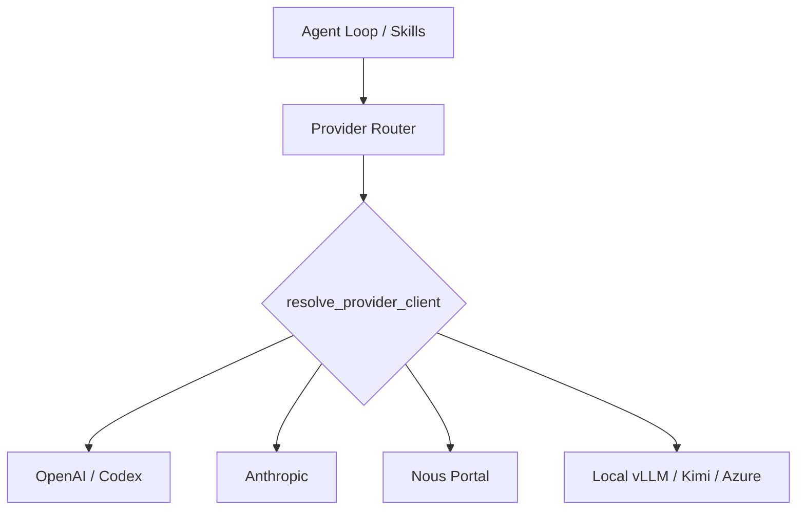

# Root — RELEASE_v0.2.0.md

# Release v0.2.0 (v2026.3.12)

The v0.2.0 release marks the transition of Hermes Agent from a foundational internal project to a production-ready AI agent platform. This version introduces a centralized provider architecture, a multi-platform messaging gateway, and a modular skills ecosystem.

## Core Architecture: Centralized Provider Router

The most significant architectural shift in v0.2.0 is the consolidation of LLM interaction logic. Previously scattered across various modules (vision, summarization, compression), all LLM requests now flow through a unified routing layer.

### Key APIs
- `call_llm()` / `async_call_llm()`: The primary entry points for all LLM consumers.
- `resolve_provider_client()`: Handles credential resolution, API key rotation, and provider-specific client initialization.

This centralization ensures that features like **Nous Portal** authentication, **OpenRouter** preferences, and automatic credential refresh (e.g., 401 error handling) are applied consistently across the entire application.

## Messaging Gateway & Session Management

The Gateway provides a unified interface for interacting with Hermes across multiple messaging platforms. It abstracts platform-specific complexities (like Telegram's `send_document` vs. Discord's attachment handling) into a consistent session-based context.

### Supported Platforms
- **Telegram:** Supports native file attachments, forum topic isolation, and location data.
- **Discord:** Includes channel topics in context and filters bot messages via `DISCORD_ALLOW_BOTS`.
- **WhatsApp:** Features multi-user session isolation and native media support.
- **Signal & Email:** New gateways for Signal (via REST API) and Email (IMAP/SMTP).
- **Home Assistant:** Integration via WebSocket gateway and REST tools.

### Session Features
- **Naming & Lineage:** Sessions now support unique titles and auto-lineage for easier resumption via `/resume`.
- **Context Compression:** Automatically handles `413 Payload Too Large` errors by compressing pathologically large sessions instead of aborting.
- **Tool Visibility:** Subagent thinking and tool calls are now optionally exposed to gateway users via `edit_message()` updates.

## Tooling & MCP Integration

Hermes v0.2.0 introduces native support for the **Model Context Protocol (MCP)**, allowing the agent to interface with external tool servers dynamically.

- **Transports:** Supports both `stdio` and `HTTP` transports.
- **Discovery:** Implements resource and prompt discovery, allowing the agent to "learn" what an MCP server offers at runtime.
- **Sampling:** Supports server-initiated LLM requests, enabling complex agentic workflows where the tool server can request LLM completions.
- **Lifecycle:** Managed via `hermes tools` UI and the `/reload-mcp` command.

## Skills Ecosystem

The Skills system has been modularized to support a growing library of 70+ community-contributed capabilities.

- **Conditional Activation:** Skills can now define prerequisites. A skill is only loaded if its required tools (e.g., a browser or a specific API key) are available.
- **Platform Filtering:** Skills can be enabled or disabled on a per-platform basis (e.g., disabling heavy file-ops skills on WhatsApp).
- **Skills Hub:** Accessible via `hermes skills browse`, providing a paginated interface for discovering and installing new capabilities.

## Security & Reliability Hardening

Significant effort was invested in making the agent safe for local and remote execution.

### Security Measures
- **Path Validation:** Fixed path traversal vulnerabilities in `skill_view` and implemented symlink boundary checks in `skills_guard`.
- **Injection Prevention:** Hardened shell execution against multi-line bypasses and process substitution patterns (e.g., `tee`).
- **Atomic Writes:** Critical data files—including `.env`, `sessions.json`, and cron jobs—now use atomic write patterns to prevent data corruption during crashes.
- **Permissions:** Sensitive files are now strictly enforced with `0600` or `0700` permissions.

### Reliability Features
- **Filesystem Checkpoints:** The agent now takes snapshots before destructive operations, allowing users to invoke `/rollback`.
- **Git Worktree Isolation:** The `-w` flag allows launching agents in isolated git worktrees, preventing file conflicts during parallel development tasks.
- **Test Suite:** Coverage increased to 3,289 tests, utilizing `pytest-xdist` for parallel execution.

## Developer Experience (CLI)

The CLI has been overhauled with a data-driven skin engine and interactive features:
- **Skins:** 7 built-in themes (e.g., `ares`, `poseidon`) configurable via YAML.
- **Quick Commands:** User-defined shortcuts that bypass the LLM loop for immediate execution.
- **Diagnostics:** `hermes doctor` provides a comprehensive health check of all configured providers and system dependencies.
- **Insights:** The `/insights` command provides usage analytics and cost estimation.