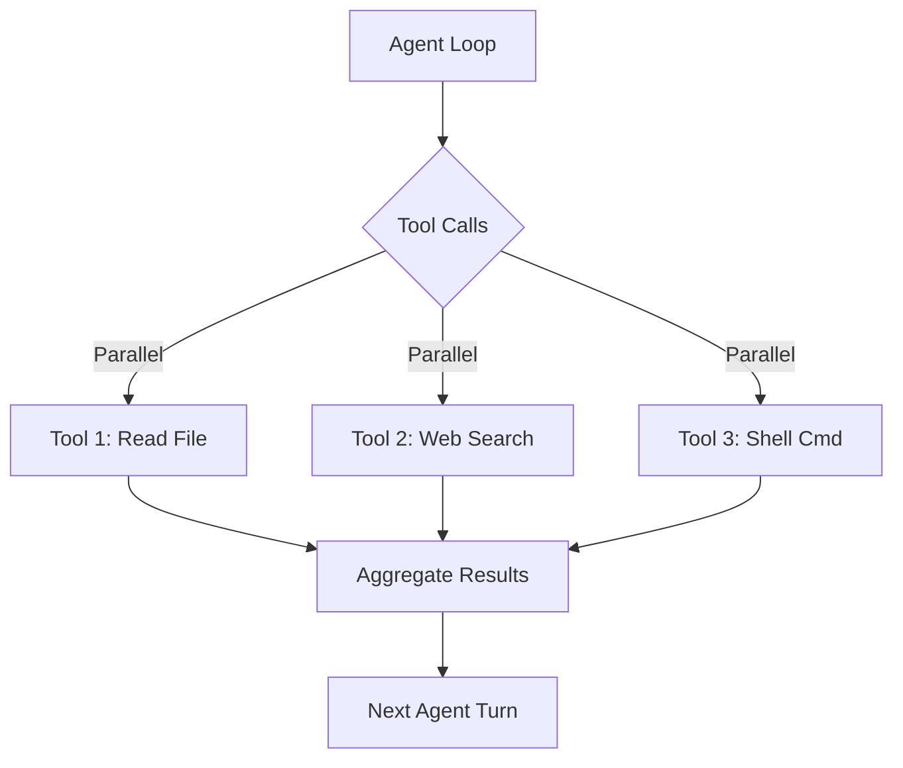

# Root — RELEASE_v0.3.0.md

# Hermes Agent v0.3.0 (v2026.3.17)

The v0.3.0 release represents a significant architectural shift toward a unified, streaming-first agent environment. It introduces a centralized provider routing system, a first-class plugin architecture, and enhanced security layers for tool execution.

## Core Architecture Updates

### Centralized Provider Router
The provider system has been rebuilt around a unified `call_llm` API. This abstraction decouples the agent logic from specific provider implementations (OpenAI, Anthropic, Vercel AI Gateway, etc.).

*   **Unified Routing:** The `/model` command now triggers an auto-detection sequence that resolves the correct provider based on the model string.
*   **Direct Overrides:** Developers can now specify `endpoint` overrides for auxiliary tasks (e.g., vision or subagent delegation) via the `custom_providers` configuration.
*   **Native Anthropic Support:** Includes direct API integration with Claude, supporting native prompt caching and OAuth PKCE flows, bypassing the need for intermediate proxies like OpenRouter.

### Unified Streaming Infrastructure
Streaming is now a first-class citizen across all interfaces. Token-by-token delivery is implemented via a shared infrastructure used by both the CLI and the Gateway platforms (Telegram, Discord, Slack). This reduces perceived latency and allows for real-time monitoring of agent thought processes.

### Plugin Architecture
Hermes now supports a "drop-in" plugin system.
*   **Location:** `~/.hermes/plugins/`
*   **Functionality:** Python files placed in this directory are automatically loaded. This allows developers to extend the agent with custom tools, slash commands, and lifecycle hooks without modifying the core repository.

## Tooling & Execution Environment

### Persistent Shell Mode
The local and SSH terminal backends now support stateful sessions.
*   **State Persistence:** Environment variables, directory changes (`cd`), and aliases persist across multiple tool calls within a single session.
*   **Implementation:** Managed via the `PersistentShell` class within the terminal backend modules.

### Browser CDP Integration
The `/browser connect` command allows the agent to attach to an existing Chrome instance via the **Chrome DevTools Protocol (CDP)**. This enables debugging and interaction with active browser sessions that the user already has open, rather than spawning isolated, headless instances.

### Concurrent Tool Execution
To reduce turn latency, independent tool calls are now dispatched in parallel using a `ThreadPoolExecutor`. This is particularly effective for agents performing multiple file reads or web searches in a single turn.

## Security & Privacy

### Tirith Pre-Exec Scanning
A new security layer, **Tirith**, performs static analysis on terminal commands before they are executed. It scans for dangerous patterns (e.g., fork bombs, unauthorized deletions) and provides a "verdict" that the agent must respect based on the user's approval settings.

### PII Redaction
When `privacy.redact_pii` is enabled in `config.yaml`, the agent scrubs personally identifiable information from the context window before it is transmitted to the LLM provider.

### Environment Sanitization
The agent now explicitly strips sensitive Hermes-specific environment variables (e.g., `OPENAI_API_KEY`, `HERMES_GATEWAY_TOKEN`) from subprocess environments to prevent accidental credential leakage during tool execution.

## Memory & Integration

### Honcho Memory
Integration with **Honcho** provides a persistent, asynchronous memory backend.
*   **Recall Modes:** Configurable modes for how the agent retrieves past interactions.
*   **Isolation:** Multi-user isolation is enforced in gateway mode, ensuring users do not leak context to one another in shared environments.

### ACP (Agent Control Protocol)
The **ACP Server** allows IDEs like VS Code, Zed, and JetBrains to use Hermes as a backend. It supports full slash command integration, allowing the agent to operate directly within the developer's workspace.

### Voice Mode
A new voice processing pipeline supports:
*   **CLI:** Push-to-talk interaction.
*   **Gateways:** Voice note transcription for Telegram and Discord.
*   **Local Processing:** Uses `faster-whisper` for local, private STT (Speech-to-Text) when configured.

## Command & Session Management

*   **Smart Approvals:** An updated approval system learns user preferences for "safe" commands, reducing prompt fatigue.
*   **Slash Command Registry:** All commands (e.g., `/plan`, `/rollback`, `/model`) are now defined in a centralized registry, ensuring consistent behavior across CLI and Gateway platforms.
*   **Session Hygiene:** The agent proactively compresses context when the session reaches a 50% token threshold, using a "handoff summary" to preserve actionable state.

## New Skills
Several high-level skills were added to the ecosystem:
*   **Linear:** Project management and issue tracking.
*   **Telephony:** Twilio integration for SMS and AI-driven voice calls.
*   **1Password:** Secure credential retrieval via the `op` CLI.
*   **NeuroSkill:** BCI (Brain-Computer Interface) integration.