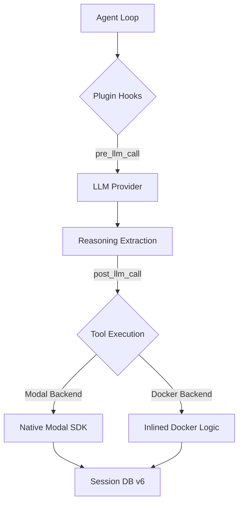

# Root — RELEASE_v0.5.0.md

# Hermes Agent v0.5.0 Release Documentation

The v0.5.0 release (v2026.3.28), codenamed "The Hardening Release," focuses on infrastructure stability, security supply chain integrity, and expanded model provider support. Key architectural shifts include the transition to native Modal SDK integration, the activation of the full plugin lifecycle hook system, and significant improvements to LLM reasoning persistence.

## 🚀 Provider & Model Architecture

### Hugging Face Integration
Hugging Face is now a first-class inference provider. This integration includes:
- **Model Mapping:** A curated agentic model picker that maps OpenRouter-style slugs to Hugging Face Inference API endpoints.
- **Discovery:** A live `/models` endpoint probe for dynamic model discovery.
- **Setup Flow:** Integration into the setup wizard for seamless authentication and configuration.

### Model Command Overhaul
The `/model` command has been refactored into a shared `switch_model()` pipeline.
- **Unified Logic:** The same logic now powers model switching across the CLI, Gateway, and API.
- **Provider Routing:** Improved routing that preserves `custom` provider settings rather than defaulting to OpenRouter.
- **Config Inheritance:** Model configurations now correctly inherit root-level `provider` and `base_url` from `config.yaml`.

## 🧠 Agent Loop & Reasoning

### Tool-Use Enforcement
To address reliability issues with OpenAI models, this release introduces `GPT_TOOL_USE_GUIDANCE`. This system prompt injection prevents models from describing actions in text and forces valid tool calls. Additionally, the agent now automatically strips stale budget warnings from conversation history to prevent models from becoming "tool-shy" in long-running sessions.

### Reasoning Persistence (Schema v6)
The session database has been upgraded to Schema v6 to support persistent reasoning across turns.
- **New Columns:** `reasoning`, `reasoning_details`, and `codex_reasoning_items`.
- **Transcript Integrity:** The `rewrite_transcript` function now preserves reasoning fields, ensuring that context compression or manual edits do not lose the model's "chain of thought."

### Context Compression
The compression logic has moved away from fixed token targets to ratio-based scaling.
- **Configurable Parameters:** `compression.target_ratio`, `protect_last_n`, and `threshold`.
- **Token Capping:** Summaries are now capped at 12K tokens to prevent the summary itself from consuming the entire context window.

## 🔌 Plugin & Backend Infrastructure

### Plugin Lifecycle Hooks
The plugin system is now fully operational with the activation of four key hooks within the agent loop:
1. `on_session_start`: Fires when a new session is initialized.
2. `pre_llm_call`: Allows modification of the prompt or state before the LLM is invoked.
3. `post_llm_call`: Allows processing of the LLM response before tool execution.
4. `on_session_end`: Fires during session teardown or cleanup.

### Native Modal SDK
The dependency on `swe-rex` has been removed in favor of the native Modal SDK.
- **Implementation:** Uses `Sandbox.create.aio` and `exec.aio` for environment management.
- **Benefit:** Eliminates the need for complex tunneling and simplifies the terminal backend for remote execution.

## 📱 Messaging & Gateway Improvements

### Telegram Private Chat Topics
The Gateway now supports project-based conversations within a single Telegram chat using Topics.
- **Skill Binding:** Functional skills can be bound to specific topics, allowing for isolated workflows (e.g., a "Coding" topic with terminal access and a "Research" topic with browser access).

### Reliability & Networking
- **DNS-over-HTTPS:** Telegram adapters now auto-discover fallback IPs via DoH when `api.telegram.org` is blocked or unreachable.
- **Session Locking:** The `/stop` command now hard-kills session locks, allowing users to recover from hung agents without restarting the entire gateway.
- **Media Handling:** WhatsApp and Mattermost adapters now support document, audio, and video media downloads.

## 🔒 Security & Supply Chain

### Hardening Measures
- **SSRF Protection:** Implemented in `browser_navigate`, `vision_tools`, and `web_tools` to prevent internal network probing.
- **Dependency Audit:** Removed the compromised `litellm` package. All dependencies are now pinned with hashes in `uv.lock`.
- **Path Traversal:** Added protections against zip-slip during self-updates and shell injection via `~user` path expansions.

### Nix Support
A full Nix flake is now provided, featuring:
- `uv2nix` build system.
- NixOS module with persistent container mode.
- Auto-generated configuration keys derived directly from the Python source.

## 🛠️ Tool System Updates

- **API Server:** Added `Idempotency-Key` support and OpenAI-compatible error envelopes.
- **MCP:** Improved toolset resolution and added name collision protection for Model Context Protocol servers.
- **V4A Patching:** The patch parser now handles addition-only hunks, improving the reliability of automated file edits.
- **Browser Vision:** Added support for `auxiliary.vision.timeout` and handled 402 (insufficient credits) errors gracefully.