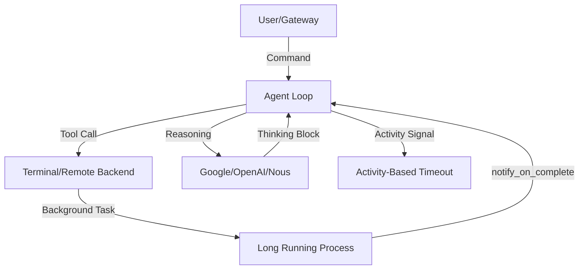

# Root — RELEASE_v0.8.0.md

# Release v0.8.0: Intelligence & Background Autonomy

Release v0.8.0 (v2026.4.8) represents a significant architectural shift toward autonomous background processing, enhanced tool-use reliability for OpenAI models, and a unified cross-platform gateway experience. This release focuses on "intelligence" through self-optimized guidance and improved lifecycle management.

## Core Architecture Updates

### Provider & Model Resolution
The provider system has been overhauled to support live switching and aggregator-aware resolution.
*   **Native Gemini Support:** Direct integration with Google AI Studio, utilizing `models.dev` for real-time context length detection.
*   **Live Switching:** The `/model` command now functions across all gateways (CLI, Telegram, Discord, Slack). It uses an aggregator-aware logic that prefers OpenRouter or Nous Portal but allows for automatic cross-provider fallback.
*   **Tool-Use Enforcement:** Specific logic has been added to enforce tool-use patterns on xAI (Grok) and MiniMax models.

### Agent Loop & Reasoning
The agent's internal reasoning loop has been hardened against common LLM failure modes:
*   **Behavioral Benchmarking:** The agent now includes self-optimized guidance for GPT and Codex models, specifically patching five identified failure modes in tool calling.
*   **Thinking Prefills:** Support for "thinking-only" prefill continuations allows models to maintain structured reasoning across multi-turn interactions without losing context.
*   **Argument Coercion:** The loop now automatically coerces tool arguments to match JSON Schema types, mitigating issues where models return strings for numeric or boolean fields.

## Background Task Management

A major feature of v0.8.0 is the transition from passive polling to active notification for long-running tasks.

### `notify_on_complete`
Background processes (builds, deployments, AI training) can now trigger an internal notification to the agent upon completion. This allows the agent to:
1.  Initiate a long-running task.
2.  Yield the session or work on parallel tasks.
3.  Receive an asynchronous callback when the process exits.

### Activity-Based Timeouts
The timeout logic for Gateway and Cron systems has moved from wall-clock time to **activity-based tracking**.
*   **Logic:** The system monitors actual tool activity (e.g., terminal output, browser navigation).
*   **Impact:** Long-running tasks that are actively producing output will no longer be killed by the gateway's idle timer. Only truly inactive agents are reaped.

## Tooling & Execution Environment

### Remote Execution Backends
The `execute_code` tool is no longer restricted to local environments. It now supports:
*   **Remote Backends:** Docker, SSH, and Modal.
*   **Contextual Awareness:** Terminal results now include exit code context for common CLI tools, helping the agent self-diagnose environment issues.
*   **Subdirectory Discovery:** The agent now employs progressive hint discovery to learn project structures as it navigates deep directory trees.

### MCP (Model Context Protocol)
*   **OAuth 2.1 PKCE:** Full standards-compliant authentication for MCP servers.
*   **Security:** Integration with the OSV (Open Source Vulnerabilities) database to perform malware scanning on MCP extension packages before execution.

## Plugin & Skill System

The plugin architecture has been expanded to allow deeper integration into the agent's lifecycle.

| Hook / Feature | Description |
| :--- | :--- |
| **CLI Registration** | Plugins can now register custom subcommands directly to the `hermes` binary. |
| **Lifecycle Hooks** | `on_session_finalize` and `on_session_reset` allow plugins to clean up resources or commit data. |
| **API Correlation** | Request-scoped hooks now include tool call correlation IDs for tracing. |
| **Config Injection** | Skills can declare required `config.yaml` settings which are validated at load time. |

## Gateway & Messaging Platforms

The gateway layer has been updated to support native platform features for better UX:
*   **Approval Buttons:** Telegram and Slack now use native UI buttons for command approvals instead of text-based `/approve` commands.
*   **Matrix Tier 1:** Full feature parity for Matrix, including E2EE, rich formatting, and room management.
*   **Discord Slash Commands:** Skills and core commands (`/approve`, `/background`, etc.) are now registered as native Discord slash commands.

## Security & Logging

### Centralized Logging
Logs are now structured and centralized in `~/.hermes/logs/`:
*   `agent.log`: General INFO level logs and execution traces.
*   `errors.log`: WARNING and ERROR level events for easier debugging.
*   **Command:** Use `hermes logs` to tail and filter these streams.

### Hardening
*   **SSRF Protections:** Consolidated protections across all web-facing tools.
*   **Path Traversal:** Hardened terminal and cron path handling to prevent directory traversal attacks.
*   **Credential Redaction:** Improved regex-based redaction for large outputs to prevent O(n²) catastrophic backtracking while ensuring secrets do not leak into logs or chat histories.

## Configuration Changes
Users upgrading to v0.8.0 should note the new config validation. Malformed YAML in `config.yaml` will now prevent startup with a specific error message identifying the line and field. Reasoning effort settings have been unified into the main configuration file.