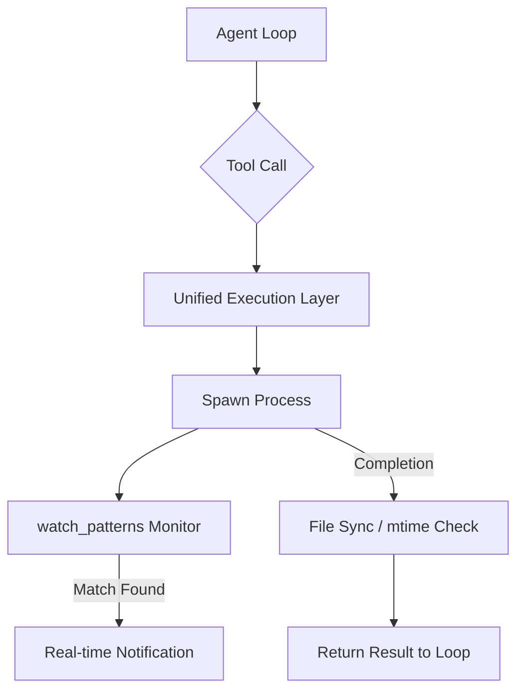

# Root — RELEASE_v0.9.0.md

# Hermes Agent v0.9.0 (v2026.4.13) — Release Documentation

The v0.9.0 release represents a significant architectural evolution of the Hermes Agent, focusing on platform ubiquity (Android/Termux), expanded messaging integrations (iMessage, WeChat), and a major security hardening pass. This version introduces a pluggable context engine and shifts session state management to a more robust concurrency model.

## Core Architectural Changes

### Pluggable Context Engine
Context management has been decoupled from the core agent loop. Developers can now implement and swap custom context engines using the `hermes plugins` interface. This allows for domain-specific logic regarding:
*   **Message Filtering:** Selective inclusion of history based on relevance.
*   **Summarization Strategies:** Custom logic for how the buffer is compressed when approaching token limits.
*   **Context Injection:** Injecting RAG results or system-level metadata dynamically.

### Session State Management
The agent has migrated from using `os.environ` for session-specific state to `contextvars` ([#7454]). This change ensures thread safety and prevents state leakage across concurrent sessions in multi-user environments (e.g., Discord servers or API server deployments).

### Unified Execution Layer
Tool execution now utilizes a **spawn-per-call** execution model ([#6343]). This provides:
*   **Isolation:** Each tool call runs in a clean environment.
*   **Persistence:** Sandbox environments can now persist between turns ([#6412]), allowing for multi-turn stateful operations (e.g., building a project across several messages).
*   **File Synchronization:** A new unified file sync system with `mtime` tracking and transactional state ensures the agent's local workspace stays in sync with remote backends (SSH, Modal, Daytona).

## New Capabilities & Commands

### Fast Mode (`/fast`)
A priority routing toggle for OpenAI and Anthropic providers. When enabled via the `/fast` command, requests are routed through priority queues (OpenAI Priority Processing / Anthropic Fast Tier) to minimize latency.

### Background Process Monitoring
The `watch_patterns` feature ([#7635]) allows the agent to monitor background process output asynchronously. Instead of polling, the agent registers patterns (e.g., "Listening on port 3000" or "Build failed") and triggers real-time notifications to the user or the agent loop when matches occur.

### Debugging & Maintenance
*   **`hermes dump`**: Generates a copy-pasteable summary of the current environment, configuration, and provider status for troubleshooting.
*   **`hermes debug share`**: Automates the creation of a redacted debug report and uploads it to a secure pastebin.
*   **`hermes backup` / `hermes import`**: Provides full serialization of sessions, skills, and configuration for migration between machines.

## Messaging Gateway Expansion

Hermes now supports 16 messaging platforms. Key additions in v0.9.0 include:
*   **BlueBubbles (iMessage):** Integration via the BlueBubbles API with automated webhook registration.
*   **WeChat (Weixin/WeCom):** Native support via iLink Bot API and a dedicated Callback Mode adapter for enterprise applications.
*   **Unified Proxying:** Support for SOCKS and system-level proxies across all gateway adapters, including auto-detection on macOS.

## Security Hardening

This release includes a comprehensive security audit and remediation of several critical vectors:

| Vector | Mitigation |
| :--- | :--- |
| **Remote Code Execution (RCE)** | Twilio webhook signature validation ([#7933]). |
| **Shell Injection** | Neutralized via path quoting in `_write_to_sandbox` ([#7940]). |
| **SSRF** | Redirect guards implemented for Slack image uploads ([#7151]). |
| **Path Traversal** | Boundary enforcement in the Checkpoint Manager and Skill Manager ([#7944], [#7156]). |
| **API Security** | Enforcement of `API_SERVER_KEY` for all non-loopback bindings ([#7455]). |

## Provider Updates

*   **xAI (Grok):** Native provider implementation with direct API access.
*   **Xiaomi MiMo:** First-class support including model catalogs and empty response recovery logic.
*   **Error Classification:** Improved `API error classification` ([#6514]) allows the agent to make smarter failover decisions (e.g., retrying on rate limits vs. switching providers on billing errors).
*   **Rate Limit Tracking:** `/usage` now displays real-time rate limit headers captured from provider responses.

## Technical Execution Flow: Tool Call with Monitoring

## Installation & Environment
*   **Termux/Android:** Native support for running the agent on mobile devices via Termux, including TUI optimizations and voice backend support.
*   **Docker:** Multi-arch images (amd64/arm64) now run as a non-root user with `uv` for faster dependency resolution.
*   **Nix:** Improved shared-state permission models for interactive CLI users.