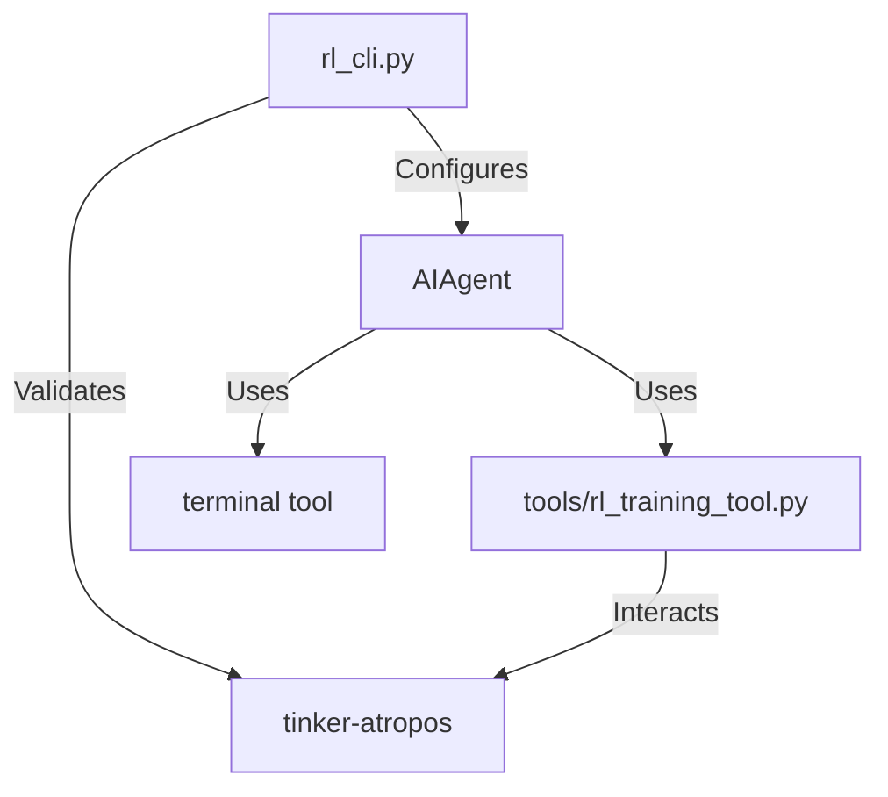

# Root — rl_cli.py

# RL Training CLI (rl_cli.py)

The `rl_cli.py` module is a dedicated entry point for Reinforcement Learning (RL) training workflows. It wraps the standard `AIAgent` with specialized configurations, extended timeouts, and a system prompt tailored for post-training engineering tasks using the `tinker-atropos` framework.

## Overview

Unlike the standard agent CLI, `rl_cli.py` is optimized for long-running operations. It automatically configures the environment to point to the `tinker-atropos` submodule and enables a specific suite of tools (`terminal`, `web`, and `rl`) required for discovering, configuring, and monitoring RL training runs.

### Key Specializations
- **Extended Iterations**: Sets `max_iterations` to 200 (defaulting higher than standard agents) to accommodate 30-minute status check intervals and multi-hour training loops.
- **Context Awareness**: Automatically sets `TERMINAL_CWD` to the `tinker-atropos` directory so the agent's terminal commands execute in the correct repository context.
- **RL System Prompt**: Injects a specialized system prompt that instructs the agent on the DISCOVER -> INSPECT -> TEST -> TRAIN workflow.

## Architecture

The CLI acts as a configuration layer that initializes the `AIAgent` with RL-specific parameters before delegating execution to the agent's conversation loop.



## Configuration & Environment

The module performs aggressive environment setup during imports and initialization:

1.  **Environment Variables**: Loads variables from `~/.hermes/.env` and the project root using `load_hermes_dotenv`.
2.  **Submodule Pathing**: Locates `tinker-atropos`. If found, it sets `os.environ['TERMINAL_CWD']` to this path, ensuring the agent's file operations and terminal commands target the RL framework.
3.  **API Requirements**: Requires `TINKER_API_KEY`, `WANDB_API_KEY`, and `OPENROUTER_API_KEY`.

## Core Functions

### `load_hermes_config()`
Reads `~/.hermes/config.yaml` to determine the default model (defaults to `anthropic/claude-opus-4.5`) and base URL. This allows users to persist their preferred LLM for the RL agent.

### `check_tinker_atropos()`
Validates the local environment. It checks for the existence of the `tinker-atropos` submodule and scans the `tinker_atropos/environments` directory to ensure training environments are available.

### `main(...)`
The entry point (exposed via `python-fire`). It handles several execution modes:
- **Task Mode**: Runs a single prompt (e.g., "Train GSM8k").
- **Interactive Mode (`--interactive`)**: Opens a REPL for ongoing RL experimentation.
- **Discovery Mode (`--list-environments`)**: Synchronously calls `rl_list_environments` to show available RL setups.
- **Server Check (`--check-server`)**: Validates API keys and submodule status.

## RL System Prompt Logic

The `RL_SYSTEM_PROMPT` defines the operational boundaries for the agent. It emphasizes a specific safety and verification lifecycle:
1.  **Discovery**: Use `rl_list_environments`.
2.  **Inspection**: Read environment files to understand reward logic and verifiers.
3.  **Validation**: Always run `rl_test_inference` before starting a full training run.
4.  **Monitoring**: Check status at 30-minute intervals and monitor WandB metrics.

## Usage Examples

### Training a Model
```bash
python rl_cli.py "Train a model on GSM8k for math reasoning using the default config"
```

### Interactive Session
Useful for debugging new environments or manually stepping through a training configuration:
```bash
python rl_cli.py --interactive
```

### Environment Discovery
To see what RL environments are currently implemented in the submodule:
```bash
python rl_cli.py --list-environments
```

## Integration with Tools
The module enables the `rl` toolset defined in `tools/rl_training_tool.py`. This provides the agent with high-level abstractions for:
- `rl_start_training`: Initiating the Tinker-Atropos pipeline.
- `rl_check_status`: Polling the training server.
- `rl_edit_config`: Modifying hyperparameters (learning rate, batch size, etc.).