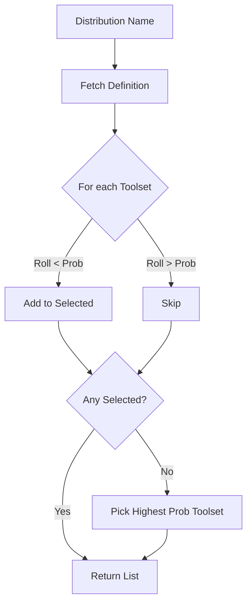

# Root — toolset_distributions.py

# Toolset Distributions

The `toolset_distributions.py` module manages probabilistic configurations of toolsets used during data generation and model evaluation. Instead of providing every tool to every prompt, this module allows developers to define "distributions" that simulate different agent capabilities and constraints.

## Core Concepts

A **Distribution** is a named configuration that defines the likelihood of specific toolsets being available for a given task. This is used to:
1.  **Diversify Training Data**: Generate trajectories where models must solve problems with varying tool availability.
2.  **Specialize Environments**: Create task-specific environments (e.g., a "research" environment vs. a "development" environment).
3.  **Simulate Constraints**: Test model robustness when certain tools are missing.

### Distribution Schema
Each entry in the `DISTRIBUTIONS` dictionary follows this structure:

```python
"distribution_name": {
    "description": "Human-readable purpose",
    "toolsets": {
        "toolset_id": probability_integer  # 0 to 100
    }
}
```

## Sampling Logic

The primary entry point for runtime tool selection is `sample_toolsets_from_distribution(distribution_name)`. 

1.  **Independent Selection**: For every toolset defined in the distribution, the module performs an independent Bernoulli trial (a "dice roll") against the specified probability.
2.  **Validation**: It calls `toolsets.validate_toolset()` to ensure the requested toolset actually exists in the system registry.
3.  **Guaranteed Minimum**: If the random sampling results in zero toolsets being selected, the module automatically selects the toolset with the **highest defined probability** as a fallback. This ensures the agent is never left without any tools.



## API Reference

### `sample_toolsets_from_distribution(distribution_name: str) -> List[str]`
The core function used by `batch_runner.py` and `hermes_base_env.py`. It returns a list of toolset names to be instantiated for a specific prompt or trajectory.

### `get_distribution(name: str) -> Optional[Dict]`
Returns the raw configuration dictionary for a specific distribution, including its description and probability map.

### `list_distributions() -> Dict[str, Dict]`
Returns a copy of the entire `DISTRIBUTIONS` registry. Used by the CLI and batch runners to validate user input.

### `validate_distribution(distribution_name: str) -> bool`
Checks if a distribution name exists in the registry.

## Integration Points

*   **`batch_runner.py`**: Uses this module during `_process_single_prompt` to determine which tools to provide to the model for a specific generation task.
*   **`environments/hermes_base_env.py`**: Calls `sample_toolsets_from_distribution` within `_resolve_tools_for_group` to configure the environment's tool registry before a trajectory begins.
*   **`toolsets.py`**: This module acts as a consumer of `toolsets.py` to validate that the names defined in distributions map to valid tool implementations.

## Adding New Distributions

To add a new distribution, append a new key to the `DISTRIBUTIONS` constant. 

**Example: Data Science Distribution**
```python
"data_science": {
    "description": "Focus on data manipulation and visualization",
    "toolsets": {
        "terminal": 100,  # Always available for python execution
        "file": 100,      # Always available for reading datasets
        "vision": 40,     # Occasionally available for plot analysis
        "web": 20         # Rarely available for documentation
    }
}
```

## Predefined Distributions

| Name | Primary Focus | Key Characteristics |
| :--- | :--- | :--- |
| `default` | All-access | 100% probability for all tools. |
| `research` | Web/Browser | High probability for `web` and `browser`, low for `terminal`. |
| `development` | Coding | High probability for `terminal` and `file`, 60% for `moa` (reasoning). |
| `safe` | Security | Excludes `terminal` entirely; focuses on `web` and `vision`. |
| `browser_tasks` | Automation | 97% `browser` availability; used for browser-specific benchmarks. |
| `terminal_tasks`| CLI | 97% `terminal` and `file` availability. |