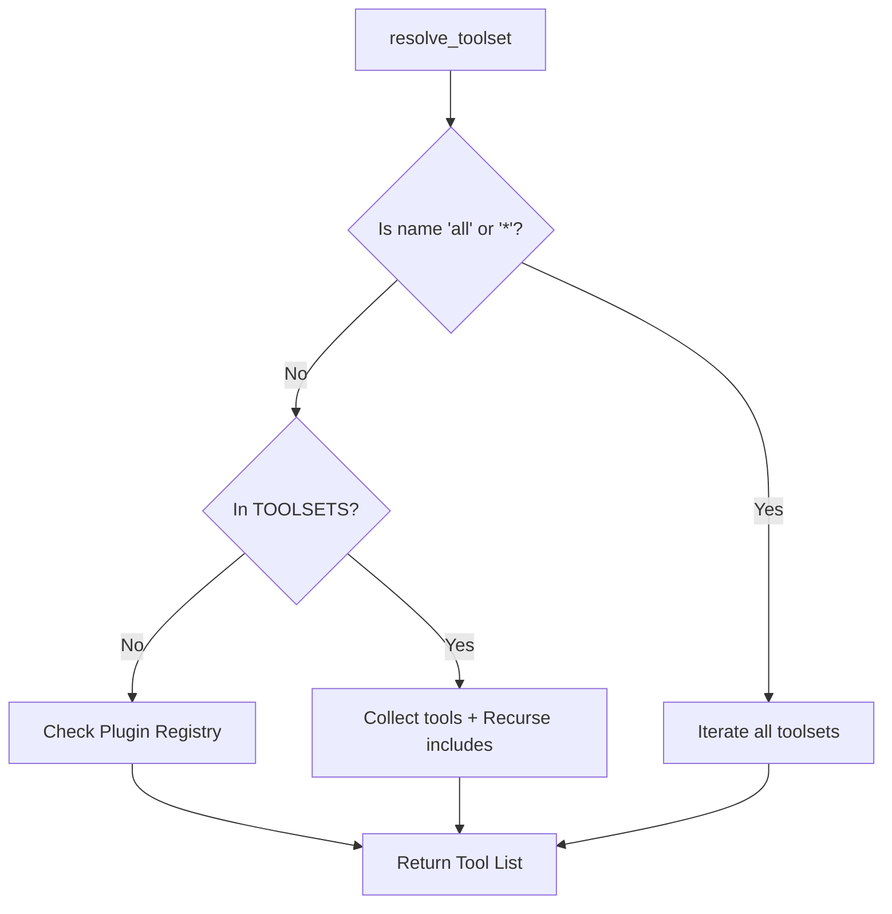

# Root — toolsets.py

# Toolsets Module

The `toolsets.py` module provides a centralized system for defining, managing, and resolving groups of tools. It allows the system to expose specific capabilities to an agent based on the environment (CLI, Telegram, VS Code) or the specific task at hand.

## Core Concepts

### Toolset Definition
A toolset is defined as a dictionary containing:
- `description`: A human-readable string explaining the toolset's purpose.
- `tools`: A list of individual tool names (e.g., `web_search`, `terminal`).
- `includes`: A list of other toolset names to be recursively included.

### Static vs. Dynamic Toolsets
1.  **Static Toolsets**: Defined within the `TOOLSETS` dictionary in this module. These include core capabilities like `web`, `browser`, and platform-specific sets like `hermes-cli`.
2.  **Dynamic Toolsets**: Registered at runtime via plugins or MCP (Model Context Protocol) servers. These are retrieved from `tools.registry.registry`.
3.  **Auto-generated Toolsets**: If a toolset named `hermes-<platform>` is requested but not defined, the module attempts to resolve it by combining `_HERMES_CORE_TOOLS` with any tools registered in the registry under that platform name.

## Toolset Resolution Flow

The primary function of this module is to "flatten" a toolset name into a deduplicated list of tool names.



### Cycle Detection
The `resolve_toolset` function uses a `visited` set to track recursion. This prevents infinite loops in cases of circular dependencies (e.g., Toolset A includes Toolset B, which includes Toolset A) and optimizes "diamond" dependencies where multiple included toolsets share a common sub-toolset.

## Key Functions

### `resolve_toolset(name: str) -> List[str]`
The workhorse of the module. It recursively resolves a toolset name into a sorted list of unique tool names.
- Supports special aliases `"all"` and `"*"` to return every available tool.
- Handles `hermes-` prefix logic for platform-specific toolsets.

### `get_toolset(name: str) -> Optional[Dict[str, Any]]`
Retrieves the raw definition of a toolset. It first checks the static `TOOLSETS` dictionary, then queries the `tools.registry.registry` for plugin-provided toolsets or MCP server aliases.

### `get_all_toolsets() -> Dict[str, Dict[str, Any]]`
Returns a merged dictionary of all static and dynamic toolset definitions. This is used by the TUI and API servers to list available capabilities.

### `create_custom_toolset(name, description, tools, includes)`
Allows for the programmatic creation of toolsets at runtime. This is useful for ephemeral sub-agents or specific task-based isolation.

## Platform Toolsets

The module defines several `hermes-` prefixed toolsets designed for specific messaging platforms and interfaces:

| Toolset | Description |
| :--- | :--- |
| `hermes-cli` | Full interactive toolset including `_HERMES_CORE_TOOLS`. |
| `hermes-acp` | Coding-focused tools for IDE integrations (VS Code, Zed); excludes messaging and UI tools like `clarify`. |
| `hermes-api-server` | OpenAI-compatible endpoint tools; excludes interactive UI tools. |
| `hermes-discord` | Core tools plus specific `discord` and `discord_admin` capabilities. |
| `hermes-gateway` | A composite toolset including all supported messaging platform toolsets. |

## Integration with Tool Registry

This module acts as a bridge between static configuration and the dynamic `tools.registry`. When `get_toolset` fails to find a static match, it calls:
- `registry.get_toolset_alias_target(name)`: To resolve MCP server aliases.
- `registry.get_tool_names_for_toolset(name)`: To fetch tools registered by external plugins.

## Usage Example

```python
from toolsets import resolve_toolset, validate_toolset

# Check if a toolset exists
if validate_toolset("research"):
    # Get all tools, including those from 'includes'
    tools = resolve_toolset("research")
    print(f"Enabled tools: {tools}")

# Resolve all available tools in the system
all_tools = resolve_toolset("*")
```

## Internal Constants
- `_HERMES_CORE_TOOLS`: The "gold standard" list of tools intended for most interactive Hermes instances. It includes web search, terminal access, file manipulation, vision, and browser automation. Modifying this list updates the default capabilities for almost all messaging platforms simultaneously.