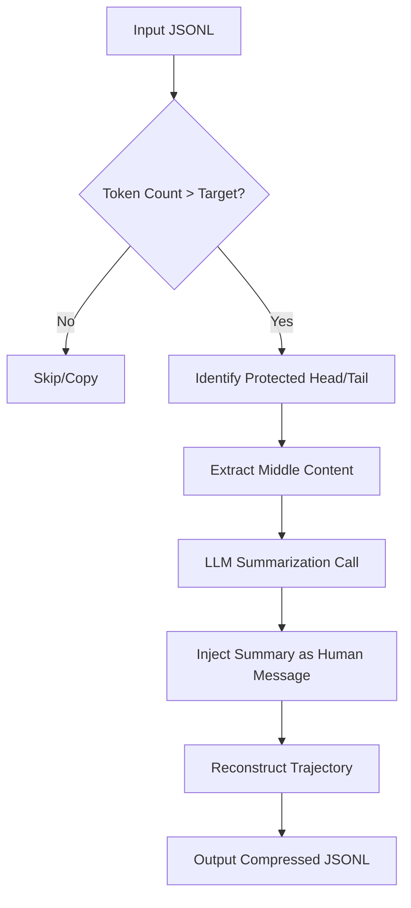

# Root — trajectory_compressor.py

# Trajectory Compressor

The `trajectory_compressor.py` module provides a robust post-processing pipeline for agent trajectories. It is designed to compress long conversation histories into a target token budget while preserving the essential training signals required for model fine-tuning or evaluation.

## Overview

As agents perform complex tasks, their trajectories often exceed the context window of the models being trained or tested. This module implements a "middle-out" compression strategy: it protects the critical setup (system prompts and initial interactions) and the final conclusions, while summarizing the intermediate tool-use loops into a single concise human message.

### Compression Strategy

The compressor follows a strict priority logic to ensure trajectory quality:
1.  **Protect Head:** Always keep the first system message, the first human message, the first GPT response, and the first tool response.
2.  **Protect Tail:** Always keep the last $N$ turns (default: 4) to preserve the final answer and the immediate context leading to it.
3.  **Compress Middle:** Only the turns between the "Head" and "Tail" are eligible for compression.
4.  **Targeted Reduction:** It only compresses as many turns as necessary to fall under the `target_max_tokens`.
5.  **LLM Summarization:** Compressed turns are sent to a summarization model (e.g., Gemini 1.5 Flash) to produce a `[CONTEXT SUMMARY]` that replaces the removed turns.

## Core Components

### CompressionConfig
A dataclass managing all hyperparameters. It can be initialized via code or loaded from a YAML file using `CompressionConfig.from_yaml()`. Key parameters include:
*   `target_max_tokens`: The hard limit for the resulting trajectory (default: 15,250).
*   `protect_last_n_turns`: Number of turns at the end to keep intact.
*   `summarization_model`: The model used to generate summaries (default: `google/gemini-3-flash-preview`).
*   `max_concurrent_requests`: Controls the parallelism of API calls during batch processing.

### TrajectoryCompressor
The primary engine responsible for token counting and transformation.

*   **Tokenization:** Uses `transformers.AutoTokenizer` (defaulting to `moonshotai/Kimi-K2-Thinking`) for accurate token counting.
*   **Logic Flow:**
    1.  `count_turn_tokens()`: Calculates the size of every message in the trajectory.
    2.  `_find_protected_indices()`: Identifies which turns cannot be touched.
    3.  `_generate_summary_async()`: Calls the summarization LLM via the `agent.auxiliary_client` provider router.
    4.  `compress_trajectory()`: Orchestrates the splicing of the head, the new summary message, and the tail.

### Metrics Tracking
The module tracks performance through `TrajectoryMetrics` (per-file) and `AggregateMetrics` (per-run). It records:
*   Tokens saved and compression ratios.
*   Turns removed vs. turns preserved.
*   API success rates and processing throughput (trajectories/sec).

## Execution Flow

The module uses `asyncio` to handle high-volume trajectory processing. When processing a directory, it loads all JSONL entries and uses a semaphore to limit concurrent LLM summarization calls.



## Integration with Agent Infrastructure

The compressor integrates with the broader `hermes` environment:
*   **Provider Routing:** Uses `agent.auxiliary_client.call_llm` and `async_call_llm` to abstract away OpenRouter, OpenAI, or custom provider logic.
*   **Temperature Handling:** Uses `_effective_temperature_for_model` to handle model-specific temperature constraints (e.g., Kimi's server-side management).
*   **Resilience:** Implements `jittered_backoff` from `agent.retry_utils` for summarization API calls.
*   **Environment:** Loads configuration via `hermes_cli.env_loader`.

## CLI Usage

The module uses `fire` to expose a developer-friendly command-line interface.

### Basic Compression
Compress a single file or an entire directory:
```bash
python trajectory_compressor.py --input=data/trajectories.jsonl --target_max_tokens=12000
```

### Sampling and Analysis
To process a subset of data (useful for testing compression quality):
```bash
python trajectory_compressor.py --input=data/run_logs --sample_percent=10 --seed=42
```

### Dry Run
Analyze how many trajectories would be compressed without performing API calls or writing files:
```bash
python trajectory_compressor.py --input=data/run_logs --dry_run=True
```

## Output Format
The compressor outputs standard JSONL files. If metrics are enabled, it adds a `compression_metrics` field to each JSON object and generates a `compression_metrics.json` summary in the output directory. Compressed trajectories include a notice in the system prompt (if configured) and a specific prefix for summarized content: `[CONTEXT SUMMARY]: ...`.