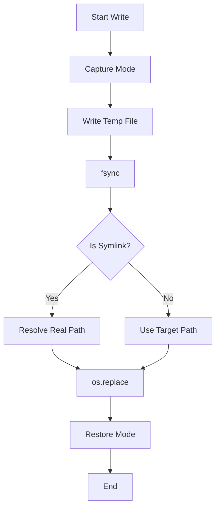

# Root — utils.py

# Root — utils.py

The `utils.py` module provides a suite of shared utility functions for the `hermes-agent` ecosystem. It focuses on robust file I/O, environment variable coercion, network proxy normalization, and secure URL parsing.

## Atomic File Operations

The module provides helpers for writing JSON and YAML files atomically. This ensures that configuration files (like `auth.json` or `SOUL.md`) are never left in a corrupted or partially-written state if the process crashes or is interrupted.

### Key Functions
- `atomic_json_write(path, data, ...)`
- `atomic_yaml_write(path, data, ...)`
- `atomic_replace(tmp_path, target)`

### Implementation Details
The atomic write flow follows a strict sequence to ensure data integrity and preserve system metadata:

1.  **Permission Capture**: `_preserve_file_mode` reads the current permission bits of the target file.
2.  **Temporary Write**: Data is written to a hidden temporary file in the same directory using `tempfile.mkstemp`.
3.  **Persistence**: The module calls `f.flush()` followed by `os.fsync()` to ensure data is physically written to the disk platter/SSD controller.
4.  **Symlink-Aware Swap**: `atomic_replace` resolves the real path of the target if it is a symlink. This prevents the common issue where `os.replace` destroys a symlink and replaces it with a regular file (critical for managed dotfiles or Docker mounts).
5.  **Permission Restoration**: `_restore_file_mode` re-applies the original permissions, as `mkstemp` defaults to restrictive `0o600` modes.



## Environment and Truthiness

To standardize configuration across the agent, the module provides a centralized definition of "truthy" values.

- **`is_truthy_value(value, default)`**: Coerces strings like `"1"`, `"true"`, `"yes"`, and `"on"` to `True`. This is used globally, including in `tools/transcription_tools.py` and `tools/approval.py`.
- **`env_var_enabled(name)`**: A shortcut for checking if an environment variable is set to a truthy value.
- **`env_int(key, default)` / `env_bool(key, default)`**: Type-safe environment variable readers with fallback values.

## Network and Proxy Normalization

The agent often runs in environments (like WSL or behind Clash) where proxy environment variables may use non-standard schemes.

- **`normalize_proxy_url(url)`**: Specifically handles the `socks://` alias by converting it to `socks5://`, which is required for compatibility with `httpx` and `aiohttp`.
- **`normalize_proxy_env_vars()`**: Iterates through standard proxy keys (both uppercase and lowercase) and updates `os.environ` in-place with normalized URLs.

## Secure URL Parsing

Standard substring matches (e.g., `if "openai.com" in base_url`) are vulnerable to spoofing. The module provides hostname-aware helpers to ensure the agent interacts with the intended providers.

- **`base_url_hostname(base_url)`**: Extracts the lowercased, normalized hostname. It handles bare hosts and full URLs correctly.
- **`base_url_host_matches(base_url, domain)`**: Checks if the hostname of a URL matches a specific domain or is a subdomain of it.

**Example:**
```python
# Returns True
base_url_host_matches("https://api.anthropic.com/v1", "anthropic.com")

# Returns False (prevents substring spoofing)
base_url_host_matches("https://anthropic.com.evil.com/v1", "anthropic.com")
```

## Data Parsing

- **`safe_json_loads(text, default)`**: A wrapper around `json.loads` that returns a default value (usually `None` or `{}`) instead of raising `JSONDecodeError` or `TypeError`. This is used extensively in adapters and client modules to handle malformed LLM outputs or API responses gracefully.