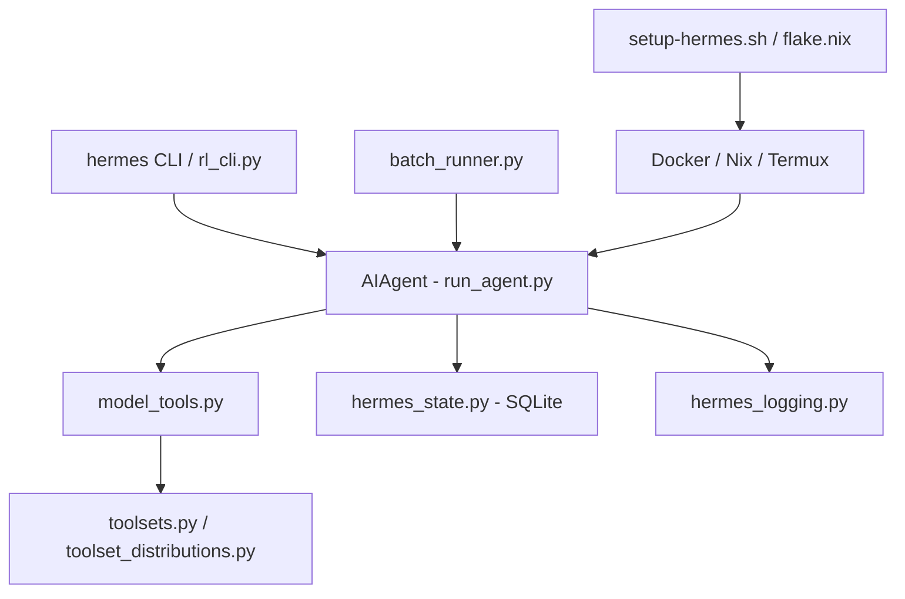

# Root

# Hermes Agent: Root Module

The **Root** module serves as the orchestration layer and configuration hub for the Hermes Agent ecosystem. It integrates the core execution logic with persistent state management, multi-platform deployment configurations, and specialized runners for training and software engineering tasks.

## System Integration Architecture

The root module bridges the gap between the high-level interfaces (CLI, Gateway, TUI) and the underlying execution environment.

## Core Components

### Orchestration & Tools
The system is centered around the `AIAgent`, which utilizes [model_tools.py](model_tools.md) to interface with the external world. Tool capabilities are managed through [toolsets.py](toolsets.md), allowing for dynamic capability resolution based on the user's environment (e.g., CLI vs. Messaging Gateway). For research and training, [toolset_distributions.py](toolset_distributions.md) enables probabilistic tool availability to diversify agent trajectories.

### Persistence & Global State
Hermes maintains a continuous learning loop through a centralized state system:
*   **[hermes_state.py](hermes_state.md)**: A SQLite-backed `SessionDB` that handles concurrent access from multiple interfaces (CLI, Telegram, Discord) using WAL mode.
*   **[hermes_constants.py](hermes_constants.md)**: The single source of truth for path resolution and environment detection across all modules.
*   **[hermes_logging.py](hermes_logging.md)**: Manages multi-file logging with secret redaction and session-specific context injection.
*   **[hermes_time.py](hermes_time.md)**: Ensures timezone-aware operations for scheduling and logging.

### Specialized Execution Loops
Beyond standard chat, the root module provides specialized entry points:
*   **[batch_runner.py](batch_runner.md)**: A parallelized framework for executing agents across large datasets with fault-tolerant checkpointing.
*   **[rl_cli.py](rl_cli.md)**: An optimized interface for Reinforcement Learning workflows, featuring extended timeouts and specialized toolsets.
*   **[mini_swe_runner.py](mini_swe_runner.md)**: A trajectory-based engine for solving software engineering tasks in sandboxed environments.
*   **[trajectory_compressor.py](trajectory_compressor.md)**: A post-processing pipeline that summarizes long agent histories into token-efficient training data.

## Deployment & Environment
The project supports a wide range of environments through modular configuration:
*   **Containerization**: Production deployments are managed via [Dockerfile](Dockerfile.md) and [docker-compose.yml](docker-compose.md), with specific hardening for [coolify-docker-compose.yaml](coolify-docker-compose.md).
*   **Reproducibility**: [flake.nix](flake.md) provides a Nix-based development shell, while [setup-hermes.sh](setup-hermes.md) automates installation on standard Linux and [Termux](constraints-termux.md) (Android) environments.
*   **Interoperability**: [mcp_serve.py](mcp_serve.md) exposes Hermes conversation history to external IDEs and clients via the Model Context Protocol.

## Configuration & Metadata
Global behavior is governed by [cli-config.yaml](cli-config.md), which defines model parameters and provider routing. The project's Python lifecycle is defined in [pyproject.toml](pyproject.md), while [package.json](package.md) manages the Node.js dependencies required for browser-based toolsets.