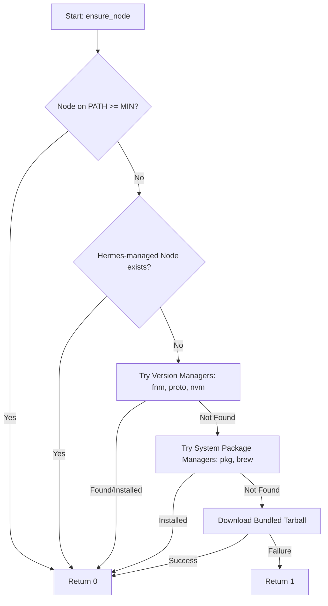

# scripts — lib

# Node Bootstrap Library (`node-bootstrap.sh`)

The `node-bootstrap.sh` script is a sourceable bash utility designed to ensure a compatible Node.js environment is available. It is primarily used by the Hermes TUI (React + Ink), browser automation tools, and the WhatsApp bridge.

The script follows a "first hit wins" strategy, prioritizing existing user configurations and version managers before attempting to install a managed binary.

## Configuration

The script can be configured via environment variables set before sourcing.

| Variable | Default | Description |
| :--- | :--- | :--- |
| `HERMES_NODE_MIN_VERSION` | `20` | The minimum major version required to skip installation. |
| `HERMES_NODE_TARGET_MAJOR` | `22` | The major version to install if no compatible version is found. |
| `HERMES_HOME` | `$HOME/.hermes` | The directory where Hermes-managed binaries are stored. |

## Public API

### `ensure_node`
The primary entry point for the module. It performs a sequence of checks and installation attempts to guarantee Node.js availability.

**Returns:**
- `0` if a compatible Node.js version is found or successfully installed.
- `1` if all installation attempts fail.

**Side Effects:**
- Sets `HERMES_NODE_AVAILABLE` to `true` or `false`.
- Modifies `PATH` if a Hermes-managed or version-manager-controlled Node.js is used.
- Creates symlinks in `$HOME/.local/bin` when performing a bundled installation.

```bash
source scripts/lib/node-bootstrap.sh

if ensure_node; then
  echo "Node version: $(node --version)"
fi
```

## Resolution Strategy

The `ensure_node` function executes the following checks in order:



### 1. Existing Environment
The script first calls `_nb_have_modern_node` to check if the current `PATH` already satisfies `HERMES_NODE_MIN_VERSION`.

### 2. Version Managers
If no system Node is found, the script attempts to leverage existing version managers in the following order:
- **fnm**: Runs `fnm install` and `fnm use`.
- **proto**: Runs `proto install node`.
- **nvm**: Sources `nvm.sh` from `NVM_DIR` and runs `nvm install`.

### 3. Platform Package Managers
- **Termux**: Uses `pkg install nodejs`.
- **macOS**: Uses `brew install node@<MAJOR>`.

### 4. Bundled Binary Fallback (`_nb_install_bundled_node`)
As a last resort, the script identifies the system architecture (`x64`, `arm64`, `armv7l`) and OS (`linux`, `darwin`), fetches the latest minor version of the target major release from `nodejs.org`, and extracts it into `$HERMES_HOME/node`.

It then creates symlinks for `node`, `npm`, and `npx` in `$HOME/.local/bin` to ensure persistence across sessions without requiring shell profile (`.bashrc`/`.zshrc`) edits.

## Logging Integration
The module is designed to integrate with the host script's logging system. It looks for the following functions:
- `log_info`
- `log_success`
- `log_warn`

If these are not defined in the calling script, it falls back to standard `printf` output to `stderr`.

## Internal Helpers
- `_nb_is_termux`: Detects if the environment is Termux via `TERMUX_VERSION` or `PREFIX` path.
- `_nb_node_major`: Parses the output of `node --version` to return an integer major version.
- `_nb_have_modern_node`: Validates both the existence of the `node` command and its version compliance.