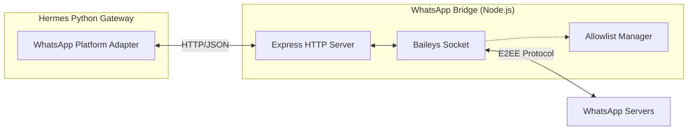

# scripts — whatsapp-bridge

# WhatsApp Bridge

The WhatsApp Bridge is a standalone Node.js module that enables the Hermes Agent to communicate over WhatsApp. It utilizes the [Baileys](https://github.com/WhiskeySockets/Baileys) library to interface with the WhatsApp Web API and exposes a RESTful HTTP interface for the Python-based gateway.

## Architecture

The bridge acts as a middleware layer between the WhatsApp network and the Hermes internal services. It manages the persistent socket connection, handles authentication via QR codes, and provides a simplified API for message exchange.

## Core Components

### `bridge.js`
The main entry point that initializes the WhatsApp connection and the HTTP server.

- **Connection Management**: Uses `useMultiFileAuthState` to persist session data in the specified session directory. It handles automatic reconnections and QR code generation for initial pairing.
- **Message Polling**: Implements a long-polling pattern. Incoming messages are pushed into an internal `messageQueue` (capped at 100 items) and retrieved by the gateway via `GET /messages`.
- **Media Handling**: Automatically downloads incoming images, videos, audio, and documents to local cache directories (`~/.hermes/*_cache`). It returns the local file paths to the gateway.
- **Loop Prevention**: In `self-chat` mode, the bridge uses `recentlySentIds` and a configurable `REPLY_PREFIX` to identify and ignore messages sent by the agent itself, preventing infinite response loops.

### `allowlist.js`
A utility module for filtering incoming traffic. It is critical for security when the bridge is exposed or used in group settings.

- **Identity Normalization**: `normalizeWhatsAppIdentifier` strips JID suffixes (e.g., `@s.whatsapp.net`, `@lid`) and formatting to produce a clean numeric ID.
- **LID Mapping**: WhatsApp increasingly uses LIDs (Linked Identity Devices) instead of phone numbers for message attribution. This module reads `lid-mapping-*.json` files from the session directory to transparently resolve phone numbers to LIDs and vice versa.
- **Wildcard Support**: Supports `*` in the `WHATSAPP_ALLOWED_USERS` environment variable to allow all incoming messages.

## Operational Modes

The bridge behavior changes based on the `WHATSAPP_MODE` environment variable:

| Mode | Description |
| :--- | :--- |
| `self-chat` | (Default) The agent operates on the user's primary account. It only responds to messages in the "Message Yourself" chat or messages where the sender is the user. |
| `bot` | The agent operates on a dedicated WhatsApp number. It responds to all allowed users and does not prepend the `REPLY_PREFIX`. |

## HTTP API Reference

The bridge binds to `127.0.0.1` by default and enforces Host-header validation to prevent DNS rebinding attacks.

### Endpoints

- **`GET /messages`**: Returns all queued incoming messages and clears the queue.
- **`POST /send`**: Sends a text message.
    - Body: `{ "chatId": "string", "message": "string", "replyTo": "string?" }`
- **`POST /send-media`**: Sends a file natively.
    - Body: `{ "chatId": "string", "filePath": "string", "mediaType": "image|video|audio|document", "caption": "string?", "fileName": "string?" }`
- **`POST /edit`**: Edits an existing message sent by the bot.
    - Body: `{ "chatId": "string", "messageId": "string", "message": "string" }`
- **`POST /typing`**: Triggers the "composing..." status.
- **`GET /chat/:id`**: Fetches metadata for a specific chat or group.
- **`GET /health`**: Returns connection status and queue depth.

## Configuration

### Environment Variables

| Variable | Description | Default |
| :--- | :--- | :--- |
| `WHATSAPP_MODE` | `self-chat` or `bot`. | `self-chat` |
| `WHATSAPP_ALLOWED_USERS` | Comma-separated list of phone numbers or LIDs. | (Empty - allows none) |
| `WHATSAPP_REPLY_PREFIX` | String prepended to messages in `self-chat` mode. | `⚕ *Hermes Agent*...` |
| `WHATSAPP_DEBUG` | Enables verbose logging of message objects. | `false` |

### CLI Arguments

- `--port <number>`: Port for the HTTP server (default: 3000).
- `--session <path>`: Directory to store authentication credentials.
- `--pair-only`: Runs the bridge only to display the QR code and save credentials, then exits.

## Identity Resolution Logic

Because WhatsApp users can be identified by either a Phone Number JID or a LID JID, the bridge performs recursive expansion during allowlist checks:

1. The `senderId` is normalized.
2. The bridge looks for `lid-mapping-{id}.json` and `lid-mapping-{id}_reverse.json` in the session folder.
3. It builds a set of all known aliases for that user.
4. If any alias exists in the `ALLOWED_USERS` set, the message is processed.

This allows developers to put a standard phone number in the allowlist while still supporting modern WhatsApp LID-based routing.