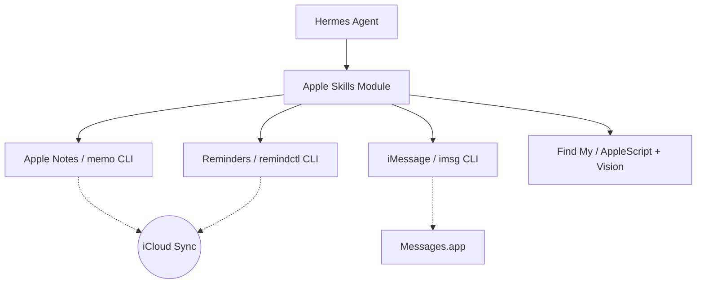

# skills — apple

# Apple Skills Module

The `skills/apple` module provides a suite of tools for interacting with native macOS applications and iCloud-synced services. It enables the agent to manage personal information, communications, and device tracking directly through the macOS ecosystem.

## Overview

This module is strictly limited to **macOS** environments. It leverages a combination of specialized CLI wrappers, AppleScript, and UI automation to bridge the gap between the agent and sandboxed Apple applications.

### Core Components

| Skill | Underlying Tool | Primary Function |
| :--- | :--- | :--- |
| `apple-notes` | `memo` | CRUD operations on iCloud Notes. |
| `apple-reminders` | `remindctl` | Task and list management in Reminders.app. |
| `imessage` | `imsg` | Sending and reading iMessage/SMS. |
| `findmy` | AppleScript / Vision | Tracking devices and AirTags via UI scraping. |

---

## Architecture & Integration

The module operates by executing shell commands that interface with macOS APIs or local databases. Because many Apple apps do not provide public APIs, the module relies on external CLI utilities that must be installed on the host system.



---

## Sub-Module Details

### Apple Notes (`apple-notes`)
Uses the `memo` CLI to interact with the Apple Notes database. 
- **Key Pattern:** Prefers interactive modes for deletion/editing but supports direct creation via `memo notes -a "Title"`.
- **Data Flow:** Notes are synced via iCloud, making them available on iOS/iPadOS devices automatically.
- **Constraint:** Cannot programmatically edit notes containing rich media (images/attachments).

### Apple Reminders (`apple-reminders`)
Uses `remindctl` for task management.
- **Programmatic Access:** Developers should use the `--json` flag (e.g., `remindctl today --json`) to parse reminder data reliably.
- **Date Handling:** Supports natural language (today, tomorrow) and ISO 8601 strings.
- **Permissions:** Requires the user to grant "Reminders" access to the terminal/agent process.

### iMessage (`imessage`)
Uses `imsg` to read and send messages.
- **Security:** Requires **Full Disk Access** in macOS System Settings to read the `chat.db` file.
- **Service Selection:** Can force `imessage` or `sms` services using the `--service` flag.
- **Workflow:** Always verify the recipient's identity via `imsg chats` before sending to avoid messaging the wrong contact.

### Find My (`findmy`)
This is a "Vision-based" skill because Apple provides no CLI or API for Find My.
- **Execution Flow:**
    1. Trigger AppleScript to activate `FindMy.app`.
    2. Use `screencapture` or `peekaboo` to take a screenshot of the UI.
    3. Pass the image to `vision_analyze` to extract location data or device status.
- **Tracking:** To track moving items (like AirTags), the Find My window must remain in the foreground to receive location updates.

---

## Developer Guidelines

### Prerequisites & Setup
Most skills in this module require specific Homebrew packages:
```bash
brew tap antoniorodr/memo && brew install antoniorodr/memo/memo
brew install steipete/tap/remindctl
brew install steipete/tap/imsg
brew install steipete/tap/peekaboo # Optional for FindMy
```

### Permission Handling
When contributing to or using these skills, handle the following macOS permission prompts:
1. **Automation:** Required for AppleScript to control apps.
2. **Full Disk Access:** Required for reading iMessage history.
3. **Screen Recording:** Required for the `findmy` skill to capture the UI.

### Best Practices
- **Confirmation:** Always confirm destructive actions (deleting notes, completing reminders) or outbound communications (sending iMessages) with the user.
- **Tool Selection:** Use `apple-notes` for long-term storage and `memory` tools for short-term agent context.
- **Parsing:** Always prefer JSON output flags when available to avoid fragile regex parsing of CLI stdout.