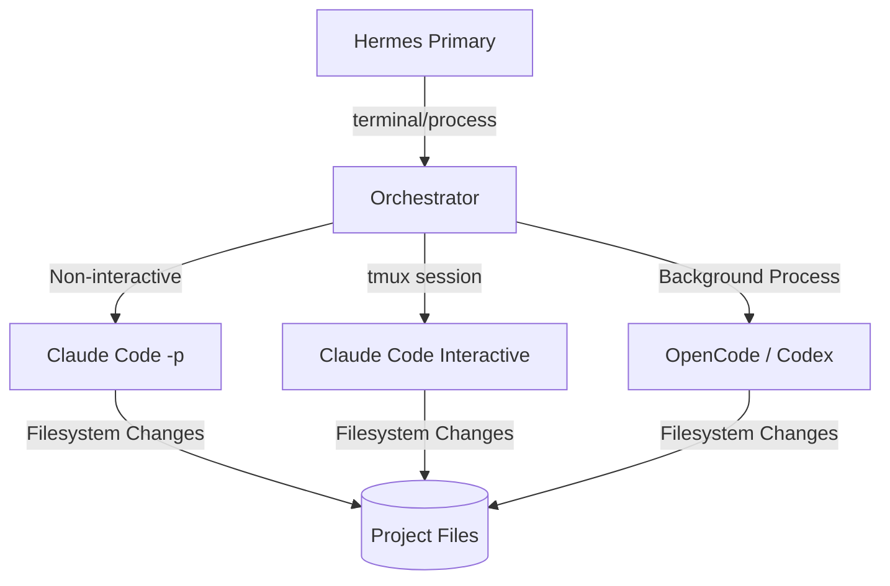

# skills — autonomous-ai-agents

# Autonomous AI Agents Module

The `autonomous-ai-agents` module provides the orchestration logic and skill definitions required to spawn, manage, and delegate tasks to independent AI coding agents. It enables a multi-agent architecture where a primary Hermes instance can act as a "manager" that delegates complex, long-running, or specialized coding tasks to sub-agents like **Claude Code**, **OpenCode**, and **Codex**, or even additional instances of **Hermes** itself.

## Orchestration Architecture

Hermes interacts with these agents primarily through the `terminal` and `process` tools. Because these agents are often interactive TUI (Terminal User Interface) applications, the module emphasizes two distinct execution patterns:

1.  **One-Shot (Print) Mode:** Non-interactive execution where the agent performs a task and exits. This is the preferred method for automation and CI/CD pipelines.
2.  **Interactive PTY Mode:** Running the agent inside a pseudo-terminal (PTY), often managed via `tmux`, to allow for multi-turn conversations and human-in-the-loop decision-making.

---

## Claude Code Orchestration

Claude Code (Anthropic) is the primary autonomous coding agent supported. It features deep filesystem access, shell execution, and git workflow management.

### Execution Modes

| Mode | Command Pattern | Use Case |
| :--- | :--- | :--- |
| **Print (`-p`)** | `claude -p "task" --max-turns 10` | Automated bug fixes, refactors, and structured JSON extraction. |
| **Interactive** | `tmux new-session ... 'claude'` | Iterative development, exploratory coding, and manual review. |

### Critical: PTY Dialog Handling
When running in interactive mode via `tmux`, Claude Code presents confirmation dialogs that must be handled programmatically:
*   **Workspace Trust:** Requires a single `Enter` keypress.
*   **Permissions Bypass:** When using `--dangerously-skip-permissions`, the default selection is "No". Orchestrators must send `Down` then `Enter` to accept.

### Structured Output
Claude Code supports `--json-schema` in print mode, allowing Hermes to receive validated, machine-readable results from an autonomous coding session.

---

## Hermes Agent (Self-Orchestration)

The `hermes-agent` skill allows Hermes to spawn additional instances of itself. This is useful for long-running "missions" that should not block the primary conversation.

### Spawning Patterns
*   **Delegation:** Use the `delegate_task` tool for quick, in-process subtasks.
*   **Process Spawning:** Use `hermes chat -q "task"` for independent, fire-and-forget background execution.
*   **Worktree Isolation:** Use the `-w` or `--worktree` flag when spawning agents to ensure they operate in an isolated git worktree, preventing filesystem collisions between parallel agents.

### Configuration Management
Hermes instances are configured via `~/.hermes/config.yaml`. Key orchestration settings include:
*   **`approvals.mode`**: Set to `manual`, `smart`, or `off` (YOLO).
*   **`security.redact_secrets`**: When enabled, masks API keys and tokens in tool outputs before they reach the LLM.

---

## OpenCode & Codex Integration

These agents are utilized for provider-agnostic coding tasks and specialized PR reviews.

### OpenCode
*   **Binary:** `opencode-ai`.
*   **Pattern:** Prefers `opencode run 'task'` for one-shots.
*   **TUI Exit:** Must be killed via `Ctrl+C` (`\x03`) or process kill; `/exit` is not a valid command in its TUI.

### Codex
*   **Requirement:** **Must** run inside a git repository.
*   **PTY:** Always requires `pty=true` in terminal calls as it is inherently interactive.
*   **Safety:** Supports `--full-auto` for sandboxed approvals and `--yolo` for unrestricted execution.

---

## Multi-Agent Workflows

The module enables complex parallel workflows by combining `tmux` and git worktrees.

### Parallel Feature Implementation
A common pattern for implementing multiple features simultaneously:
1.  **Create Worktrees:** `git worktree add -b feature-a ./feature-a main`.
2.  **Spawn Agents:** Launch independent `claude` or `hermes` processes in each directory.
3.  **Monitor:** Use `tmux capture-pane` to scrape the status of each agent.
4.  **Consolidate:** Once agents finish, the primary Hermes instance reviews the changes and merges the worktrees.

### PR Review Pipeline
1.  Fetch PR refs.
2.  Spawn an agent with the specific task: `claude -p "Review PR #42" --from-pr 42`.
3.  The agent autonomously reads the diff, runs tests, and generates a summary.

---

## Security and Safety Controls

Orchestrating autonomous agents requires strict safety boundaries:

*   **`--max-turns`**: Limits the number of agentic loops to prevent infinite loops and runaway API costs.
*   **`--max-budget-usd`**: Caps the total spend for a single autonomous session.
*   **`--allowedTools`**: Whitelists specific capabilities (e.g., allowing `Read` and `Bash(npm test)` but disallowing `Write`).
*   **`--bare`**: Used in CI/CD to skip loading local plugins, hooks, and `CLAUDE.md` files for a clean, predictable environment.

## Project Context (CLAUDE.md)

All agents in this module respect the `CLAUDE.md` (or `.claude/rules/`) convention. This file serves as the "memory" for the project, containing:
*   Build and test commands.
*   Code style guidelines.
*   Architectural patterns.

When spawning a sub-agent, Hermes ensures these context files are present so the sub-agent adheres to the project's specific standards without manual prompting.