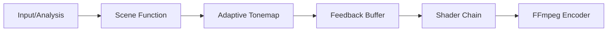

# skills — creative

# Skills — Creative

The **Creative** module provides a suite of tools for technical visualization and generative art. It is divided into three primary domains: professional architecture diagrams, static ASCII art utilities, and a high-fidelity ASCII video rendering pipeline.

## Architecture Diagrams

The `architecture-diagram` skill generates standalone, dark-themed HTML files containing inline SVG graphics. It is designed for infrastructure mapping, service topology, and cloud architecture.

### Design System
The module uses a semantic color palette to categorize components:

| Category | Fill (RGBA) | Stroke (Hex) |
| :--- | :--- | :--- |
| **Frontend** | `rgba(8, 51, 68, 0.4)` | `#22d3ee` (Cyan) |
| **Backend** | `rgba(6, 78, 59, 0.4)` | `#34d399` (Emerald) |
| **Database** | `rgba(76, 29, 149, 0.4)` | `#a78bfa` (Violet) |
| **Cloud/AWS** | `rgba(120, 53, 15, 0.3)` | `#fbbf24` (Amber) |
| **Security** | `rgba(136, 19, 55, 0.4)` | `#fb7185` (Rose) |

### Implementation Patterns
- **Double-Rect Masking**: To prevent connection lines from showing through semi-transparent component fills, the module draws an opaque background rect (`#0f172a`) before the styled semi-transparent rect.
- **Z-Order Management**: Arrows and connection lines are rendered immediately after the background grid to ensure they appear behind component boxes.
- **Grid System**: Uses a 40px SVG pattern (`#1e293b`) for alignment.

---

## ASCII Art Utilities

The `ascii-art` skill aggregates multiple CLI tools and REST APIs for text-based visual design.

### Toolset
1.  **Text Banners**: Uses `pyfiglet` (local) or the `asciified` API (remote) for FIGlet font rendering.
2.  **Decorative Borders**: Uses `boxes` to wrap text in frames (e.g., `stone`, `parchment`, `c-cmt`).
3.  **Character Art**: Uses `cowsay` for speech-bubble art and `ascii.co.uk` (via `curl` and regex parsing) for subject-specific pre-made art.
4.  **Image Conversion**: Uses `ascii-image-converter` or `jp2a` to transform raster images into character grids.
5.  **Dynamic Data**: Fetches weather (`wttr.in`), moon phases, and QR codes (`qrenco.de`) as ASCII via `curl`.

---

## ASCII Video Pipeline

The `ascii-video` module is a sophisticated rendering engine that converts video, audio, or mathematical functions into colored ASCII MP4/GIF files. It relies on **NumPy** for vectorized math and **Pillow** for font rasterization.

### The Rendering Pipeline

### Core Components

#### 1. GridLayer Class
The `GridLayer` manages font rasterization and coordinate mapping. It pre-computes aspect-corrected polar and Cartesian coordinates to allow for vectorized effect generation.
- **Cell Height Calculation**: Uses `ascent + descent` from `font.getmetrics()` rather than `textbbox` to ensure consistent vertical spacing.
- **Bitmap Cache**: Pre-rasterizes the character palette into `float32` bitmaps stored in `self.bm`.

#### 2. Multi-Grid Composition
Complexity is achieved by layering multiple grids of different densities.
- **`_render_vf()`**: The primary helper that maps a **Value Field** (brightness) and **Hue Field** (color) to a specific `GridLayer`.
- **Interference Patterns**: By blending a small grid (`sm`, 10px) with a large grid (`lg`, 20px), the engine creates natural texture interference.

#### 3. Adaptive Tonemapping
Because ASCII on black is inherently dark, the module uses `tonemap()` instead of linear multipliers.
- **Logic**: It calculates the 1st and 99.5th percentiles of the frame, stretches the range, and applies a gamma curve (default `0.75`).
- **Performance**: Subsamples the frame (4x) during percentile calculation to minimize CPU overhead.

#### 4. Feedback & Shaders
- **`FeedbackBuffer`**: Implements temporal recursion. It applies spatial transforms (zoom, rotate, shift) to the previous frame before blending it into the current one.
- **`ShaderChain`**: A post-processing stack that applies effects like `sh_kaleidoscope`, `sh_chromatic_aberration`, and `sh_crt_barrel` to the final pixel canvas.

### Color Systems
The module supports three color models:
1.  **HSV**: Standard for most generative effects.
2.  **Discrete RGB**: Used for retro palettes (e.g., `COLORS_CYBERPUNK`, `COLORS_VAPORWAVE`).
3.  **OKLAB/OKLCH**: Used for perceptually uniform gradients and color harmonies. Functions like `lerp_oklch` prevent the "gray-out" effect seen in standard RGB interpolation.

### Execution & Parallelism
To handle the high computational cost of character rendering (~150ms/frame), the module uses `concurrent.futures` to distribute frame ranges across multiple workers. Each worker pipes raw RGB bytes directly to an `ffmpeg` subprocess to avoid memory bottlenecks.

**Critical Note**: When piping to FFmpeg, `stderr` must be redirected to a file or `DEVNULL` to prevent the 64KB pipe buffer from deadlocking the process during long renders.