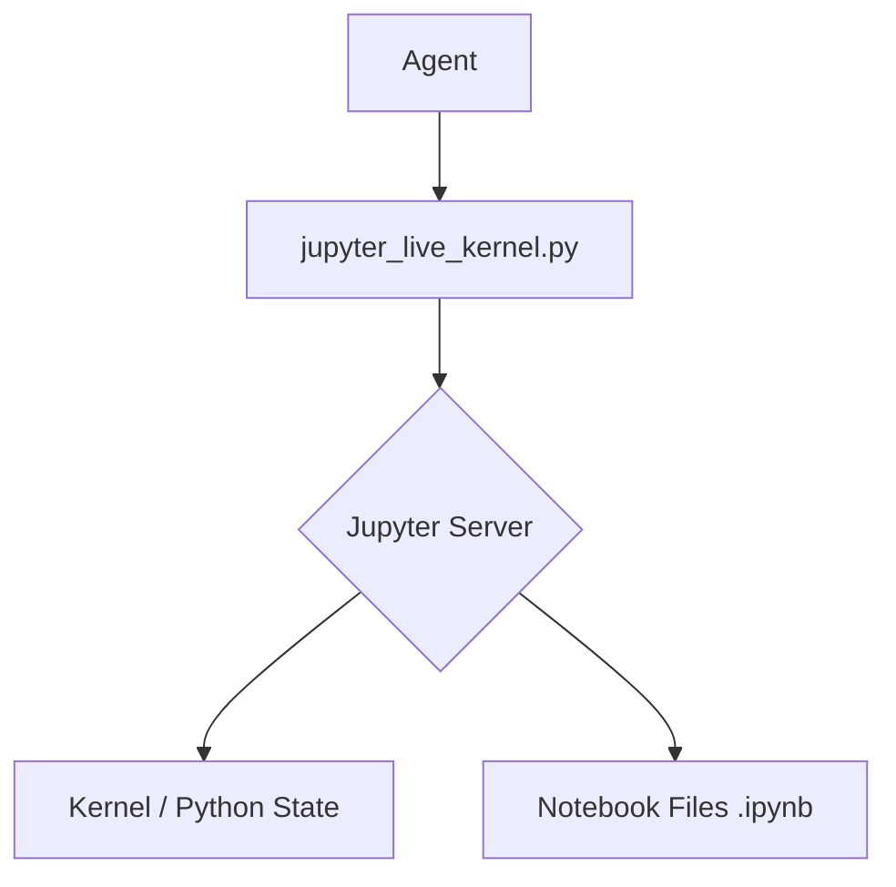

# skills — data-science

# Data Science Skill: Jupyter Live Kernel

The `jupyter-live-kernel` skill provides a stateful Python execution environment by interfacing with a live Jupyter kernel. Unlike standard stateless execution tools, this module allows for incremental state building, making it the primary tool for data exploration, model training, and iterative debugging.

## Overview

The module wraps the `hamelnb` utility script (`jupyter_live_kernel.py`) to communicate with a Jupyter server via REST APIs and WebSockets. It enables an agent to treat a `.ipynb` file as a persistent REPL.

### Key Differences

| Feature | `jupyter-live-kernel` | `execute_code` |
| :--- | :--- | :--- |
| **Persistence** | Stateful (variables persist across calls) | Stateless (fresh process every time) |
| **Context** | Best for Data Science, ML, and EDA | Best for one-off scripts and tool usage |
| **Environment** | Runs in JupyterLab's environment | Runs in the agent's local environment |
| **Output** | Rich JSON (tracebacks, variable lists) | Standard STDOUT/STDERR |

## Architecture

The skill acts as a bridge between the agent's command line and a headless JupyterLab instance.



## Setup and Initialization

The skill requires a running Jupyter server. If a server is not detected, it must be started manually or via a shell command before the skill can function.

### 1. Server Discovery
Check for existing servers:
```bash
uv run "$SCRIPT" servers --compact
```

### 2. Session Creation
If no session exists for a notebook, one must be initialized via the Jupyter REST API:
```bash
curl -s -X POST http://127.0.0.1:8888/api/sessions \
  -H "Content-Type: application/json" \
  -d '{"path":"scratch.ipynb","type":"notebook","name":"scratch.ipynb","kernel":{"name":"python3"}}'
```

## Core Operations

### Code Execution
The `execute` command is the primary interface. It sends code to the kernel associated with a specific notebook path.

```bash
uv run "$SCRIPT" execute --path <notebook.ipynb> --code '<python_code>' --compact
```
*   **Persistence:** All imports and variables defined in `<python_code>` remain available for subsequent `execute` calls.
*   **Timeouts:** Defaults to 30s. Use `--timeout` for heavy computations.

### State Inspection
Developers can inspect the current memory state of the kernel without executing new logic.

*   **List Variables:** `uv run "$SCRIPT" variables --path <nb.ipynb> list`
*   **Preview Variable:** `uv run "$SCRIPT" variables --path <nb.ipynb> preview --name <varname>`

### Notebook Manipulation
The skill allows for direct manipulation of the `.ipynb` JSON structure:

*   **`contents`**: Returns the current list of cells and their IDs.
*   **`edit insert`**: Adds a new cell at a specific index.
*   **`edit replace-source`**: Updates the code within an existing cell using its `cell-id`.
*   **`edit delete`**: Removes a cell.

## Execution Flow: Verification

When a notebook needs to be validated from a clean state (e.g., before committing or after complex iterations), use the `restart-run-all` command.

1.  **Restart:** The kernel is killed and a fresh one is started.
2.  **Execution:** Every cell in the notebook is executed in order.
3.  **Persistence:** If `--save-outputs` is passed, the resulting cell outputs are written back to the `.ipynb` file.

## Developer Guidelines

### Token Management
The output from Jupyter can be extremely verbose (especially DataFrames or long tracebacks). 
*   **Always use the `--compact` flag** to strip unnecessary metadata from the JSON response.
*   When inspecting large DataFrames, use `.head()` or `.info()` within the `execute` call rather than returning the whole object.

### Error Handling
Errors are returned as structured JSON. Key fields to inspect:
*   `ename`: The exception type (e.g., `NameError`).
*   `evalue`: The error message.
*   `traceback`: A list of strings representing the stack trace.

### Environment Consistency
Since the kernel runs within the JupyterLab environment, any libraries required for a task must be installed in that specific environment. If a module is missing, use the `terminal` skill to `pip install` or `uv pip install` into the Jupyter environment before retrying the execution.