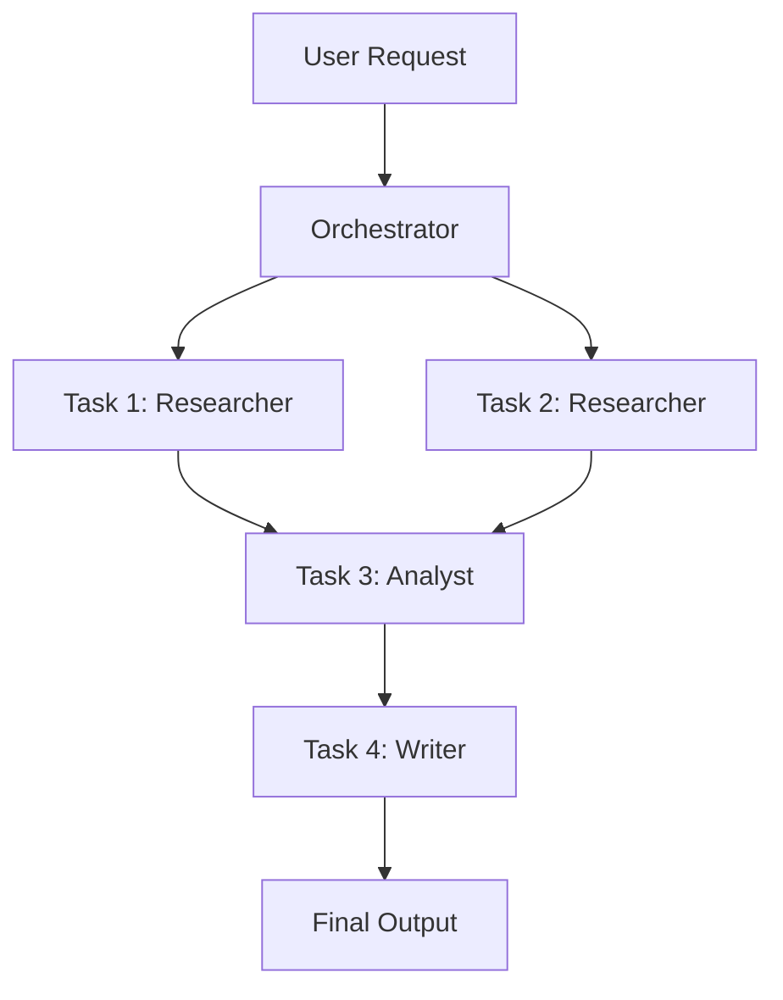

# skills — devops

# DevOps & Orchestration Skills

The **DevOps** module provides the logic and conventions for multi-agent coordination, task decomposition, and event-driven automation within the Hermes ecosystem. It is divided into three primary functional areas: **Orchestration** (routing and planning), **Execution** (worker lifecycle), and **Automation** (webhook-driven triggers).

## Kanban Orchestration

The Orchestrator is a high-level profile responsible for decomposing complex user requests into a directed acyclic graph (DAG) of tasks. The core philosophy is **"Route, don't execute."**

### The Orchestration Lifecycle
1.  **Decomposition:** Break the goal into discrete tasks assigned to specialized profiles (e.g., `researcher`, `backend-eng`).
2.  **Graph Sketching:** Define dependencies using the `parents` argument in `kanban_create`.
3.  **Fan-out:** Dispatch parallel tasks that have no mutual dependencies.
4.  **Handoff:** Use `kanban_complete` to summarize the plan for the user or a downstream supervisor.

### Key Tools
*   `kanban_create(title, assignee, body, parents=[], tenant=None)`: Spawns a new task. Children in the `parents` list remain in `todo` until all parents are `done`.
*   `kanban_link(parent_id, child_id)`: Manually establishes dependencies between existing tasks.
*   `kanban_complete(summary, metadata)`: Finalizes the orchestrator's planning phase.



---

## Kanban Worker Execution

Workers are specialized agents dispatched to fulfill specific tasks. Every worker follows a standardized lifecycle injected via `KANBAN_GUIDANCE`.

### Workspace Types
Workers operate within `$HERMES_KANBAN_WORKSPACE`. The behavior changes based on the workspace kind:
*   **`scratch`**: A temporary directory for one-off tasks.
*   **`dir:<path>`**: A persistent directory for long-lived state or shared resources.
*   **`worktree`**: A Git worktree for code implementation. Workers should commit changes here.

### The Worker Loop
1.  **Orient:** Call `kanban_show` to verify task status and read parent outputs.
2.  **Work:** Execute the task within the assigned workspace.
3.  **Heartbeat:** Periodically call `kanban_heartbeat` for long-running tasks (intervals > 2 mins).
4.  **Handoff:** Call `kanban_complete` with structured `metadata` to assist downstream agents.

### Handling Blockers
If a worker lacks information or credentials, they must call `kanban_block(reason)`. 
*   **Do NOT** use `delegate_task` for cross-agent handoffs; use `kanban_create` or `kanban_block`.
*   **Do NOT** finish a task partially; block it and wait for human or system intervention.

---

## Webhook Subscriptions

The `webhook-subscriptions` skill enables event-driven agent activation. It allows external services (GitHub, Stripe, CI/CD) to trigger Hermes runs via HMAC-signed POST requests.

### Configuration & Setup
Webhooks must be enabled in `~/.hermes/config.yaml` or via environment variables (`WEBHOOK_ENABLED=true`). The gateway listens on a configured port (default `8644`) and validates incoming payloads against a global or subscription-specific secret.

### Subscription Management
Subscriptions are managed via the `hermes webhook` CLI:

```bash
# Create a subscription for GitHub issues
hermes webhook subscribe github-triage \
  --events "issues" \
  --prompt "New issue: {issue.title}\nBody: {issue.body}" \
  --deliver telegram \
  --deliver-chat-id "12345"
```

### Advanced Patterns
*   **Payload Templating:** Use `{dot.notation}` to inject JSON fields from the webhook payload directly into the agent's prompt.
*   **Direct Delivery (`--deliver-only`):** Bypasses the LLM entirely. The rendered prompt is sent directly to the output adapter (e.g., Telegram). This is ideal for high-volume monitoring alerts where reasoning is not required.
*   **Tenant Isolation:** If `HERMES_TENANT` is active, webhooks inherit the tenant context, ensuring data isolation in persistent memory.

---

## Best Practices for Developers

### Orchestrator Anti-Temptation
Orchestrators often lack implementation tools (terminal, file access). If you are writing an orchestrator profile, ensure it strictly delegates work. If no specialist fits the task, the orchestrator should ask the user to define a new profile rather than attempting the work itself.

### Structured Metadata
When calling `kanban_complete`, always populate the `metadata` field with machine-readable data.
*   **Bad:** `summary="I fixed the bugs."`
*   **Good:** `metadata={"files_fixed": ["app.py"], "tests_passed": 5, "coverage": "88%"}`
This allows downstream `analyst` or `reviewer` profiles to process results without parsing natural language.

### Error Recovery
Workers should check `kanban_show` for previous `runs`. If a task is a retry, the `error` or `outcome` fields (e.g., `timed_out`, `crashed`) provide the necessary context to avoid repeating the same failure path.