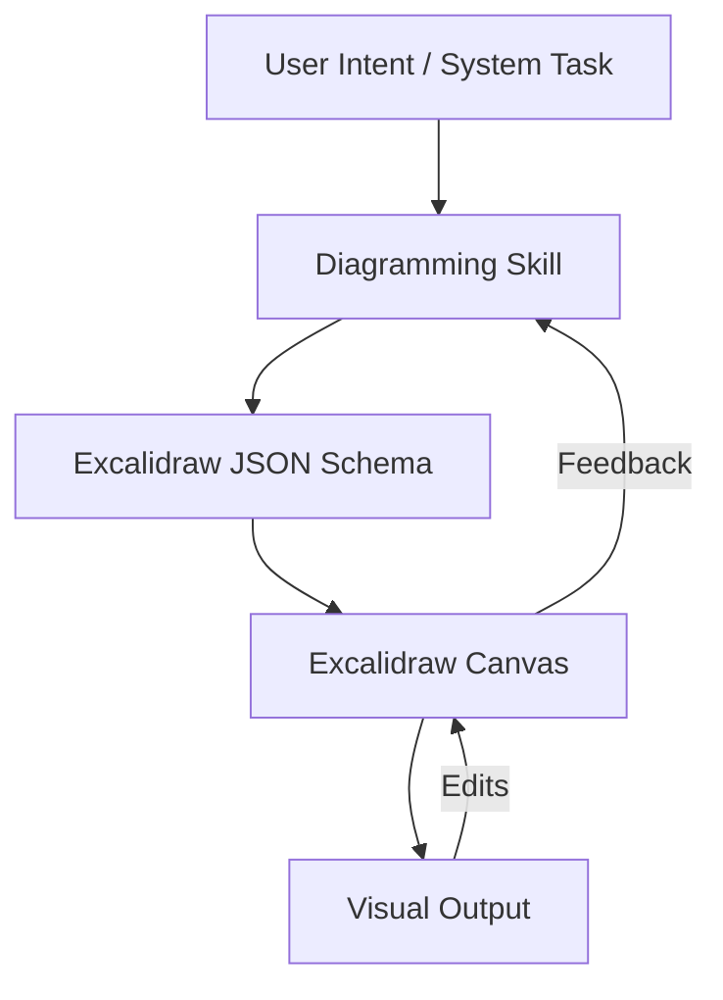

# skills — diagramming

# Diagramming Skill Module

The `skills/diagramming` module provides the system with the capability to generate, modify, and interpret visual diagrams. It acts as a bridge between high-level conceptual descriptions (like system architectures or logic flows) and structured visual formats, primarily targeting **Excalidraw** for rendering.

## Overview

This module enables the AI to communicate complex ideas that are better suited for visual representation than text. It is designed to handle:
*   **Architecture Diagrams:** Visualizing cloud infrastructure, microservices, and data flow.
*   **Flowcharts:** Mapping out decision logic, business processes, and algorithm steps.
*   **Sequence Diagrams:** Illustrating interactions between components over time.
*   **UI Wireframes:** Creating low-fidelity mockups for interface planning.

## Core Capabilities

The module defines the schemas and constraints required to produce valid visual assets. Unlike standard image generation, this module focuses on **vector-based, editable diagrams**.

### Excalidraw Integration
The primary output format is the Excalidraw scene schema. This allows the generated diagrams to be:
1.  **Interactive:** Users can move elements, change colors, and edit text within the UI.
2.  **Scalable:** Diagrams remain crisp at any zoom level.
3.  **Programmatic:** The system can update specific nodes in a diagram without redrawing the entire scene.

## Architecture & Data Flow

The diagramming skill operates as a transformation layer. It takes a natural language intent or a structured data model and converts it into a collection of `elements` (rectangles, arrows, text, etc.) defined by the Excalidraw specification.



## Implementation Details

### Scene Definition
A diagram is represented as a "scene" object. Key properties managed by this module include:
*   **Elements:** An array of objects (e.g., `type: "rectangle"`, `type: "arrow"`, `type: "text"`).
*   **AppState:** Controls the visual environment (theme, grid mode, zoom level).
*   **Bindings:** Logic that attaches arrows to shapes, ensuring that moving a box also moves the connected lines.

### Element Structure
When generating diagrams, the module adheres to the following structural pattern for elements:

```json
{
  "type": "rectangle",
  "x": 100,
  "y": 100,
  "width": 200,
  "height": 100,
  "backgroundColor": "#f1f3f5",
  "strokeColor": "#1e1e1e",
  "fillStyle": "hachure",
  "strokeWidth": 1,
  "strokeStyle": "solid",
  "roughness": 1,
  "opacity": 100,
  "roundness": { "type": 3 }
}
```

## Usage Patterns

### Generating a Flowchart
To generate a flowchart, the module calculates the spatial positioning (layout engine) for nodes and automatically generates `arrow` elements with `startBinding` and `endBinding` attributes to maintain connectivity.

### Architecture Mapping
For technical architecture, the module utilizes specific visual metaphors:
*   **Groups:** Used to represent VPCs, Subnets, or Clusters.
*   **Text Labels:** Positioned relative to icons or boxes to identify services.
*   **Color Coding:** Standardized colors for different environments (e.g., green for "Active", red for "Error").

## Integration with Other Modules
The diagramming skill is frequently invoked by:
*   **Documentation Skills:** To insert visual aids into generated Markdown files.
*   **System Analysis Skills:** To visualize call graphs or database schemas derived from source code.
*   **UI/UX Skills:** To prototype layouts based on user requirements.