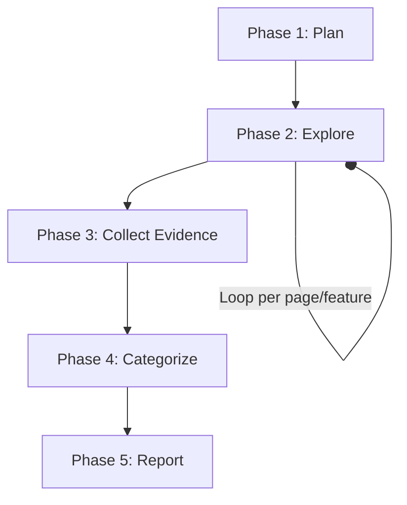

# skills — dogfood

# Dogfood: Systematic Web QA Module

The `dogfood` module provides a structured framework for exploratory quality assurance (QA) of web applications. It leverages a suite of browser automation tools to navigate applications, detect functional and visual regressions, capture evidence, and generate standardized bug reports.

## Core Components

The module is composed of three primary files that define the logic, classification standards, and output format:

*   **`SKILL.md`**: The primary execution logic. It defines a 5-phase workflow (Plan, Explore, Collect, Categorize, Report) and maps browser tool outputs to QA actions.
*   **`references/issue-taxonomy.md`**: A standardized classification system for bugs, defining four severity levels (Critical, High, Medium, Low) and six categories (Functional, Visual, Accessibility, Console, UX, Content).
*   **`templates/dogfood-report-template.md`**: A Markdown template used to aggregate findings into a final executive summary and detailed issue log.

## Execution Workflow

The module follows a linear progression from initial planning to final reporting.

### Phase 1: Planning
The module initializes the environment by creating an output directory structure (defaulting to `./dogfood-output`). It establishes a testing scope based on the target URL and identifies key user flows such as authentication, search, and checkout.

### Phase 2: Exploration & Interaction
This is the active testing phase. The module utilizes the following tool pattern for every page visited:

1.  **Navigation**: `browser_navigate(url=...)`
2.  **State Capture**: `browser_snapshot()` for DOM/Accessibility tree analysis.
3.  **Error Detection**: `browser_console(clear=true)` is called after every navigation and interaction to catch silent JavaScript exceptions.
4.  **Visual Analysis**: `browser_vision(annotate=true)` generates a screenshot where interactive elements are labeled with numeric IDs (e.g., `[1]`, `[2]`).
5.  **Interaction**: Elements are targeted using the `@eN` reference syntax (e.g., `browser_click(ref="@e1")`).

### Phase 3: Evidence Collection
When a discrepancy is found, the module captures:
*   **Visual Evidence**: A non-annotated screenshot via `browser_vision`.
*   **Context**: The current URL and the specific steps to reproduce (STR).
*   **Technical Logs**: Relevant console errors or failed network requests.

### Phase 4: Categorization
Findings are de-duplicated and mapped against the `issue-taxonomy.md`. Issues are sorted by severity to ensure the most critical blockers appear first in the final report.

### Phase 5: Reporting
The module populates `dogfood-report-template.md`. A key feature of the reporting phase is the use of the `MEDIA:<screenshot_path>` syntax, which allows the final Markdown report to render captured evidence inline.

## Tool Integration Reference

The module acts as a coordinator for the following browser tools:

| Tool | Usage Pattern |
| :--- | :--- |
| `browser_vision` | Used with `annotate=true` to map the visual UI to actionable element references (`@eN`). |
| `browser_console` | Critical for identifying "High" severity issues that don't manifest visually (e.g., unhandled promise rejections). |
| `browser_snapshot` | Provides the text-based accessibility tree used to understand page structure and content. |
| `browser_press` | Used for testing keyboard accessibility and form submission (e.g., `key="Enter"`). |

## Issue Taxonomy

The module enforces a strict classification to ensure report consistency:

### Severity Levels
*   **Critical**: Total feature failure, data loss, or security vulnerabilities.
*   **High**: Significant impairment (e.g., broken core buttons) with possible workarounds.
*   **Medium**: UI/UX issues that don't block functionality (e.g., layout misalignment).
*   **Low**: Polish issues, typos, or missing favicons.

### Categories
*   **Functional**: Logic errors and broken links.
*   **Visual**: CSS/Layout failures and broken images.
*   **Accessibility**: WCAG violations or keyboard traps.
*   **Console**: JS exceptions and 4xx/5xx network errors.
*   **UX/Content**: Confusing flows or placeholder text.

## Implementation Notes for Developers

*   **State Management**: The module does not maintain an internal state machine of the web app; it relies on `browser_snapshot` and `browser_vision` at each step to determine the current state.
*   **Element Referencing**: Always use the `@eN` syntax provided by `browser_vision` or `browser_snapshot` for interactions to ensure accuracy in dynamic SPAs.
*   **Reporting Pathing**: Ensure the `output_dir` is writable, as all screenshots and the final `report.md` are persisted there.