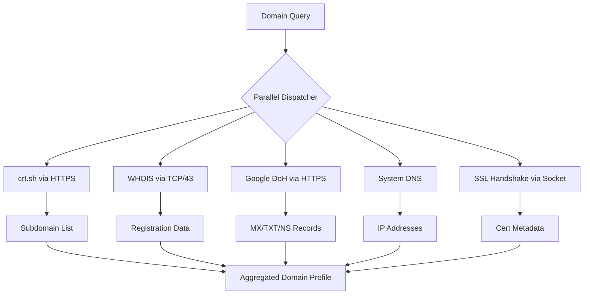

# skills — domain

# Domain Intelligence Skill

The `domain-intel` module provides passive reconnaissance capabilities for domain names using only the Python standard library. It is designed to gather comprehensive technical and administrative data about domains without requiring external dependencies or API keys.

## Core Capabilities

The module aggregates data from multiple passive sources to build a profile of a target domain:

*   **Subdomain Discovery:** Queries Certificate Transparency (CT) logs via `crt.sh` to identify historical and current subdomains.
*   **SSL/TLS Inspection:** Performs live handshakes to extract certificate metadata, including expiration dates, Subject Alternative Names (SANs), supported cipher suites, and TLS versions.
*   **WHOIS Lookups:** Executes direct TCP queries to authoritative WHOIS servers for over 100 Top-Level Domains (TLDs) to retrieve registration details.
*   **DNS Resolution:** 
    *   **System DNS:** Resolves `A` and `AAAA` records.
    *   **Google DNS-over-HTTPS (DoH):** Resolves complex records including `MX`, `NS`, `TXT`, and `CNAME` to bypass local resolver limitations.
*   **Availability Analysis:** Heuristically determines if a domain is available for registration by correlating DNS NXDOMAIN responses, WHOIS "not found" strings, and SSL connection failures.
*   **Bulk Processing:** Supports parallel analysis of up to 20 domains simultaneously.

## Architecture & Data Flow

The module operates as a stateless intelligence gatherer. When a domain is queried, it initiates concurrent requests across different protocols (HTTPS, DNS, TCP).

## Technical Implementation Details

### Passive Reconnaissance Strategy
The module strictly adheres to passive or semi-passive methods. It does not perform "active" scanning (like port scanning or directory brute-forcing). Instead, it relies on:
1.  **Public Logs:** CT logs are immutable records of issued certificates.
2.  **Standard Protocols:** Direct WHOIS queries to port 43.
3.  **Third-party Resolvers:** Using Google DoH ensures consistent results regardless of the host's local DNS configuration.

### Zero-Dependency Design
To maintain portability and minimize the footprint, the module implements:
*   **Custom WHOIS Client:** A raw socket implementation that handles the logic of identifying the correct authoritative server for a given TLD and parsing the response.
*   **DoH Client:** Uses `urllib.request` to perform JSON-based DNS queries over HTTPS.
*   **SSL Parser:** Uses the `ssl` module to decode peer certificates and extract X.509 extensions.

## Usage Patterns

The skill is triggered by intent-based requests. Common patterns include:

| Intent | Example Request |
| :--- | :--- |
| **Discovery** | "Find all subdomains for example.com" |
| **Security Audit** | "Check the SSL certificate for api.example.com" |
| **Ownership** | "Whois lookup for example.org" |
| **Infrastructure** | "Get DNS records for example.com" |
| **Bulk Analysis** | "Check availability for these 10 domains: ..." |

## Constraints and Limitations

*   **Rate Limiting:** Since it queries public services like `crt.sh` and Google DoH, aggressive bulk querying may result in temporary IP-based rate limiting from those providers.
*   **WHOIS Parsing:** Because WHOIS data is semi-structured and varies by registrar, some fields may return raw text if the specific TLD format is not recognized.
*   **No Active Probing:** The module will not detect services running on non-standard ports or subdomains that have never requested an SSL certificate.