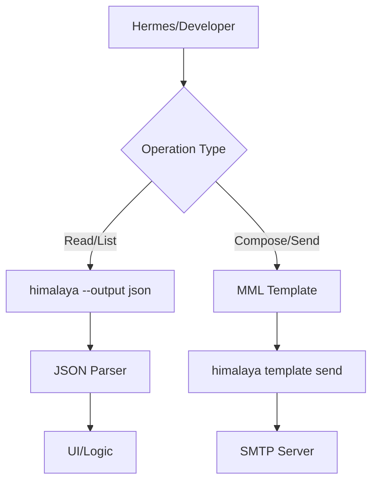

# skills — email

# Email Skill (Himalaya CLI)

The `skills/email` module provides a terminal-based interface for managing email accounts via the **Himalaya CLI**. It supports IMAP for reading and searching, and SMTP (or Sendmail/Notmuch) for sending messages.

## Overview

This module acts as a bridge between the system and email servers. It is designed to handle both interactive use (via a PTY) and programmatic automation (via JSON output and piped input).

### Key Capabilities
- **Account Management:** Support for multiple accounts (Gmail, iCloud, Outlook, etc.).
- **Message Lifecycle:** List, read, search, move, copy, and delete emails.
- **Rich Composition:** Uses **MML (MIME Meta Language)** to handle attachments, HTML parts, and inline images.
- **Structured Data:** Supports `--output json` for programmatic parsing of email envelopes and metadata.

## Prerequisites

1. **Himalaya CLI:** Must be installed and available in the system `$PATH`.
2. **Configuration:** A valid `~/.config/himalaya/config.toml` file.
3. **Authentication:** Credentials should ideally be managed via a password manager (e.g., `pass`) or the system keyring to avoid plain-text passwords in the config.

## Integration Architecture

The module interacts with the Himalaya binary through shell execution. For automation, the "Template" flow is preferred over the "Interactive" flow.



## Configuration

The configuration file (`~/.config/himalaya/config.toml`) defines backends for different accounts.

### Example Account Setup
```toml
[accounts.personal]
email = "user@example.com"
display-name = "Your Name"
default = true

backend.type = "imap"
backend.host = "imap.example.com"
backend.port = 993
backend.encryption.type = "tls"
backend.auth.cmd = "pass show email/imap"

message.send.backend.type = "smtp"
message.send.backend.host = "smtp.example.com"
message.send.backend.port = 587
message.send.backend.encryption.type = "start-tls"
message.send.backend.auth.cmd = "pass show email/smtp"
```

## Core Operations

### 1. Navigation and Discovery
To list folders or the "envelopes" (headers) of messages:

```bash
# List all folders
himalaya folder list

# List the last 10 emails in JSON format
himalaya envelope list --page-size 10 --output json
```

### 2. Searching
Himalaya supports filtering by sender, subject, or keywords:
```bash
himalaya envelope list from "boss@company.com" subject "Urgent"
```

### 3. Reading and Attachments
Reading a message returns the plain-text body by default. To handle attachments, they must be downloaded to a directory.
```bash
# Read message ID 42
himalaya message read 42

# Download all attachments for message 42
himalaya attachment download 42 --dir ~/Downloads
```

### 4. Programmatic Composition (MML)
When sending emails programmatically, use **MML syntax**. This allows you to define headers and body content in a single stream.

**Sending a simple message:**
```bash
cat << 'EOF' | himalaya template send
From: you@example.com
To: recipient@example.com
Subject: Automated Report

Please find the data attached.
<#part filename=/tmp/report.csv><#/part>
EOF
```

**Replying to a message:**
To reply, fetch the template first to ensure `In-Reply-To` and `References` headers are correctly set:
```bash
himalaya template reply 42 | sed 's/^$/\nMy reply text here\n/' | himalaya template send
```

## Developer Patterns

### Handling Interactive Prompts
Commands like `himalaya account configure` require user input. When calling these from a parent process, ensure a PTY (Pseudo-Terminal) is allocated:
```python
# Example pattern
terminal(command="himalaya account configure", pty=true)
```

### Parsing Structured Output
Always use `--output json` when the result needs to be processed by another tool. The JSON schema for `envelope list` includes:
- `id`: The internal folder-relative ID.
- `flags`: Array of strings (e.g., `["seen", "flagged"]`).
- `subject`: The message subject.
- `sender`: The display name or email of the sender.
- `date`: ISO 8601 formatted timestamp.

### Flag Management
Manage message states without moving them:
```bash
# Mark as read
himalaya flag add 42 --flag seen

# Mark as important
himalaya flag add 42 --flag flagged
```

## Troubleshooting

- **Authentication Failures:** Verify that the `backend.auth.cmd` returns the password correctly to stdout without extra line breaks.
- **Message IDs:** Remember that IDs are relative to the current folder. If you change folders, you must re-list envelopes to get valid IDs.
- **MML Compilation:** If an attachment fails, ensure the path in the `<#part>` tag is absolute or correctly relative to the execution context.