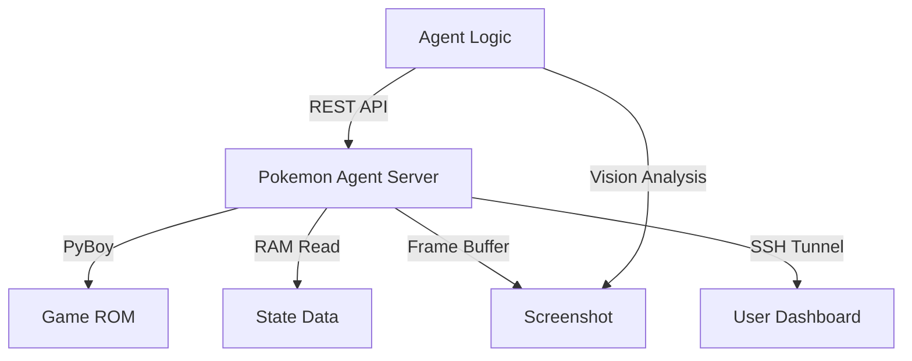

# skills — gaming

# Skills: Gaming

The `skills/gaming` module provides automated workflows for infrastructure management and interactive gameplay. It is divided into two primary domains: **Minecraft Modpack Server Management** and **Headless Pokemon Emulation**.

## Minecraft Modpack Server Setup

This sub-module automates the deployment of modded Minecraft servers (Forge/NeoForge) from server pack archives. It handles the full lifecycle from environment preparation to automated backup scheduling.

### Deployment Workflow

1.  **Environment Preparation**: Identifies required Java versions based on Minecraft release:
    *   1.21+: Java 21
    *   1.18 - 1.20: Java 17
    *   1.16 and below: Java 8
2.  **Installation**: Utilizes mod loader installers. For packs like All The Mods (ATM), it uses environment variables like `ATM10_INSTALL_ONLY=true` to trigger headless installation via `startserver.sh`.
3.  **Configuration**: Generates `server.properties` with specific overrides for modded environments:
    *   `allow-flight=true`: Prevents kicks from modded movement items.
    *   `max-tick-time=180000`: Prevents watchdog crashes during heavy world generation.
4.  **JVM Tuning**: Configures `user_jvm_args.txt` using G1GC optimized flags. RAM allocation follows a heuristic based on mod count:
    *   100-200 mods: 6-12GB
    *   200-350+ mods: 12-24GB

### Automation & Maintenance

The module implements a robust backup system via `backup.sh` and `crontab`.

*   **Backup Logic**: Performs a `tar -czf` of the `world` directory, timestamps the archive, and implements a rotation policy (default: 24 backups).
*   **Persistence**: Injects an hourly cron job to ensure consistent state recovery points.

---

## Pokemon Player (Headless Emulation)

The `pokemon-player` skill interfaces with the `pokemon-agent` package to play GameBoy/GBA Pokemon titles using the PyBoy emulator. It operates as a REST-controlled server with a vision-integrated feedback loop.

### System Architecture

### The Gameplay Loop (OODA)

The agent follows a strict execution pattern to prevent desynchronization:

1.  **Observe**: Calls `GET /state` for RAM-based data (HP, coordinates) and `GET /screenshot` for spatial context.
2.  **Orient**: Uses vision models to identify obstacles (ledges, NPCs) not visible in RAM.
3.  **Decide**: Prioritizes actions: Dialog > Battle > Healing > Objectives.
4.  **Act**: Sends `POST /action` with a sequence of 2-4 moves.
5.  **Verify**: Takes a post-action screenshot to confirm the character reached the intended tile.

### API Reference

| Endpoint | Method | Description |
| :--- | :--- | :--- |
| `/health` | GET | Verifies server and emulator status. |
| `/state` | GET | Returns JSON of party stats, location, and battle flags. |
| `/screenshot` | GET | Returns the current frame buffer as a PNG. |
| `/action` | POST | Accepts a list of inputs (e.g., `walk_up`, `press_a`). |
| `/save` | POST | Creates a named state save. |
| `/load` | POST | Restores a named state save. |

### Critical Implementation Details

*   **Warp Handling**: Map transitions (doors/stairs) require a `wait_60` (1 second) delay to allow the emulator to update the position RAM.
*   **Building Exit Logic**: The agent is programmed to sidestep (left/right) after exiting a building to avoid immediately re-entering the door.
*   **Vision Dependency**: RAM state is insufficient for navigation. The agent must use `vision_analyze` on screenshots to detect one-way ledges and fences.
*   **Remote Access**: Uses `localhost.run` via SSH reverse tunneling to provide the user with a live dashboard URL (`.lhr.life/dashboard/`).

### Memory Conventions

The module uses specific prefixes for the Persistent Knowledge Base (PKM) to track game state across sessions:
*   `PKM:OBJECTIVE`: Current quest goal.
*   `PKM:MAP`: Spatial layout notes (e.g., "Mart is NE of Center").
*   `PKM:TEAM`: Current roster and move sets.
*   `PKM:STUCK`: Coordinates of known navigation hazards.