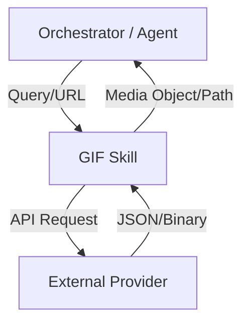

# skills — gifs

# Skills — GIFs

The `skills/gifs` module provides a dedicated interface for interacting with short-form animated media. It serves as the functional domain for searching, retrieving, and processing GIF files, typically acting as a bridge between the core agent logic and external media providers (such as Giphy or Tenor).

## Overview

This module is designed to encapsulate all logic related to animated image formats. By isolating these capabilities into a specific skill, the system can provide consistent media handling across different user interfaces and platforms.

### Core Responsibilities

Based on the module definition, the implementation focuses on three primary areas:

1.  **Media Discovery (Search):** Interfacing with external APIs to find relevant animated content based on text queries, categories, or trending metrics.
2.  **Asset Acquisition (Download):** Handling the transfer of binary data from remote servers to local storage or memory buffers, including management of different resolutions and file sizes.
3.  **Media Manipulation:** Basic operations for "working with" GIFs, which may include metadata extraction, format conversion (e.g., GIF to MP4/WebP), or frame-rate adjustments.

## Architecture & Integration

As a "skill" module, it follows the standard pattern of receiving high-level intent from an orchestrator and returning structured media objects.

### Input Patterns
The module is designed to handle:
*   **Natural Language Queries:** "Find a happy cat GIF."
*   **Direct Identifiers:** Specific IDs from supported providers.
*   **Source URLs:** Direct links to `.gif` files for processing or re-hosting.

### Output Patterns
Results from this module typically include:
*   **Source URL:** The original location of the media.
*   **Local Path:** The location of the cached or downloaded file.
*   **Dimensions:** Width and height in pixels.
*   **Format Metadata:** File size, frame count, and looping information.

## Development Guidelines

When contributing to this module, ensure that:
*   **Rate Limiting:** Any external API calls respect the provider's rate limits.
*   **Caching:** Downloaded media is cached locally to prevent redundant network traffic.
*   **Error Handling:** Gracefully handle 404s from expired media links or API timeouts.
*   **Format Agnosticism:** While named "GIFs," the module should ideally handle modern alternatives like looped MP4s or WebP animations if the provider offers them, as these are often more efficient for short-form animated media.