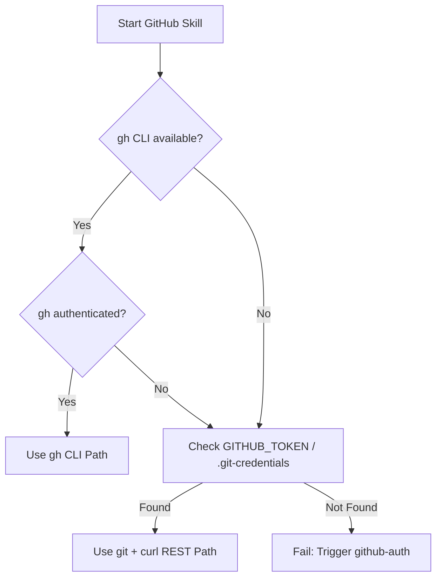

# skills — github

# GitHub Skills Module

The **github** module provides a comprehensive suite of tools for managing the software development lifecycle on GitHub. It is designed to operate in diverse environments by implementing a dual-path execution strategy: leveraging the `gh` CLI for high-level operations when available, and falling back to raw `git` commands combined with `curl` calls to the GitHub REST API when it is not.

## Core Architecture: The Dual-Path Strategy

The module is built on the principle of "graceful degradation." Most skills within this module first detect the available tooling and authentication state to decide which path to take.



### Environment Detection (`gh-env.sh`)
The script `skills/github/github-auth/scripts/gh-env.sh` is the central utility for state detection. When sourced, it populates the following variables:
- `GH_AUTH_METHOD`: "gh", "curl", or "none".
- `GITHUB_TOKEN`: The PAT (Personal Access Token) extracted from environment variables, `.hermes/.env`, or `~/.git-credentials`.
- `GH_USER`: The authenticated GitHub username.
- `GH_OWNER_REPO`: The `owner/repo` string parsed from the local git remote.

## Module Components

### 1. Authentication (`github-auth`)
Handles the initial setup required for all other skills. It supports:
- **gh CLI login**: Interactive or token-based.
- **Git-only (HTTPS)**: Configures `credential.helper store` to cache Personal Access Tokens.
- **SSH**: Generates Ed25519 keys and provides the public key for GitHub settings.

### 2. Pull Request Lifecycle (`github-pr-workflow`)
Manages the end-to-end PR process. A key feature is the **Auto-Fix Loop Pattern**:
1. **Detection**: Monitor CI status via `gh pr checks` or the `/commits/{sha}/status` endpoint.
2. **Diagnosis**: Retrieve failed logs (using `gh run view --log-failed` or downloading log artifacts via REST).
3. **Action**: Apply fixes using local file tools, commit, and push.
4. **Verification**: Poll the status until the check passes or a retry limit is reached.

### 3. Code Review (`github-code-review`)
Provides structured analysis of both local changes and remote PRs.
- **Local Review**: Uses `git diff main...HEAD` to perform pre-push checks.
- **Remote Review**: Supports fetching PR branches locally (`git fetch origin pull/N/head:pr-N`) for deep inspection.
- **Standardized Feedback**: Findings are categorized by severity:
    - `🔴 Critical`: Security vulnerabilities or breaking bugs (Blocks merge).
    - `⚠️ Warning`: Logic flaws or missing tests.
    - `💡 Suggestion`: Style or performance improvements.
    - `✅ Looks Good`: Positive reinforcement for clean patterns.

### 4. Repository Management (`github-repo-management`)
Handles administrative tasks including:
- **Repository CRUD**: Creating from templates, forking, and editing settings.
- **Secrets**: Managing GitHub Actions secrets (requires `PyNaCl` for encryption when using the REST API path).
- **Releases**: Automating tag creation and asset uploads.

### 5. Issue Tracking (`github-issues`)
Facilitates project management through:
- **Triage**: Filtering issues by labels like `needs-triage`.
- **Automation**: Linking issues to PRs using "Closes #N" keywords.
- **Templates**: Standardized formats for bug reports and feature requests located in `github-issues/templates/`.

### 6. Codebase Inspection (`codebase-inspection`)
A specialized utility using `pygount` to provide metrics.
- **Functionality**: Analyzes Lines of Code (LOC), language breakdown, and code-to-comment ratios.
- **Performance**: Uses strict `--folders-to-skip` (e.g., `node_modules`, `venv`, `.git`) to prevent hanging on large dependency trees.

## Integration Patterns

### Using the REST API Fallback
When `gh` is unavailable, the module uses `python3` one-liners to parse JSON responses from `curl`. Developers contributing to this module should follow this pattern for consistency:

```bash
curl -s -H "Authorization: token $GITHUB_TOKEN" \
  https://api.github.com/repos/$OWNER/$REPO/pulls \
  | python3 -c "import sys, json; [print(pr['number']) for pr in json.load(sys.stdin)]"
```

### Conventional Commits
The module enforces the Conventional Commits standard for all automated commits:
- `feat(...)`: New features.
- `fix(...)`: Bug fixes.
- `docs(...)`: Documentation changes.
- `ci(...)`: Pipeline updates.

## Prerequisites
- **Git**: Required for all local operations.
- **gh CLI**: Highly recommended for simplified auth and secret management.
- **pygount**: Required for the `codebase-inspection` skill.
- **python3**: Required for JSON parsing in the REST API fallback path.