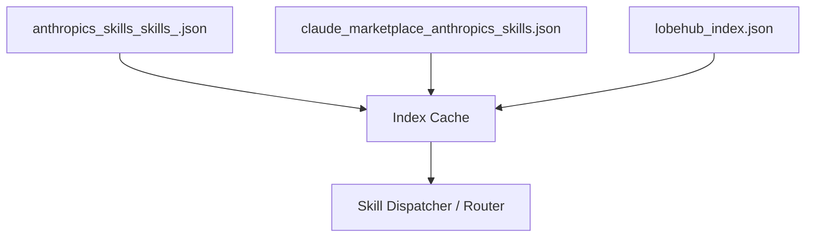

# skills — index-cache

# Skills Index-Cache

The `skills — index-cache` module serves as a centralized registry and metadata repository for the system's available AI capabilities. It aggregates definitions for individual functional tools (skills), grouped capability suites (marketplace collections), and specialized personas (agents).

This module acts as the primary lookup source for the system's dispatcher to determine which skill or agent should be activated based on user input.

## Module Architecture

The index cache is composed of three primary data sources, each serving a distinct role in the ecosystem:

### 1. Core Skill Definitions
**Source:** `anthropics_skills_skills_.json`

This file contains the atomic units of functionality. Each entry defines a specific toolset that the model can utilize. Key fields include:

*   **`name`**: The unique slug for the skill (e.g., `pdf`, `frontend-design`).
*   **`description`**: A detailed natural language prompt used by the model to understand when to trigger the skill.
*   **`identifier`**: The full path for resource resolution (e.g., `anthropics/skills/skills/docx`).
*   **`trust_level`**: Indicates the security context (e.g., `trusted`).

**Example Skill Pattern:**
Skills like `xlsx` or `pptx` include explicit trigger instructions within their descriptions, such as: *"Trigger whenever the user mentions 'deck,' 'slides,' 'presentation,' or references a .pptx filename."*

### 2. Skill Collections (Marketplace)
**Source:** `claude_marketplace_anthropics_skills.json`

This layer organizes individual skills into logical bundles for easier management and higher-level capability discovery.

*   **`document-skills`**: Aggregates `xlsx`, `docx`, `pptx`, and `pdf`.
*   **`example-skills`**: A broad collection including `mcp-builder`, `skill-creator`, and `web-artifacts-builder`.

These collections allow the system to load related dependencies or provide a "suite" of tools to the model simultaneously.

### 3. Agent Registry
**Source:** `lobehub_index.json`

This is a high-volume registry of specialized agent personas. Unlike functional skills, these entries define entire system prompts and UI metadata for specific use cases.

*   **Metadata (`meta`)**: Contains UI-specific data like `avatar`, `tags`, `title`, and `category` (e.g., `programming`, `academic`, `life`).
*   **Schema Versioning**: Uses `schemaVersion: 1` to ensure compatibility with the LobeHub agent standard.
*   **Usage Tracking**: Includes `tokenUsage` metrics for performance monitoring.

## Key Skill Categories

The index cache categorizes capabilities into several high-impact areas:

| Category | Key Skills | Purpose |
| :--- | :--- | :--- |
| **Document Processing** | `pdf`, `docx`, `xlsx`, `pptx` | Manipulation, extraction, and creation of office formats. |
| **Design & Art** | `algorithmic-art`, `canvas-design`, `theme-factory` | Generative art via p5.js and static visual design. |
| **Development** | `mcp-builder`, `webapp-testing`, `frontend-design` | Building MCP servers, Playwright testing, and React/Tailwind UI. |
| **Workflow** | `doc-coauthoring`, `skill-creator` | Structured collaboration and extending system capabilities. |

## Implementation Details

### Trigger Logic
The `description` field in the JSON files is the most critical component for developers. It functions as the "routing prompt." When adding a new skill, the description must include:
1.  **Explicit Keywords**: Specific file extensions or terms (e.g., `.csv`, `GIF`).
2.  **Negative Constraints**: Instructions on when *not* to use the skill (e.g., the `xlsx` skill explicitly states: *"Do NOT trigger when the primary deliverable is a Word document"*).

### Resource Resolution
The `identifier` and `path` fields map the logical skill name to the physical location in the `anthropics/skills` repository. This allows the runtime to dynamically fetch the necessary logic or environment configurations required to execute the skill.